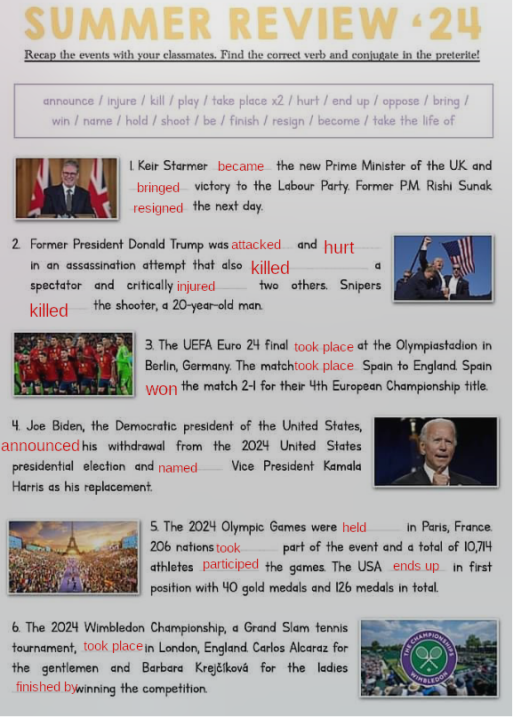
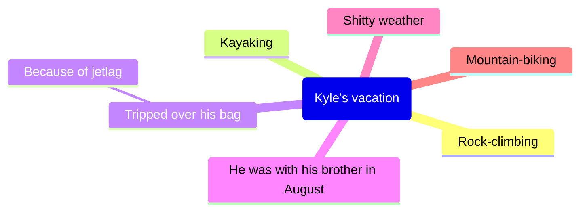

# English
## Thursday, 5th September 2024

### Today's quote
!!! quote

	Success is not final, failure is not fatal, it is the courage to continue that counts
	
	_Winston Churchill_

### Summer Review - 24

About 2: I think it was pretty funny because in fact he really didnt really got hurt, the guards obviously let the attack go and Trump really overplayed (the famous self-growing band-aid).

During the Olympic games Leon Marchand, a french swimmer, won three gold medals and one bronze medal.

Another event:
[article](https://www.forbes.fr/science/neuralink-sapprete-a-implanter-un-deuxieme-patient-humain/)
(creuser)

**Neuralink Set to Implant Second Human Patient**

??? abstract "Details"

    

	Neuralink, Elon Musk's brain-implant company, aims to give humans "cybernetic superpowers" and allow them to control robots with their thoughts, according to the billionaire. Musk recently announced that a second human patient is expected to receive an implant within a week.

	Key Things:

	- [x] Musk envisions future users of Neuralink’s brain-computer interface controlling prosthetics faster than before they lost their limbs.
	- [x] He predicts that Neuralink could treat epilepsy, cure paralysis, and even allow users to control Tesla's humanoid robot, Optimus, with their minds. The robot could be sold as early as next year.
	- [x] Neuralink plans to address technical issues experienced with the first patient, including implant detachment. Improvements like deeper wire insertion and reducing air pockets in the skull are in progress.
	- [x] Musk's optimistic timelines should be viewed with caution, as experts suggest Neuralink's technology is still experimental, with approvals limited to clinical trials.

	Musk also teased a more advanced version of the implant, doubling the number of brain-inserted wires and improving bandwidth. Despite the ambitious vision, commercialization for medical or other uses is still years away.

After the summer. Part 2: How was your summer

| Regular verbs (write the past simple form) | Irregular verbs (write the past simple form) |
|---|---|
| listened/d/ | slept |
| stayed/d/ | ate |
| walked/d/ | done |
| visited | gone |
| watched/d/ | read |
| played/d/ | swam |
| drawed/d/ | rode |
| | fought |

I love programming, I think MacOS is good, I know how to center something on a website.

## Thursday, 12th September

I didn't eat ice cream
(didn't est invariable quelque soit le pronom
Ex: Last summer, I rode my mountain-bike and went kiking. I did some sport, however, I din't swim, because i'm not a juge fan of water sports.

Howerver = but
Toujour utiliser avec DID et l'infinitif du verbe à la forme négative et interrogative au prétérit; sauf avec BE (was/were). 
Moi aussi = So did I (affirmative), Neither did I (moi non plus)
Moi si = I did, moi non = i didn't

Las summer i swam in the sea. it was really cool, because i looked at dolphins/ i saw dolphins.

What about you ? Write a sentence to talk about your last summer. Give some details.

I programmed 200 hours long, but i didn't played any games (neither did I watched smth else than Netflix)

| Name        | activity            | yes/no |
|-------------|---------------------|--------|
| Adam        | fed his chicken     | yes    |
| Nolan       | played Minecraft    | yes    |
| Noé         | used Windows        | no     |

I learned Adam had a life. I also learnt 

1. J'utilise le prétérit quand l'action est passée et terminée
2. yesterday=hier; last summer=l'été dernier; two days ago=il y à deux jours.

Tom is wearing Sunglasses.
He looks relaxed.
He looks joyful and he is wearing a colorful shirt.

Tom took a picture with a Schrek thing, it was approximately 38 degrees Celsius, visited some LA beaches, 
swam in the pacific ocean, visited hollywood, gone shopping, posted 200 pictures;he feels happy.

Last summer, Tom went to Los Angeles. It was brilliant ! Most days he spent time at the beach and he went swimming in the Pacific Ocean. 
It was really exciting, because he visited Hollywood and the movie studios.
He also walked down Sunset Boulevard and he took photos of the palm trees. He saw Schreck's star on the walk of fame. He posted zillions of photos and he took 23 photos of himself standing next to a palm tree. It was 100 degrees Farenheit (=37.7 degrees Celsius). Finally he bought a shirt which is very colorful.

sailing
ballooning

[exos](../assets/noscans/english/summer_activities.pdf)

where what when who how how long

2

1. when
2. how
3. how long
4. where
5. who
6. where

3

1. When did you go to Australia ?
2. How long did you stay there ?
3. what did you do ?
4. Where did your parents travel ?
5. How did you go there ?
6. Who did you go with ?

4

1. How did you go to Miami ?
2. When was the last time your sister read ?
3. When was the last time you went to cinema ?
4. Who did you play tennis with ?
5. How long James watched the TV for ?
6. Where did you walked your dog ?

5

1. Where did you ate you ice cream yesterday ?
2. How much time did you got ?
3. How did you go to school ?
4. What did you draw ?
5. With who have you gone to the cinema ?
6. When did you visited this museum ?

One week at miami

|            | Le sujet ressent une émotion | Le sujet provoque une émotion |
|:----------:|:----------------------------:|:-----------------------------:|
|  Interest  |         interressed          |          interesting          |
|   Excite   |           excited            |           exciting            |
|   Amaze    |            amazed            |            amazing            |
| Fascinate  |          fascinated          |          fascinating          |
|    Bore    |            bored             |            boring             |
|  Terrify   |          terrified           |          terrifying           |
| Disappoint |         disappointed         |         disappointing         |

| Positive adjectives | Negative adjectives |
|:-------------------:|:-------------------:|
|      exciting       |     nightmarish     |
|      peaceful       |    catastrophic     |
|     incredible      |       strange       |
|       amazing       |    uninteresting    |
|        quiet        |        weird        |
|      terrific       |        dull         |
|      relaxing       |         odd         |
|      wonderful      |       boring        |
|      fabulous       |     disastrous      |

😁: The view in the Pyrénées was fabulous and incredible.

😠: The internet in the mountains was nightmarish and dull.

👽: It was weird when I had to learn golang on the fly, and the experience was quite odd (well, as the language).

🀧: Hiking in the Pyrénées was peaceful and relaxing.

🥱: 2 weeks next to the beach were boring and uninteresting.

Questions:

* What happened to your arm ?
* Who did you go with ?
* What happened last summer ?
< during your vacations

he felt over his backpack. also he did some hitch-hiking.

This is a tatoo about the 9/11 events. We see the two towers on the tatoo.

This document is a _. In the background, there's the American flag (called the Stars-spangled banner), there's a man, presumably a firefighter because he's holding a helmet under his left arm. The picture must have been taken in the USA shortly after the twin tower terrorist attack which took place on the September 9th 2001, widely called 9/11 attacjs? The fireman has got a tatoo all over his back which represents the plane and the twin towers in the middle and names on the left. The names must be those of firemen who died in the attacks of 9/11 victims. It must be the names of the members of his fire teammates who died in the rescue of the 9/11 victims. In the bottom left, we can notice/note the hand and the flame of the statue of liberty.
The man must have got this tattoo to pay respect to the firman

Look and react. Say all you can about the differences and similarities between these three photos.

In 2001, there was the twin towers before the attacks. After, in 2011, there was two laser aimed at the sky to commemorate the attack. In 2021, A single skyscraper had been built.

The three photos show the New York skyline which is easily recognisable with all its tall skyscraper made of steel.

They were taken every ten years from 2001 to 2021, because twenty three years ago there was a terrorist attack which destroyed the Twin Towers (= The World Trade Center) killing thousands of people.

In 2001 there were two similar skyscrapesr, whereas in 2011 there was a neon light flashing up to the sky where the two towers were missing.

Nowadays, in 2021, there is one tall skyscraper which was built where the two towers were standing.

**Passive form: was / were + participe passé du verbe (was taken)**

1. September 11^th^ is the Patriot Day
2. Americans commemorate the 2001 terrorist attack
3. There is a minute of silence at 8:46 am because the atack took place at that time.

_

- 1wtc: freedom tower 3.8 billion dollars + 8 years build, 541 meters talles in western hemisphere

a) one thousand and six hundred seventy seven
b) four thousands square meters
c) 