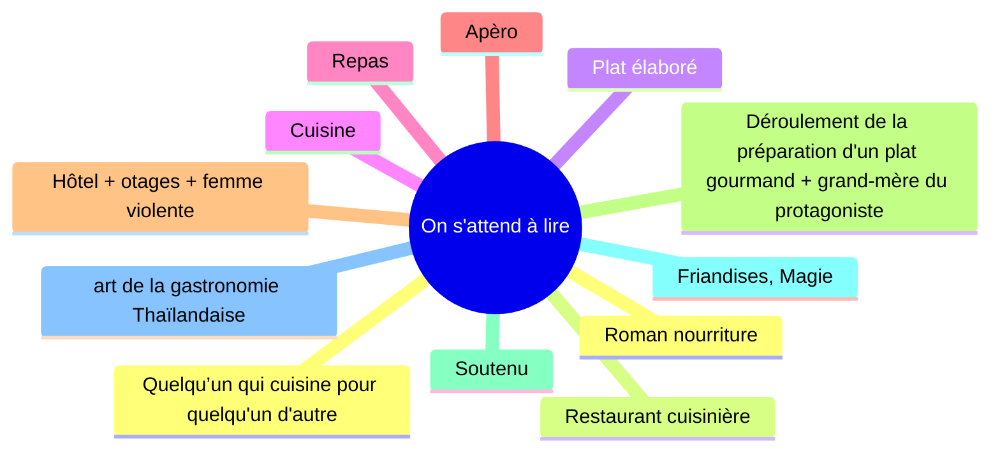
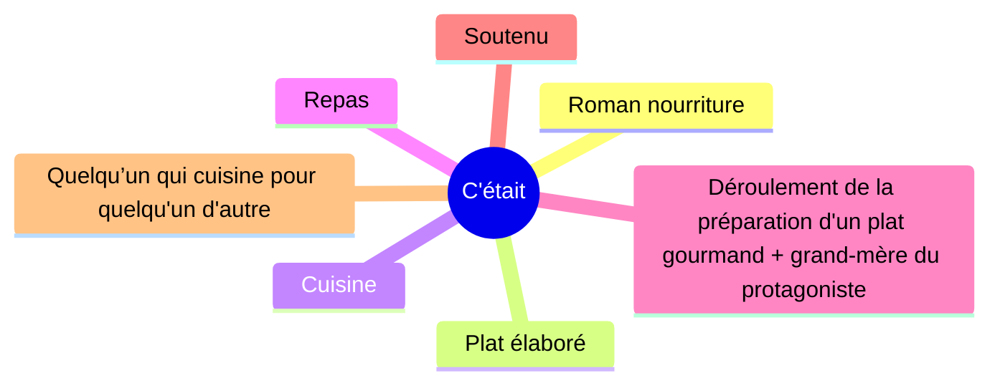

[padlet](https://padlet.com/CNRD/orientation-3e-nbo9zzj97rwx)
# Séquence 1
## Savoir lire un texte:

^^Texte d'étude^^: ["Une gourmandise"](../../assets/scans/une-gourmandise-francais.png) de [Muriel Barbery](https://en.wikipedia.org/wiki/Muriel_Barbery).

??? abstract "Texte"

	## Une gourmandise

	La cuisine de ma grand-mère m'avait accoutumé à une atmosphère bruyante et enfiévrée où, dans le tintamarre des casseroles, le chuintement du beurre et le clac-clac des couteaux se démenait une virago en transe à laquelle seule sa longue expérience conférait une aura de sérénité - de celles que conservent les martyrs dans les flammes de l'enfer. Jacques, lui, accomplissait toutes choses avec mesure. Il ne se pressait pas, mais point de lenteur non plus. Chaque geste venait en son temps.

	Il rinça soigneusement le riz thaïlandais dans une petite passoire argentée, l'égoutta, le versa dans la casserole, le recouvrit d'un volume et demi d'eau saléee, couvrit, laissa cuire. Les crevettes gisaient dans le bol de faïence. Tout en conversant avec moi, essentiellement de mon article et de mes projets, il les décortiqua avec une méticulosité concentrée. Pas un instant il n'accéléra la cadence, pas un instant il ne la ralentit. La dernière petite arabesque dépouillée de sa gangue protectrice, il se lava consciencieusement les mains, avec un savon qui sentait le lait. Avec la même uniformité sereine, il plaça une sauteuse en fonte sur le feu, y versa un filet d'huile d’olive, l'y laissa chauffer, y jeta en pluie les crevettes dénudées. Adroitement, la spatule en bois les circonvenait, ne laissant aux menus croissants aucune échappatoire, les saisissant de tous côtés, les faisant valser sur le grill odorant. Puis du curry. Ni trop ni trop peu. Une poussière sensuelle embellissant de son or exotique le cuivre rosé des crustacés: l'Orient réinventé. Sel, poivre, Il égrena aux ciseaux une branche de coriandre au-dessus de la poêlée. Enfin, rapidement, un bouchon de cognac, une allumette; du récipient jaillit une longue flamme hargneuse; comme un appel on ou cri qu'on libère enfin, soupir déchaîné qui s'éteint aussi vite qu'il s'est élevé.

	Sur la table de marbre patientaient une assiette de porcelaine, un verre de cristal, une argenterie superbe et une serviette de lin brodé. Dans l'assiette, il disposa soigneusement, à la cuillère en bois, la moitié des crevettes, le riz auparavant tassé dans un minuscule bol et retourné en une petite coupole joufflue surmontée d'une feuille de menthe. Dans le verre, il se versa généreusement d'un liquide de blé transparent. 

	" Je te sers un verre de sancerre ? "
	
	Je fis non de la tête. Il s'attabla.

	Un repas sur le pouce. C'était ce que Jacques Destrères appelait un repas sur le pouce. Et je savais qu'il ne plaisantait pas, que chaque jour il se mitonnait ainsi une petite bouchées de paradis, ignorant du raffinement de son ordinaire, vrai gourmet, réel esthète dans l'absence de mise en scène qui caractérisait son quotidien. Je le regardais manger, sans toucher moi-même au mets qu'il avait préparé sous mes yeux, manger avec le même soin détaché et subtil qu'il avait mis à cuisine et ce repas que je ne goûtai pas demeura l'un des meilleurs de ma vie.

	Déguster est un acte de plaisir, écrire ce plaisir est un fait artistique mais la seule vrai œuvre d'art, en définitive, c'est le festin de l'autre

	**Muriel Barbery**, *Une gourmandise*, 2000 © Ed. Gallimard

### 1) ^^Étape 1^^:
Avant de lire un texte, il faut l'observer car des renseignements nous sont donnés par l'étude:

??? abstract inline end "Définition"

	**Paratexte:** ce sont toutes les informations qui environnent le texte (exemple: courte introduction, note, date et circonstances de la publication de l’œuvre, renseignements biographiques sur l'auteur, nom de l'auteur, titre de l’œuvre, titre de l'extrait..)

- du **PARATEXTE**
- du **TITRE**: Le titre, quand il y en à un, permet d'éclairer le sens d'un texte, d'en connaître le thème (le sujet)
??? abstract inline end "Définition"

    **Mise en page**:  La disposition du texte sur la page

    - Paragraphes: roman
    - Retours à la ligne: poésie
    - Noms des personnages: théâtre
    - Colonnes: articles de presse
    - BD: planches
- de la **MISE EN PAGE**

La lecture du paratexte et l'observation de la mise en page permettent d'émettre des hypothèses sur la nature du document que l'on à sous les yeux et le genre littéraire auquel il appartient.

Seule une lecture attentive permet de confirmer ou de démentir ces hypothèses.

_

!!! tip

	Création de mot: **néologisme**

Roman=genre narratif
+ Nouvelle, conte

Roman sf: la planète des singes

Roman d'aventures: Jules Vernes

Roman policier: Sherlock Holmes, Agatha Christie, Ils étaient dix, Arsène Lupin

points de vues interne, externe, omniscient

théâtre: Molière 17ème (les femmes savantes, le malade imaginaire, l'avare, le médecin malgré lui, les fourberies de scapin), Racine, Phèdre

La fontaine, Fables
Hugo, Les contemplations
Beaudelaire, Les Fleurs du mal
Rimbault, une saison en enfer
Verlaine
Strophes, rimes, veers

### 2) Étape 2

https://www.larousse.fr/dictionnaires/francais/{mot}

* le **VOCABULAIRE**

à chercher:
[aura](https://www.larousse.fr/dictionnaires/francais/aura) (définiton 3),
[martyr](https://www.larousse.fr/dictionnaires/francais/martyr) (définition 2),
[gisaient](https://www.larousse.fr/dictionnaires/francais/gisaient) (définition 1),
[arabesque](https://www.larousse.fr/dictionnaires/francais/arabesque) (définition 2),
[gangue](#),
[circonvenait](#) ,
[sensuelle](#),
[hargneux](https://www.larousse.fr/dictionnaires/francais/hargneux) (définition 1),
[gourmet](https://www.larousse.fr/dictionnaires/francais/gourmet) (définition 1),
[subtile](https://www.larousse.fr/dictionnaires/francais/subtile)

??? tip   "Conversant"

	parler, discuter

??? tip   "Se mitonner"

	préparer avec soin

??? tip   "Aura"

	Atmosphère immatérielle qui enveloppe ou semble envelopper certains êtres

??? tip   "Martyr"

	 Chrétien mis à mort ou torturé en témoignage de sa foi. (On l'appelait aussi martyr de la foi ou confesseur [de la foi].)

??? tip   "Gisaient"

	Être étendu, couché, sans mouvement.

??? tip   "Arabesque"

	Ligne idéale, sinueuse, résumant le rythme essentiel d'une composition peinte, dessinée ou sculptée.

??? tip   "Gangue"

	Ce qui enveloppe ou dissimule quelque chose

??? tip   "Circonvenait"

	Entourer de tout côtés

??? tip  "Sensuelle"

	Propre au sens

??? tip  "Harngeux"

	Qui montre de la hargne dans son comportement avec autrui 

??? tip  "Gourmet"

	Personne qui sait distinguer et apprécier la bonne cuisine et les bons vins

* la **SITUATION d'ENONCIATION** (cf. Fiche prof n°3)

Ici, nous avons aujourd'hui un temps magnifiques, mais demain, il pleuvra

Ce jour-là, à Paris, le temps était magnifique, mais on leur avait annoncé que le lendemain il pleuvrait.

* le **TYPE DE TEXTE** (cf. Fiche prof n°4)

sl DN-Exemples; DN-[TEmps dominants de référence]; DN-[Vocabulaire et outils grammaticaux]; DE-[cn logique, scientifique, ttn imp]; DA-1; DA-3[Engaged/jenous]; DA-5;

Schéma narratif

- Situation initiale
- Elément modif
- péripéties
- élément de résolution
- situation finale

??? info "Ellipse"

	Passer sous silence certains évènements.
	Exemple: 20 après, 30 minutes plus tard...

indices spatio-temporels

Expansions du nom

- Adjectif épithète

Le chien noir joue à la balle

- CDN

Le chien noir de mon voisin joue à la balle

- Proposition subordonnée relative

Le chien noir de mon voisin, qui à un collier, joue à la balle.

### 3) Etape 3: étude des champs lexicaux pour confirmer l'idée du texte

??? abstract "Champ lexical"

    Ensemble de mots se rapportant à un même thème

Relevez dans le texte les deux champs lexicaux dominants.

| Champ lexical des ustensiles. | Champ lexical des ingrédients | Champ lexical de  | Champ lexical de _ |
|:-----------------------------:|:-----------------------------:|:-----------------:|:------------------:|
|       casseroles (l. 2)       |         beurre (l.2)          |                   |                    |
|        couteaux (l. 3)        |    riz thaîlandais (l. 8)     |                   |                    |
|        passoire (l. 8)        |       crevettes (l. 10)       |                   |                    |
|       casserole (l. 9)        |         curry (l. 19)         |                   |                    |
|    bol de faïence (l. 10)     |      sel, poivre (l. 21)      |                   |                    |
| saauteuse en fonte (l. 15-16) |       coriandre (l.21)        |                   |                    |
|    spatule en bois (l. 17)    |   feuille de menthe (l. 29)   |                   |                    |
|         grill (l. 19)         |     huile d'olive (l. 16)     |                   |                    |
|        ciseaux (l. 21)        |        cognac (l. 22)         |                   |                    |
|      récipient (l.  22)       |                               |                   |                    |
|     assiette (l. 25, 26)      |                               |                   |                    |
|      argenterie (l. 26)       |                               |                   |                    |
|   cuillère en bois (l. 27)    |                               |                   |                    |
|     minuscule bol (l. 28)     |                               |                   |                    |
|  verre (l. 25, l. 29, l. 31)  |                               |                   |                    |

