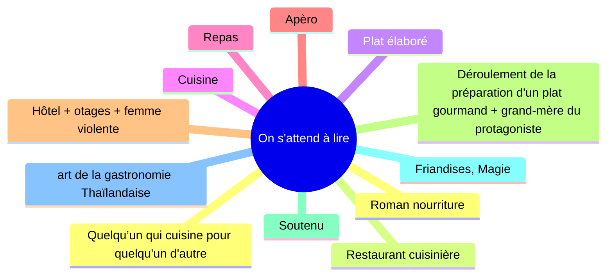

# Séquence 1
## Savoir lire un texte:

^^Texte d'étude^^: ["Une gourmandise"](../../assets/scans/une-gourmandise-francais.png) de [Muriel Barbery](https://en.wikipedia.org/wiki/Muriel_Barbery). 

### 1) ^^Etape 1^^:
Avant de lire un texte, il faut l'observer car des renseignements nous sont donnés par l'étude: 

??? abstract inline end "Définition"

	**Paratexte:** ce sont toutes les informations qui environnent le texte (exemple: courte introduction, note, date et circonstances de la publication de l’œuvre, renseignements biographiques sur l'auteur, nom de l'auteur, titre de l’œuvre, titre de l'extrait..)

- du **PARATEXTE**
- du **TITRE**: Le titre, quand il y en à un, permet d'éclairer le sens d'un texte, d'en connaître le thème (le sujet)
??? abstract inline end "Définition"

	**Mise en page**:  La disposition du texte sur la page
	
	- Paragraphes: roman
	- Retours à la ligne: poésie
	- Noms des personnages: théâtre
	- Colonnes: articles de presse
	- BD: planches
- de la **MISE EN PAGE**

La lecture du paratexte et l'observation de la mise en page permettent d'émettre des hypothèses sur la nature du document que l'on à sous les yeux et le genre littéraire auquel il appartient.

Seule une lecture attentive permet de confirmer ou de démentir ces hypothèses. 

!!! tip 

	Création de mot: **néologisme**

??? abstract "Texte"

	## Une gourmandise

	La cuisine de ma grand-mère m'avait accoutumé à une atmosphère bruyante et enfiévrée où, dans le tintamarre des casseroles, le chuintement du beure et le clac-clac des couteaux se démenait une virago