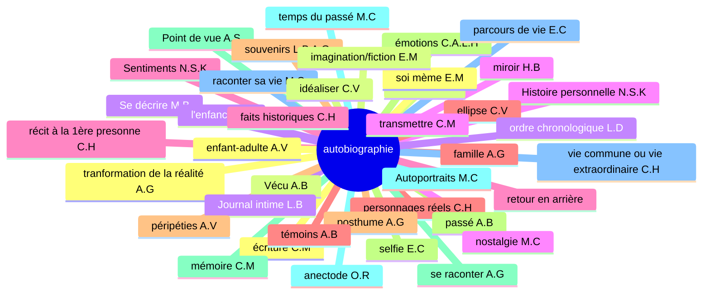
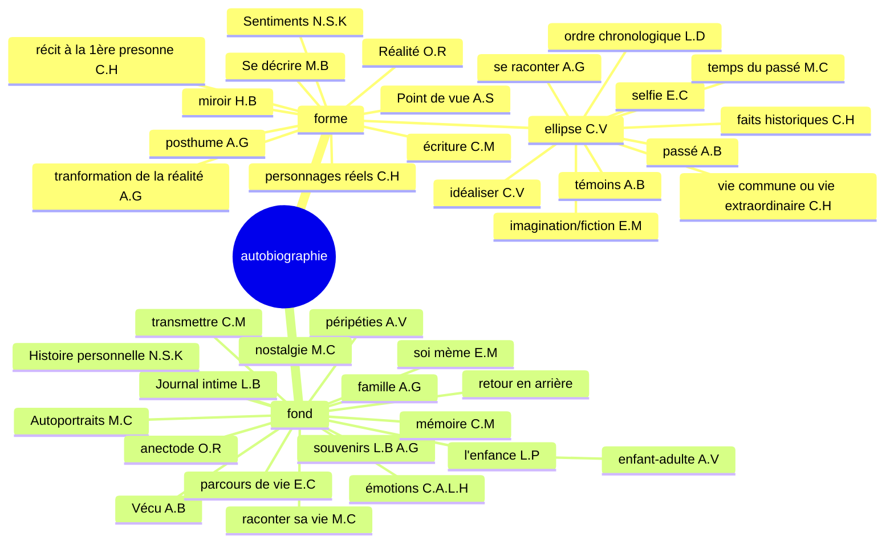
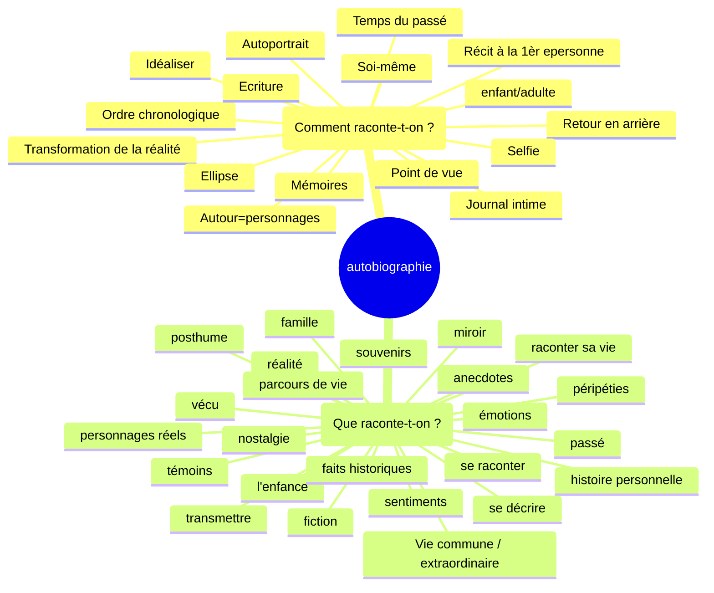

# Séquence 2 : L'autobiographie
## 2) Activité 2 : Etymologie

Décomposer le mot autobiographie en ces différents éléments. Nommer ces différents éléments et donner leur sens.

auto (de soi-même/ par soi-même) (préfixe) — bio (vie) (radical) — graphie (tracer) (suffixe)

| auto           | bio         | graphie       |
|----------------|-------------|---------------|
| automatisme    | biologie    | graphique     |
| automatisation | biologique  | graphologie   |
| automatisé     | biologiste  | graphologue   |
| auto-édition   | biographie  | graphiste     |
| autologie      | microbiote  | graphisme     |
|                |             | spectrographe |
|                |             | écographie    |
|                |             | géographe     |
|                |             | sysmographe   |

19

+ _

| auto | bio | graphie |
|------|-----|---------|
| autopsie | biogaz | sérigraphie |
| autodérision | biologiste | photographie |
| automutilation | biodégradable | cinématographe |
| autodéfense | biodiverstié | caligraphie |
| autonome | biopic | orthographe |
| autoportrait | bioéthique | sténographe |
| autodidacte | bioluminescent | lithographie |
| autographe | biocarburant | chorégraphie |
| autocratie | biotope | graphologue |
| autocollant | biosphère | échographie |
| autocritique | biométrie | |
| autochtone | | |
| autosatisfait | | |
| autocensure | | |

TD Bordas p. 64-65

6 :
rival : rivaliser -> rivalité
crème : crémeu -> écrémé
uni : union -> unifier

7 :

1. bi(deux) cyclette(roues) : deux-roues
2. anti (contre) constitutionellement (qui respecte la constitution) : contre la constitution
3. in inflammable: non inflammable
4. ex patrie r : sortir de la patrie

8:

1. populaire, population
2. manuel
3. clairon

9: 

adjectif + nom
adjectif + nom
adverbe + nom
verbe + nom

## 3) Activité 3 : Carte mentale

philizot

# Séquence 2 (le vrai départ)
## Séance 1: Etude du Texte 1 : Une perfidie digne de l'enfer

Appliquez à ce texte les Etapes 1 et 2 vues au cours de la Séquence 1

etape 1: Je m'attends à ce soit un roman/nouvelle parlant d'une trahison.

etape 2: Vocabulaire : aucun; 
Situation d'énonciation: ancrée
Type de texte: Texte narratif

gré
calomnie: accusation fausse qui atteint l'honneur de quelqu'un
infâmes
fiscale
pittoresque
parées

que sait-on du narrateur 5 infos

statut social: 

« Une perfidie digne de l'enfer »

Le malheur voulut que M. Lebrun, qui, contre mon gré, faisait batir une maison rue du Gros-
-Chenét, donnât par 1a prétexte à la calomnie. Certainement lui et moi nous avions gagné assez
d'argent pour nous permettre une pareille dépense; cependant certaines gens soutenaient que M. de
Calonne payait cette maison . — Vous voyez, disais-je sans cesse à M. Lebrun, quels infâmes
propos l'on tient ! — Laissez-les dire, me répondait-il dans une sainte colére ; quand vous serez
morte, je ferai élever dans mon jardin une pyramide qui ira jusqu'au ciel, et je ferai graver dessus la
liste de vos portraits ; on saura bien alors à quoi s'en tenir sur votre fortune. (...)

Mon indifférence pour la fortune tenait sans doute alors au peu de besoin que j'avais d'être riche.
Ce qui rendait ma maison agréable n'exigeant aucun luxe, j'ai toujours vécu fort modestement. Je
dépensais extrémement peu pour ma toilette : on me reprochait méme trop de négligence, car je ne
portais que des robes blanches, de mousseline ou de linon, et je n'ai jamais fait faire de robes parées
que pour mes séances 4 Versailles. Ma coiffure ne me coiitait rien, j'arrangeais mes Cheveux moi-
méme, et le plus souvent je tortillais sur ma téte un fichu de mousseline, ainsi qu'on peut le voir
dans mes portraits, 4 Florence, 4 Pétersbourg et 4 Paris, chez M. de Laborde. Dans tous mes
portraits enfin, je me suis peinte ainsi, excepté dans celui qui est au ministére de l'intérieur, ott je
suis costumée a la grecque. Certes, ce n'était pas une telle femme que pouvait séduire le titre de
receveur-général des finances, et, sous tout autre rapport, M. de Calonne m’a toujours semblé peu
séduisant ; car il portait une perruque fiscale. Une perruque ! jugez comme, avec mon amour du
pittoresque, j'aurais pu m'accoutumer a une perruque ! je les ai toujours eues en horreur, au point de
refuser un riche mariage, parce que le prétendant portait perruque ; et je ne peignais qu’a regret les
hommes coiffés ainsi. .

Ce qu'il y a d'ailleurs de surprenant dans cette affaire, c'est que rien n'avait pu préter une ombre
de vraisemblance a la calomnie ; je connaissais 4 peine M. de Calonne. Une seule fois dans ma vie
j'avais été chez lui au ministére des finances ; il donnait une grande soirée au prince Henri de
Prusse, et ce prince venant habituellement chez moi, il avait jugé convenable de m'inviter ; enfin je
me souviens d'avoir haté son portrait au point de ne pas faire les mains d'aprés lui, quoique j'eusse

I'habitude de les faire toujours d'aprés mes modéles.
Je n'aurais donc jamais imaginé de quelle source pouvaient naitre ces propos désolants, sans la

découverte que je fis plus tard d'une perfidie digne de l'enfer.
