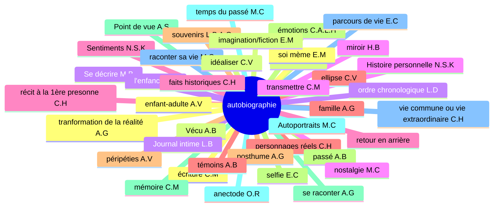
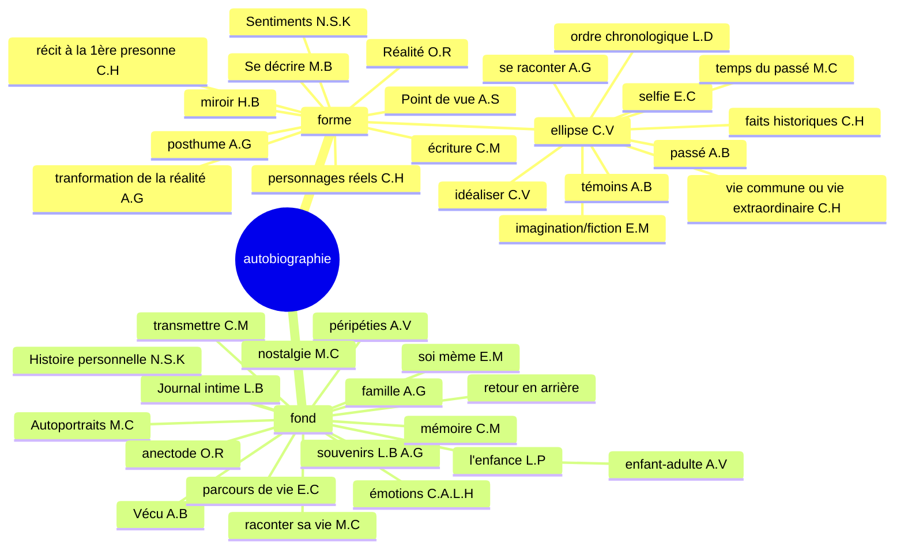
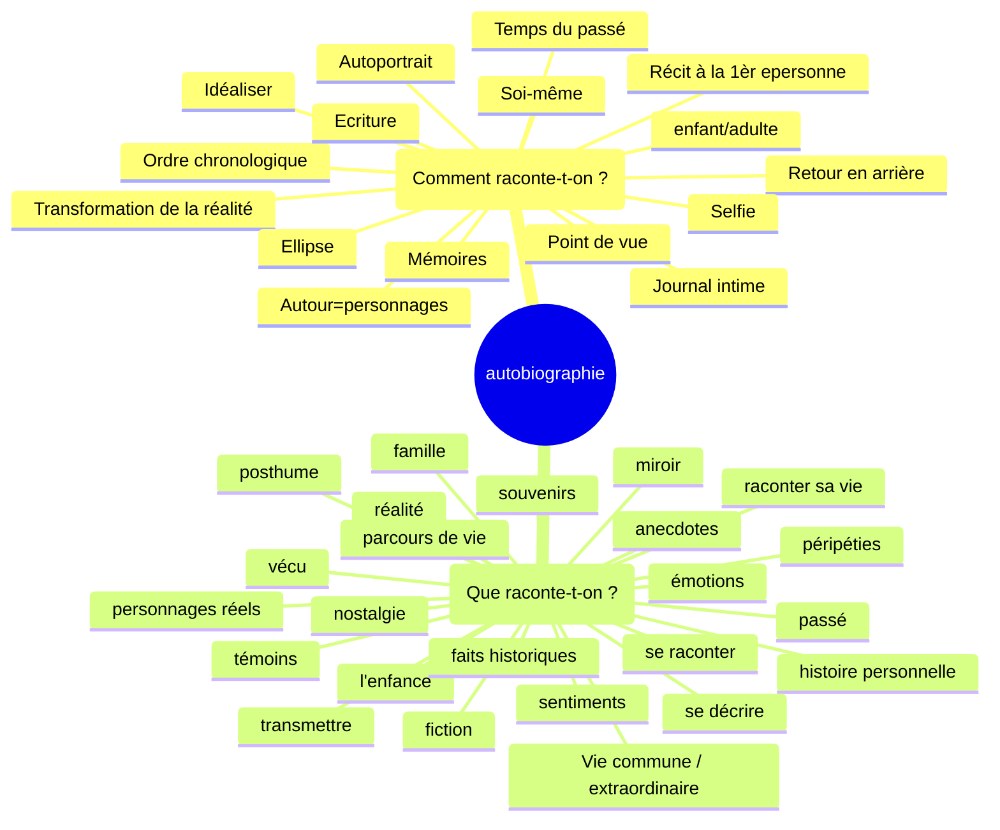

# Séquence 2 : L'autobiographie
## 2) Activité 2 : Etymologie

Décomposer le mot autobiographie en ces différents éléments. Nommer ces différents éléments et donner leur sens.

Auto (de soi-même/ par soi-même) (préfixe) — bio (vie) (radical) — graphie (tracer) (suffixe)

| auto           | bio         | graphie       |
|----------------|-------------|---------------|
| automatisme    | biologie    | graphique     |
| automatisation | biologique  | graphologie   |
| automatisé     | biologiste  | graphologue   |
| auto-édition   | biographie  | graphiste     |
| autologie      | microbiote  | graphisme     |
|                |             | spectrographe |
|                |             | écographie    |
|                |             | géographe     |
|                |             | sysmographe   |

19

+ _

| auto           | bio            | graphie        |
|----------------|----------------|----------------|
| autopsie       | biogaz         | sérigraphie    |
| autodérision   | biologiste     | photographie   |
| automutilation | biodégradable  | cinématographe |
| autodéfense    | biodiverstié   | caligraphie    |
| autonome       | biopic         | orthographe    |
| autoportrait   | bioéthique     | sténographe    |
| autodidacte    | bioluminescent | lithographie   |
| autographe     | biocarburant   | chorégraphie   |
| autocratie     | biotope        | graphologue    |
| autocollant    | biosphère      | échographie    |
| autocritique   | biométrie      |                |
| autochtone     |                |                |
| autosatisfait  |                |                |
| autocensure    |                |                |

TD Bordas p. 64-65

6 :
rival : rivaliser → rivalité
crème : crémeu → écrémé
uni : union → unifier

7 :

1. bi(deux) cyclette(roues) : deux-roues
2. anti (contre) constitutionellement (qui respecte la constitution) : contre la constitution
3. in inflammable: non inflammable
4. ex patrie r: sortir de la patrie

8:

1. populaire, population
2. manuel
3. clairon

9: 

adjectif + nom
adjectif + nom
adverbe + nom
verbe + nom

## 3) Activité 3 : Carte mentale

philizot

# Séquence 2 (le vrai départ)
## Séance 1: Etude du Texte 1 : Une perfidie digne de l'enfer

Appliquez à ce texte les Etapes 1 et 2 vues au cours de la Séquence 1

etape 1: Je m'attends à ce soit un roman/nouvelle parlant d'une trahison.

etape 2: Vocabulaire : aucun; 
Situation d'énonciation: ancrée
Type de texte: Texte narratif

gré
calomnie: accusation fausse qui atteint l'honneur de quelqu'un
infâmes
fiscale
pittoresque
parées

que sait-on du narrateur 5 infos

statut social: 

« Une perfidie digne de l'enfer »

Le malheur voulut que M. Lebrun, qui, contre mon gré, faisait batir une maison rue du Gros-
-Chenét, donnât par 1a prétexte à la calomnie. Certainement lui et moi nous avions gagné assez
d'argent pour nous permettre une pareille dépense ; cependant certaines gens soutenaient que M. de
Calonne payait cette maison. — Vous voyez, disais-je sans cesse à M. Lebrun, quels infâmes
propos l'on tient ! — Laissez-les dire, me répondait-il dans une sainte colère ; quand vous serez
morte, je ferai élever dans mon jardin une pyramide qui ira jusqu'au ciel, et je ferai graver dessus la
liste de vos portraits ; on saura bien alors à quoi s'en tenir sur votre fortune. (...)

Mon indifférence pour la fortune tenait sans doute alors au peu de besoin que j'avais d'être riche.
Ce qui rendait ma maison agréable n'exigeant aucun luxe, j'ai toujours vécu fort modestement. Je
dépensais extrêmement peu pour ma toilette : on me reprochait méme trop de négligence, car je ne
portais que des robes blanches, de mousseline ou de linon, et je n'ai jamais fait faire de robes parées
que pour mes séances 4 Versailles. Ma coiffure ne me coutait rien, j'arrangeais mes Cheveux moi-même, 
et le plus souvent je tortillais sur ma téte un fichu de mousseline, ainsi qu'on peut le voir
dans mes portraits, 4 Florence, 4 Pétersbourg et 4 Paris, chez M. de Laborde. Dans tous mes
portraits enfin, je me suis peinte ainsi, excepté dans celui qui est au ministère de l'Intérieur, où je
suis costumée a la grecque. Certes, ce n'était pas une telle femme que pouvait séduire le titre de
receveur-général des finances, et, sous tout autre rapport, M. de Calonne m’a toujours semblé peu
séduisant ; car il portait une perruque fiscale. Une perruque ! jugez comme, avec mon amour du
pittoresque, j'aurais pu m'accoutumer a une perruque ! je les ai toujours eues en horreur, au point de
refuser un riche mariage, parce que le prétendant portait perruque ; et je ne peignais qu’à regret les
hommes coiffés ainsi.

Ce qu'il y a d'ailleurs de surprenant dans cette affaire, c'est que rien n'avait pu prêter une ombre
de vraisemblance à la calomnie ; je connaissais 4 peine M. de Calonne. Une seule fois dans ma vie
j'avais été chez lui au ministère des Finances ; il donnait une grande soirée au prince Henri de
Prusse, et ce prince venant habituellement chez moi, il avait jugé convenable de m'inviter ; enfin, je
me souviens d'avoir haté son portrait au point de ne pas faire les mains d'aprés lui, quoique j'eusse
l'habitude de les faire toujours d'aprés mes modèles.
Je n'aurais donc jamais imaginé de quelle source pouvaient naitre ces propos désolants, sans la
découverte que je fis plus tard d'une perfidie digne de l'enfer.

1. Le narrateur est une femme, car on a des accords au féminin : "quand vous serez morte" (l. 5-6), "je me suis peinte" (l. 15), "une telle femme" (l. 16)
2. La narratrice est peintre : "je me suis peinte" (l. 15), "la liste de vos portraits" (l. 7), "je ne peignais qu'à regret" (l. 20)
3. La narratrice peint avec talent, car ses portraits sont exposés partout. "à Florence, à Petersbourg et à Paris" (l.14), "au ministère de l'Intérieur" (l. 15) et peint des personnes importantes. "prince Henri de Prusse" (l. 24-25)
4. La narratrice vient d'un milieu aisé : "votre fortune" (l. 7), "Nous avions gagné assez d'argent" (l. 2-3)
5. La narratrice vit simplement, elle est économe : "j'ai toujours vécu fort modestement" (l. 9), "Je dépensais extrêmement peu" (l. 10-11), "Ma coiffure ne me coûtait rien" (l. 12)
6. La narratrice est désintéressée : "Mon indifférence pour la fortune" (l. 8)
7. La narratrice n'est pas coquette : "Je ne portai que des robes blanches" (l. 11), "Ma coiffure ne me coûtait rien" (l. 12)

Louise Elisabeth Vigée Lebrun

Souvenirs (écrits entre 1825 et 1837)

Née en 1755 et morte en 1842

à vécu la révolution française, 1789

Élisabeth Vigée Le Brun (LEVL) a écrit ce texte pour répondre aux calomnies. Elle y présente plusieurs arguments : 

1. Son mode de vie modeste réfute l'idée d'un besoin d'argent: Elle insiste sur sa simplicité et son indépendance financière: « Je dépensais extrêmement peu pour ma toilette : on me reprochait même trop de négligence, car je ne portais que des robes blanches, de mousseline ou de linon. »* 
2. Son succès repose uniquement sur son travail d’artiste: « Quand vous serez morte, je ferai élever dans mon jardin une pyramide qui ira jusqu’au ciel, et je ferai graver dessus la liste de vos portraits. »
3. La calomnie est infondée car elle connaissait à peine M. de Calonne :« Une seule fois dans ma vie j'avais été chez lui au ministère des Finances. »

LEVL à écrit ce texte pour se justifier, por se laver de l'accusation portée contre elle: elle serait la maïtresse de M. De Calonne, qui la paierait pour ceci.

déja des thunes + vit simplement + ne connais pas M. De Calonne + pas attirant + 

Louise Elisabeth Vigée Lebrun écrit ce texte pour répondre aux calomnies. Elle 
présente plsusieurs arguments. Tout d'abord, elle avance l'absence d'une 
nécessité d'argent en 0expliquant sa simplicité 
("j'ai toujours vécu fort modestement", "je dépensais extrêmement peu", 
"ma coiffure ne me coûtait rien") et sa richesse: 
("nous avions gagné assez d'argent"). La narratrice explique aussi l'origine
de sa fortune, ses oeuvres qui sont exposées partout 
("à Florence, a Petersbourg et à Paris"). Elle avance aussi le fait qu'elle
ne connait pas Mr De Calonne (, 

Dans ce texte, Louise Élisabeth Vigée Le Brun répond aux calomnies l'accusant d'être la maîtresse de M. de Calonne, qui l'aurait financée. Elle affirme d'abord son indépendance financière et son mode de vie simple : *« J'ai toujours vécu fort modestement »*, expliquant qu'elle n'avait aucun besoin d'argent grâce à sa propre richesse : *« Nous avions gagné assez d'argent. »* Elle met également en avant le succès de son travail d’artiste, attesté par ses portraits exposés dans des lieux prestigieux (*« à Florence, à Petersbourg et à Paris »*), prouvant que sa fortune repose uniquement sur son talent. De plus, elle souligne qu’elle connaissait à peine M. de Calonne : *« Une seule fois dans ma vie j'avais été chez lui »*, et déclare qu’il ne l’attirait pas, notamment à cause de sa *« perruque fiscale »*, ridiculisant ainsi l’accusation. Enfin, elle insiste sur l’absence totale de fondement de ces rumeurs, concluant que rien ne pouvait leur donner de vraisemblance. Par ces arguments, elle cherche à défendre son honneur et à démontrer que sa vie et sa réussite étaient uniquement dues à son travail et à son talent.

LEVL a écrit ce texte pour se justifier de la calomnie dont elle est victime.
Tout d'abord, elle a suffisamment d'argent : "nous avions gagné assez d'argent" (l. 2-3).
Ensuite, LEVL ajoute qu'elle est désintéressée : "Mon indifférence pour la fortune" (l. 8).
Puis, elle vit simplement : "je dépensais extrêmement peu" (l. 10).
De plus, M. de Calonne est un homme qui, pour elle, n'est pas attirant : "M. de Calonne m'a toujours semblé peu séduisant" (l. 17-18).
Pour finir, elle connait à peine cet homme : "Une seule fois dans ma vie j'avais été chez lui" (l. 23-24)

Dans l'autobiographie, l'auteur, le narrateur et le personnage ont la même identité

Le récit autobiographique est un récit intime, rétrospectif. 

Une des raisons qui peuvent pousser les écrivains à écrire leur autobiographie est le besoin de ce justifier.

Texte narratif à visée argumentative. Présence d'un narrateur (ici, une narratrice). Expression d'une opinion : subjectivité 

## Séance 2: L'expression de la subjectivité: Modalisation et modalisateurs

1. _
   1. Objectif
   2. Subjectif
   3. Subjectif
   4. Objectif
   5. Subjectif
2. _
   1. Il ^^me semble^^ que les cinémas étaient plus fréquentés autrefois.
   2. Lola a ^^bien sûr^^ raté son train.
   3. ^^J’apprécie^^ votre aide en ces moments difficiles.
   4. Notre plan a ^^malheureusement^^ échoué, il était ^^certainement^^ irréalisable.
   5. Ce local est, certes, exigu, mais pour ma part, je le ^^trouve^^ suffisant pour mon activité.
   6. Vous avez ^^peut-être^^ raison, mais ^^j’en doute^^
3. _
   1. Alexis est ^^étourdi^^, ^^il a une cervelle de moineau^^: péjoratif, métaphore
   2. La nouvelle autoroute ^^serait^^ ouverte prochainement à la circulation: vocabulaire mélioratif
   3. Son regard est ^^glacial^^ et ^^aussi noir qu’un ciel d’orage^^: péjoratif, métaphore
4. Un _énorme_ incendie a détruit plusieurs hectares de forêt. Ce sont _probablement_ _encore_ de _mauvais_ campeurs qui ont provoqué ce sinistre en faisant _un mauvais_ feu

_

### Exercice 5
1. Heureseument, notre voyage se termine et j'en suis heureux
2. Vous avez certainement raison, j'en suis sur

### Exercice 6
1. Valorisante: variées et stimulantes, chaleureuse
2. Neutre
3. Dévalorisante: fragile, inconfortable

### Exercice 7

1. Malheureusement, votre séjour parmis nous à été trop bref.
2. La commune pourrait agrandir le stade
3. Nous allons finalement passer une semaine à la montagne
4. Chacun doit veiller à préserver la nature

### Exercice 8

Ces élèves ont au moins bavardé pendant 3 heures !
Les êtres humains ont tendance à bavarder.

Cette journée fut extrêmement longue !
Les journées d'été sont les plus longues.

### Exercice 9

des cheveux rêches + une terre fertile - un climat tempéré - un élève négligent - une eau pure - des idées claires

Retrouvez dans le texte de LEVL les modalisateurs

malheur - prétexte - calomnie - infâmes - négligence - peu - fortune - 

malheur - infâmes - assez d'argent - sainte - certainement - sans doute - fort modestement - extrêmement peu - même - certes - telle - sous tout autres rapport - m'a semblé - jugez comme - peu séduisant - j'aurais pu - en honneur - à regret - surprenant - il avait jugé convenable - digne de l'enfer - je n'aurais donc jamais imaginé - désolants - 

l'air - découragement - croassement

Martin - corbeau - voyageur

+ onomatopées

Exercice sur les classes grammaticales

Il voyait le soleil. La chambre, dès qu'il leva le volet, en fut inondée. Il ouvrit la fenêtre et apreçut, en face, à trente mètres au moins, un immeuble blanc tout pareil au leur. En face aussi, chaque appartement avait un balcon de ciment et, sur quelques-uns de ces balcons, du linge séchait.

La rue des Francs-Bourgeois, à l'endroit où ils habitaient trois jours plus tôt encore, était à peine large de cinq mètres et on devait descendre du trottoir quand on croisait un passant

Deux avions vrombissaient dans le ciel, parfois cachés par la brume matinale. On n'était qu'à huit kilomètes d'Orly.

Il: pronom
Chambre: nom
Dès qu': locution conjonctive
le: déterminant
en: pronom
leur: pronom
chaque: déterminant
et: conjonction de coordination
ces: déterminant
à: préposition
où: adverbe relatif
encore: adverbe
large: adjectif qualificatif
de: préposition
quand: conjonction de subordination
croisait: verbe
dans: préposition
parfois: adverbe
on: pronom
huit: adjectif numéral