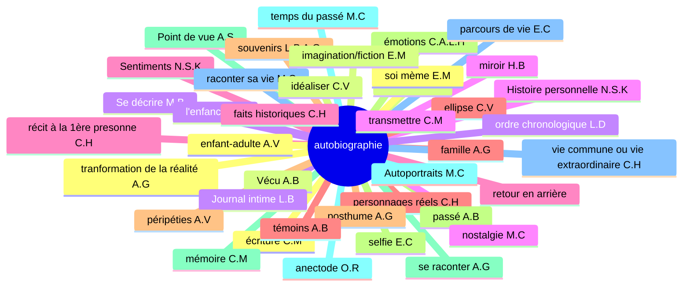
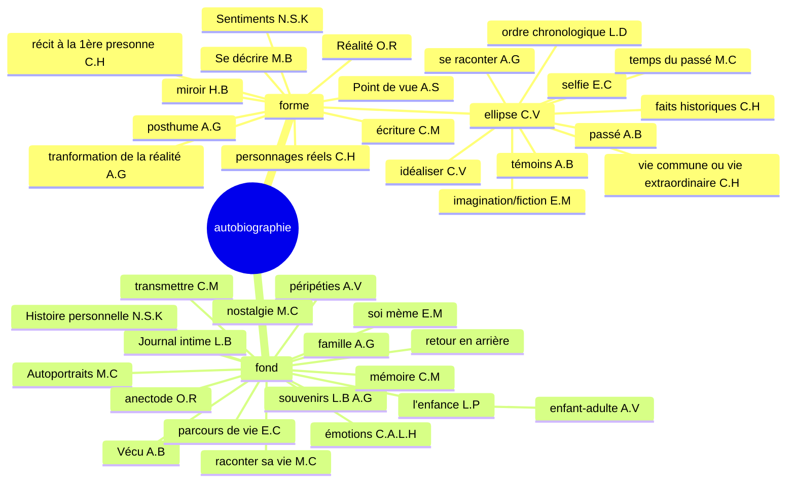
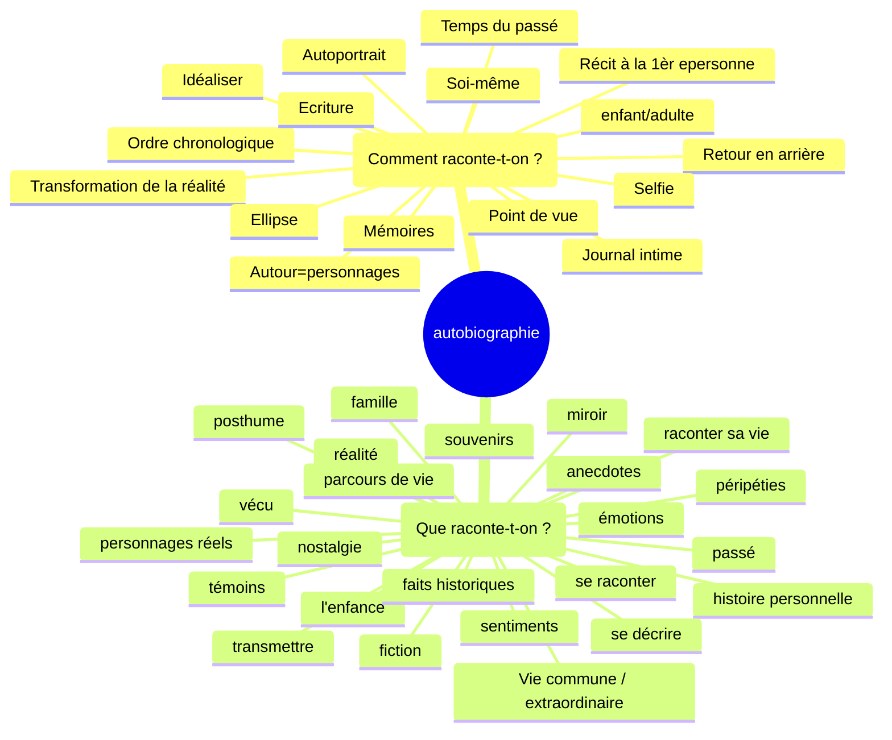

# Séquence 2 : L'autobiographie
## 2) Activité 2 : Etymologie

Décomposer le mot autobiographie en ces différents éléments. Nommer ces différents éléments et donner leur sens.

Auto (de soi-même/ par soi-même) (préfixe) — bio (vie) (radical) — graphie (tracer) (suffixe)

| auto           | bio         | graphie       |
|----------------|-------------|---------------|
| automatisme    | biologie    | graphique     |
| automatisation | biologique  | graphologie   |
| automatisé     | biologiste  | graphologue   |
| auto-édition   | biographie  | graphiste     |
| autologie      | microbiote  | graphisme     |
|                |             | spectrographe |
|                |             | écographie    |
|                |             | géographe     |
|                |             | sysmographe   |

19

+ _

| auto           | bio            | graphie        |
|----------------|----------------|----------------|
| autopsie       | biogaz         | sérigraphie    |
| autodérision   | biologiste     | photographie   |
| automutilation | biodégradable  | cinématographe |
| autodéfense    | biodiverstié   | caligraphie    |
| autonome       | biopic         | orthographe    |
| autoportrait   | bioéthique     | sténographe    |
| autodidacte    | bioluminescent | lithographie   |
| autographe     | biocarburant   | chorégraphie   |
| autocratie     | biotope        | graphologue    |
| autocollant    | biosphère      | échographie    |
| autocritique   | biométrie      |                |
| autochtone     |                |                |
| autosatisfait  |                |                |
| autocensure    |                |                |

TD Bordas p. 64-65

6 :
rival : rivaliser → rivalité
crème : crémeu → écrémé
uni : union → unifier

7 :

1. bi(deux) cyclette(roues) : deux-roues
2. anti (contre) constitutionellement (qui respecte la constitution) : contre la constitution
3. in inflammable: non inflammable
4. ex patrie r: sortir de la patrie

8:

1. populaire, population
2. manuel
3. clairon

9:

adjectif + nom
adjectif + nom
adverbe + nom
verbe + nom

## 3) Activité 3 : Carte mentale

philizot

# Séquence 2 (le vrai départ)
## Séance 1 : Etude du Texte 1 : Une perfidie digne de l'enfer

Appliquez à ce texte les Etapes 1 et 2 vues au cours de la Séquence 1

etape 1: Je m'attends à ce soit un roman/nouvelle parlant d'une trahison.

etape 2: Vocabulaire : aucun;
Situation d'énonciation: ancrée
Type de texte: Texte narratif

gré
calomnie: accusation fausse qui atteint l'honneur de quelqu'un
infâmes
fiscale
pittoresque
parées

que sait-on du narrateur 5 infos

statut social:

« Une perfidie digne de l'enfer »

Le malheur voulut que M. Lebrun, qui, contre mon gré, faisait batir une maison rue du Gros-
-Chenét, donnât par 1a prétexte à la calomnie. Certainement lui et moi nous avions gagné assez
d'argent pour nous permettre une pareille dépense ; cependant certaines gens soutenaient que M. de
Calonne payait cette maison. — Vous voyez, disais-je sans cesse à M. Lebrun, quels infâmes
propos l'on tient ! — Laissez-les dire, me répondait-il dans une sainte colère ; quand vous serez
morte, je ferai élever dans mon jardin une pyramide qui ira jusqu'au ciel, et je ferai graver dessus la
liste de vos portraits ; on saura bien alors à quoi s'en tenir sur votre fortune. (...)

Mon indifférence pour la fortune tenait sans doute alors au peu de besoin que j'avais d'être riche.
Ce qui rendait ma maison agréable n'exigeant aucun luxe, j'ai toujours vécu fort modestement. Je
dépensais extrêmement peu pour ma toilette : on me reprochait méme trop de négligence, car je ne
portais que des robes blanches, de mousseline ou de linon, et je n'ai jamais fait faire de robes parées
que pour mes séances 4 Versailles. Ma coiffure ne me coutait rien, j'arrangeais mes Cheveux moi-même,
et le plus souvent je tortillais sur ma téte un fichu de mousseline, ainsi qu'on peut le voir
dans mes portraits, 4 Florence, 4 Pétersbourg et 4 Paris, chez M. de Laborde. Dans tous mes
portraits enfin, je me suis peinte ainsi, excepté dans celui qui est au ministère de l'Intérieur, où je
suis costumée a la grecque. Certes, ce n'était pas une telle femme que pouvait séduire le titre de
receveur-général des finances, et, sous tout autre rapport, M. de Calonne m’a toujours semblé peu
séduisant ; car il portait une perruque fiscale. Une perruque ! jugez comme, avec mon amour du
pittoresque, j'aurais pu m'accoutumer a une perruque ! je les ai toujours eues en horreur, au point de
refuser un riche mariage, parce que le prétendant portait perruque ; et je ne peignais qu’à regret les
hommes coiffés ainsi.

Ce qu'il y a d'ailleurs de surprenant dans cette affaire, c'est que rien n'avait pu prêter une ombre
de vraisemblance à la calomnie ; je connaissais 4 peine M. de Calonne. Une seule fois dans ma vie
j'avais été chez lui au ministère des Finances ; il donnait une grande soirée au prince Henri de
Prusse, et ce prince venant habituellement chez moi, il avait jugé convenable de m'inviter ; enfin, je
me souviens d'avoir haté son portrait au point de ne pas faire les mains d'aprés lui, quoique j'eusse
l'habitude de les faire toujours d'aprés mes modèles.
Je n'aurais donc jamais imaginé de quelle source pouvaient naitre ces propos désolants, sans la
découverte que je fis plus tard d'une perfidie digne de l'enfer.

1. Le narrateur est une femme, car on a des accords au féminin : "quand vous serez morte" (l. 5-6), "je me suis peinte" (l. 15), "une telle femme" (l. 16)
2. La narratrice est peintre : "je me suis peinte" (l. 15), "la liste de vos portraits" (l. 7), "je ne peignais qu'à regret" (l. 20)
3. La narratrice peint avec talent, car ses portraits sont exposés partout. "à Florence, à Petersbourg et à Paris" (l.14), "au ministère de l'Intérieur" (l. 15) et peint des personnes importantes. "prince Henri de Prusse" (l. 24-25)
4. La narratrice vient d'un milieu aisé : "votre fortune" (l. 7), "Nous avions gagné assez d'argent" (l. 2-3)
5. La narratrice vit simplement, elle est économe : "j'ai toujours vécu fort modestement" (l. 9), "Je dépensais extrêmement peu" (l. 10-11), "Ma coiffure ne me coûtait rien" (l. 12)
6. La narratrice est désintéressée : "Mon indifférence pour la fortune" (l. 8)
7. La narratrice n'est pas coquette : "Je ne portai que des robes blanches" (l. 11), "Ma coiffure ne me coûtait rien" (l. 12)

Louise Elisabeth Vigée Lebrun

Souvenirs (écrits entre 1825 et 1837)

Née en 1755 et morte en 1842

à vécu la révolution française, 1789

Élisabeth Vigée Le Brun (LEVL) a écrit ce texte pour répondre aux calomnies. Elle y présente plusieurs arguments :

1. Son mode de vie modeste réfute l'idée d'un besoin d'argent: Elle insiste sur sa simplicité et son indépendance financière: « Je dépensais extrêmement peu pour ma toilette : on me reprochait même trop de négligence, car je ne portais que des robes blanches, de mousseline ou de linon. »*
2. Son succès repose uniquement sur son travail d’artiste: « Quand vous serez morte, je ferai élever dans mon jardin une pyramide qui ira jusqu’au ciel, et je ferai graver dessus la liste de vos portraits. »
3. La calomnie est infondée car elle connaissait à peine M. de Calonne :« Une seule fois dans ma vie j'avais été chez lui au ministère des Finances. »

LEVL à écrit ce texte pour se justifier, por se laver de l'accusation portée contre elle: elle serait la maïtresse de M. De Calonne, qui la paierait pour ceci.

déja des thunes + vit simplement + ne connais pas M. De Calonne + pas attirant +

Louise Elisabeth Vigée Lebrun écrit ce texte pour répondre aux calomnies. Elle
présente plsusieurs arguments. Tout d'abord, elle avance l'absence d'une
nécessité d'argent en 0expliquant sa simplicité
("j'ai toujours vécu fort modestement", "je dépensais extrêmement peu",
"ma coiffure ne me coûtait rien") et sa richesse:
("nous avions gagné assez d'argent"). La narratrice explique aussi l'origine
de sa fortune, ses oeuvres qui sont exposées partout
("à Florence, a Petersbourg et à Paris"). Elle avance aussi le fait qu'elle
ne connait pas Mr De Calonne (,

Dans ce texte, Louise Élisabeth Vigée Le Brun répond aux calomnies l'accusant d'être la maîtresse de M. de Calonne, qui l'aurait financée. Elle affirme d'abord son indépendance financière et son mode de vie simple : *« J'ai toujours vécu fort modestement »*, expliquant qu'elle n'avait aucun besoin d'argent grâce à sa propre richesse : *« Nous avions gagné assez d'argent. »* Elle met également en avant le succès de son travail d’artiste, attesté par ses portraits exposés dans des lieux prestigieux (*« à Florence, à Petersbourg et à Paris »*), prouvant que sa fortune repose uniquement sur son talent. De plus, elle souligne qu’elle connaissait à peine M. de Calonne : *« Une seule fois dans ma vie j'avais été chez lui »*, et déclare qu’il ne l’attirait pas, notamment à cause de sa *« perruque fiscale »*, ridiculisant ainsi l’accusation. Enfin, elle insiste sur l’absence totale de fondement de ces rumeurs, concluant que rien ne pouvait leur donner de vraisemblance. Par ces arguments, elle cherche à défendre son honneur et à démontrer que sa vie et sa réussite étaient uniquement dues à son travail et à son talent.

LEVL a écrit ce texte pour se justifier de la calomnie dont elle est victime.
Tout d'abord, elle a suffisamment d'argent : "nous avions gagné assez d'argent" (l. 2-3).
Ensuite, LEVL ajoute qu'elle est désintéressée : "Mon indifférence pour la fortune" (l. 8).
Puis, elle vit simplement : "je dépensais extrêmement peu" (l. 10).
De plus, M. de Calonne est un homme qui, pour elle, n'est pas attirant : "M. de Calonne m'a toujours semblé peu séduisant" (l. 17-18).
Pour finir, elle connait à peine cet homme : "Une seule fois dans ma vie j'avais été chez lui" (l. 23-24)

Dans l'autobiographie, l'auteur, le narrateur et le personnage ont la même identité

Le récit autobiographique est un récit intime, rétrospectif.

Une des raisons qui peuvent pousser les écrivains à écrire leur autobiographie est le besoin de ce justifier.

Texte narratif à visée argumentative. Présence d'un narrateur (ici, une narratrice). Expression d'une opinion : subjectivité

## Séance 2 : L'expression de la subjectivité : Modalisation et modalisateurs

1. _
    1. Objectif
    2. Subjectif
    3. Subjectif
    4. Objectif
    5. Subjectif
2. _
    1. Il ^^me semble^^ que les cinémas étaient plus fréquentés autrefois.
    2. Lola a ^^bien sûr^^ raté son train.
    3. ^^J’apprécie^^ votre aide en ces moments difficiles.
    4. Notre plan a ^^malheureusement^^ échoué, il était ^^certainement^^ irréalisable.
    5. Ce local est, certes, exigu, mais pour ma part, je le ^^trouve^^ suffisant pour mon activité.
    6. Vous avez ^^peut-être^^ raison, mais ^^j’en doute^^
3. _
    1. Alexis est ^^étourdi^^, ^^il a une cervelle de moineau^^: péjoratif, métaphore
    2. La nouvelle autoroute ^^serait^^ ouverte prochainement à la circulation: vocabulaire mélioratif
    3. Son regard est ^^glacial^^ et ^^aussi noir qu’un ciel d’orage^^: péjoratif, métaphore
4. Un _énorme_ incendie a détruit plusieurs hectares de forêt. Ce sont _probablement_ _encore_ de _mauvais_ campeurs qui ont provoqué ce sinistre en faisant _un mauvais_ feu

_

### Exercice 5
1. Heureseument, notre voyage se termine et j'en suis heureux
2. Vous avez certainement raison, j'en suis sur

### Exercice 6
1. Valorisante: variées et stimulantes, chaleureuse
2. Neutre
3. Dévalorisante: fragile, inconfortable

### Exercice 7

1. Malheureusement, votre séjour parmis nous à été trop bref.
2. La commune pourrait agrandir le stade
3. Nous allons finalement passer une semaine à la montagne
4. Chacun doit veiller à préserver la nature

### Exercice 8

Ces élèves ont au moins bavardé pendant 3 heures !
Les êtres humains ont tendance à bavarder.

Cette journée fut extrêmement longue !
Les journées d'été sont les plus longues.

### Exercice 9

des cheveux rêches + une terre fertile - un climat tempéré - un élève négligent - une eau pure - des idées claires

Retrouvez dans le texte de LEVL les modalisateurs

malheur - prétexte - calomnie - infâmes - négligence - peu - fortune -

malheur - infâmes - assez d'argent - sainte - certainement - sans doute - fort modestement - extrêmement peu - même - certes - telle - sous tout autres rapport - m'a semblé - jugez comme - peu séduisant - j'aurais pu - en honneur - à regret - surprenant - il avait jugé convenable - digne de l'enfer - je n'aurais donc jamais imaginé - désolants -

l'air - découragement - croassement

Martin - corbeau - voyageur

+ onomatopées

Exercice sur les classes grammaticales

Il voyait le soleil. La chambre, dès qu'il leva le volet, en fut inondée. Il ouvrit la fenêtre et apreçut, en face, à trente mètres au moins, un immeuble blanc tout pareil au leur. En face aussi, chaque appartement avait un balcon de ciment et, sur quelques-uns de ces balcons, du linge séchait.

La rue des Francs-Bourgeois, à l'endroit où ils habitaient trois jours plus tôt encore, était à peine large de cinq mètres et on devait descendre du trottoir quand on croisait un passant

Deux avions vrombissaient dans le ciel, parfois cachés par la brume matinale. On n'était qu'à huit kilomètes d'Orly.

Il: pronom -> 1
Chambre: nom -> 0.5
Dès qu': conjonction de subordination -> 0
le: déterminant -> 0
en: pronom -> 0.5
leur: pronom -> 0.5
chaque: déterminant ->  0.5
et: conjonction de coordination -> 1
ces: déterminant -> 0.5
à: préposition -> 1
où: adverbe relatif ->  0
encore: adverbe -> 1
large: adjectif qualificatif -> 1
de: préposition -> 1
quand: conjonction de subordination -> 1
croisait: verbe -> 1
dans: préposition -> 1
parfois: adverbe -> 1
on: pronom -> 0.5
huit: adjectif numéral -> 0.5

15.5

1. Subite : Qui se produit soudainement, de manière imprévue et rapide.
2. Ardents : Qui brûle avec intensité, littéralement ou figurativement ; peut aussi désigner une passion ou un désir très vif.
3. Impétueux : Qui agit ou se déplace avec fougue et sans retenue, ou qui manifeste une grande énergie et un caractère passionné.
4. Couvent : Maison religieuse où vivent des moines ou des moniales qui ont fait vœu de consacrer leur vie à Dieu.
5. Vocation : Inclination ou appel profond pour une profession, une activité ou une mission considérée comme un idéal.
6. Futilité : Caractère de ce qui est insignifiant, sans importance ou inutile.
7. Insouciant : Qui ne se préoccupe pas des soucis, des dangers ou des responsabilités ; léger et détendu.
8. Paralyse : Incapacité temporaire ou permanente de bouger une partie du corps ou, au sens figuré, de réagir face à une situation.
9. Mélancolique : Qui exprime ou éprouve une tristesse douce, vague et rêveuse.
10. Irruption : Entrée soudaine et souvent violente dans un lieu ou un groupe.

La narratrice est une femme, elle vit au 19 ème siècle ("18 juillet 1879" (l. 1)),
et âgée de 17 ans ("J'ai maintenant dix-sept ans" (l. 3)). Elle a la résolution de tenir un journal
("Je prends [...] une [...] résolution: celle de tenir un journal" (l. 1)). Elle explore ces sentiments dans ce texte et imagine
une vie plus libre, vivant dans un couvent
("mon imagination à la bride sur le cou. Je me vois parfois dans le monde, courant de plaisir en plaisir ;
et le lendemain, je me retrouve entre les quatre murs de mon couvent" (l. 1-2)).
Elle a aussi reçu une demande en mariage ("Il me faut noter que j'ai reçu une demande en mariage" (l. 26))

Tout d'abord, la narratrice est une femme "paresseuse" (l. 32), Elle vit au XIXe siècle "1879" (l. 1).
Ensuite, elle entre dans l'âge adulte "dix-sept ans" (l. 3). Elle est spontanée "caractère insouciant et enfantin" (l. 4).
La narratrice est sensible à l'art "le sentiment [...] lorsque j'entends de la belle musique [...]: l'inspiration" (l. 9-11).
Elle aime bien la littérature et la poésie "ce que je ressens est peut-être ce qui anime les poètes" (l. 10-11)
"J'ai une légère inclination vers la littérature" (l. 31). Puis, elle est aussi instruite et cultivée
"J'ai lu ce soir du Lamartine" (l. 8). De plus elle appartient à une classe sociale aisée :
"je me retrouve entre les quatre murs de mon couvent" (l. 18-19). Enfin, elle a failli se marier :
"j'ai reçu une demande en mariage" (l. 26)

* Quels eléments montre qu'il s'agit d'un journal intime ?
* A qui l'autrice destine-t-elle son récit ?
* Pour quelle raisons décide-t-elle de tenir son journal ?
* A quelle personne la narration est-elle menée ?
* A quel temps le journal est-il principalement écrit ?
* Quel est le champ lexical dominant ?

1. **Quels éléments montrent qu'il s'agit d'un journal intime ?**
    - L'écriture est à la première personne du singulier, ce qui traduit une réflexion personnelle.
    - Les dates précises en début de chaque entrée structurent le texte comme un journal.
    - L'autrice partage des pensées et des émotions intimes, parfois contradictoires, sans chercher à les dissimuler.

2. **À qui l’autrice destine-t-elle son récit ?**
    - À elle-même, principalement, comme un moyen de confier ses pensées et émotions. Elle mentionne aussi l'absence d'un confident, ce qui renforce l'idée que le journal est un substitut.

3. **Pour quelles raisons décide-t-elle de tenir son journal ?**
    - Elle souhaite consigner ses impressions et pensées, qu’elle décrit comme un "miroir" de ses émotions et réflexions.
    - Elle ressent un besoin d’exprimer ce qu’elle ne peut pas partager avec autrui.

4. **À quelle personne la narration est-elle menée ?**
    - À la première personne du singulier ("je").

5. **À quel temps le journal est-il principalement écrit ?**
    - Il est écrit principalement au passé simple et à l’imparfait pour raconter les événements et les états d’âme. Quelques passages au présent renforcent l'immédiateté des réflexions.

6. **Quel est le champ lexical dominant ?**
    - Le champ lexical des émotions et des sentiments domine : "amour", "mélancolique", "rêveuse", "inspiration", "plaisir", "imagination".

**18 juillet 1879**. Vendredi

Je prends ce soir une subite résolution : celle de tenir un journal, miroir de mes impressions.

J'ai maintenant dix-sept ans et connais à peine les sentiments ardents et les illusions qu'on attribue à l'adolescence - à cause peut-être de mon caractère insouciant et enfantin.  
L'irruption spontanée de ces sensations en mon âme fait vibrer toutes mes cordes. Seraient-ce les premiers souffles impétueux de l'amour ? Je deviens mélancolique et rêveuse,  
et ne me sens pas dans mon état normal. Le cœur a un grand besoin d'aimer, mais il ne sait pas encore où se fixer... J'ai lu ce soir du Lamartine : les *Confidences* et *Graziella*.  
Dans mon présent état d'esprit, cette lecture a eu chez moi l'effet du vent sur la flamme. Le sentiment dont je parle est celui que je ressens lorsque j'entends de la belle musique ;  
et ce que je ressens est peut-être ce qui anime les poètes : l'inspiration.

Je voudrais alors traduire mes idées avec la plume, ou les confier à quelqu'un dans l'intimité ; mais mon impuissance à rendre pleinement mes impressions, et l'absence du confident  
souhaité, me paralysent.

**20 juillet 1879**. Dimanche

Ces jours-ci, mon imagination a la bride sur le cou. Je me vois parfois dans le monde, courant de plaisir en plaisir ; et le lendemain, je me retrouve entre les quatre murs de mon  
couvent, penchée sur mes livres. L'étude a pour moi un certain attrait ; et j'envisage sans trop de déplaisir une dernière année d'études, comme pensionnaire. J'aime bien la  
société, mais je ne suis pas encore d'âge à presser une vocation. Je puis encore rester un an dans l'ombre, sans que mes charmes - si charmes il y a - en souffrent le moins du monde.  
Tout cela m'amène à penser que les impressions d'hier ne sont pas celles d'aujourd'hui, et seront sujet d'indifférence demain. Les émotions que je ressentais ces jours-ci se sont envolées,  
et je dois en constater la futilité.

Il me faut noter que j'ai reçu une demande en mariage. Quand je pense à la charpente prononcée du prétendant, à sa figure florissante et par trop épanouie, je ne m'étonne pas de la réponse  
aussi brève que négative que je lui fis.

Voilà un souvenir que je raconterai à mes petits-neveux lorsque, vieille et célibataire, je leur parlerai du passé : du temps où, jeune et charmante, j'ai refusé un brillant.

J'ai une légère inclination vers la littérature. J'ai écrit ces jours-ci quelques petites chroniques que papa me promet de faire publier, si je ne suis pas trop paresseuse pour  
les corriger et les mettre au point. L'avouerai-je ? La paresse a mille chances de triompher sur l'ambition de donner au public mes essais littéraires. Je suis cependant résolue  
à dompter cette vilaine bête et à me mettre au travail.

1. **18 juillet 1879**
2. **20 juillet 1879**
3. "Ces jours-ci"
4. "Hier"
5. "Aujourd'hui"
6. "Demain"
7. "Ces jours-ci" (répété)
8. "Ces jours-ci" (dans un autre contexte)
9. "Lorsque, vieille et célibataire"
10. "Du passé"
11. "Du temps où, jeune et charmante"

rendre rapport de stage
avoir le compte rendu d'autobiographie prêt

fond

* narration: 4 étapes: 2pts (arrivée, acceuil, décision, réaction)
* argumentation: 2pts
    * autonomie
    * aider les parents
* narration: 1pts
* description de la machine: 2pts (figures de style, expansions du nom...)
* explication sous la forme d'un dialogue: 2pts
* chute humoristique: 1pts

Joséphine Marchand, *Journal Intime*, (1879-1900)

Née en 1861. Morte en 1925

Pionière du journalisme féminin au canada

Elle a laancé le premier journal féminin au Canada.

1) Les éléments qui montre que ce texte est un journal intime sont: les dates (jour, mois, année): "18 juillet 1879" (l. 1); l'emploi de la 1^e^ personne du singulier: "Je" (l. 1); l'expression des sentiments: "mion de mes impressions" (l. 1-2), "mélancolique et rêveuse" (l. 6).
2) Joséphine Marchand destine son récit à elle-même: "Voilà ce qui me décide à être mon propre confident" (l. 15)
3) Joséphine Marchand tient son journal intime parce qu'elle veut mettre des mots sur ce qu'elle éprouve: "jJe voudrais alors traduire mes idées avec la plume" (L. 12). Elle le fait aussi parce qu'elle n'a personne à qui parler: "l'absence du confident souhaité" (l. 12-13). Ce journal intime va aussi lui permettre de ce rappeler des moments de sa vie passée: "Voilà un souvenir que je raconterais ) mes pettits neveux " (l. 29)
4) La narration est menée à la 1^ère^ personne du singulier: "Je" (l. 1), "mes" (l. 5), "me" (l. 4)

- intime
- journal
- 1ère personne du singulier

!!! abstract "Le journal intime"
C'est un écrit régulier (quotidien ou plus espacé), chronologique. Il est écrit à la 1ère personne.
Il est fait mention des dates, des jours et de l'année de l'écriture. C'est un écrit non fictionnel, privé,
destiné au départ à n'être lu que de celui qui l'écrit. C'est la relation de son vécu (intérieur et extérieur).
La rédaction d'un hournal intime aide à mieux saisir et comprendre ce qui arrive à la personne qui l'écrit, ce qu'elle
éprouve (émotions et sentiments). Il conserve la mémoire des événements traversés et est écrit aux temps du présent (présent comme temps de référence avec recours au passé composé, imparfait et futur simple).

## Séance 5 : Le vocabulaire des émotions et des sentiments

1) Un sentiment est un état plus ou moins fort et durable. l'émotion est une réaction (souvent physique) intense et brève.
2) _

| émotions     | sentiments |
|--------------|------------|
| peur         | tendresse  |
| angoisse     | mépris     |
| joie         | bonheur    |
| tristesse    | amour      |
| colère       | affection  |
| stupéfaction |            |
| effroi       |            |
|              |            |
|              |            |
il y à 7 émotions de base en psychologie. La joie, la tristesse, la colère, la peur, la surprise, le dégout et la honte.
3) _
    1) crainte peur angoisse terreur épouvante
    2) dégoût aversion répulsion horreur
    3) intérêt penchant passion amour
    4) gaieté joie jubilation extase
    5) lassitude tristesse accablement désespoir
4) joie -> trépigner; honte -> rougir; colère -> hurler; rage -> sauter; peur -> blêmir;
5) _
    1) rage -> vert, peur -> bleu, colère -> rouge
        2) Il eu une peur bleue. ça la rendu vert de rage. ça à cause une colère rouge.
6)

Joyeux : Les enfants étaient joyeux en découvrant les cadeaux sous le sapin de Noël.
Allégresse : Une allégresse indescriptible s'empara de la foule lorsque le feu d'artifice illumina le ciel.
Ravissement : Elle regardait le coucher de soleil avec un ravissement qui se lisait sur son visage.
Heureux : Il était heureux de retrouver ses amis après une longue absence.
Émerveillement : L'émerveillement des touristes devant la Tour Eiffel était palpable.
Épanoui : Depuis qu'il a trouvé sa passion, il semble plus épanoui et confiant.
Gaieté : La gaieté des enfants qui jouaient dans le parc était contagieuse.
Réjoui : La bonne nouvelle concernant sa promotion l'a tellement réjoui qu'il a organisé un dîner pour fêter ça.
Plaisir : Elle prend un immense plaisir à lire un livre au coin du feu pendant l'hiver.

Dépit : Chagrin mêlé de colère dû à une déception personnelle

    Adjectif : Dépité(e)

Amertume : Sentiment durable de tristesse mêlée de rancœur

    Adjectif : Amer/amère

Chagrin : État moralement douloureux, tristesse

    Adjectif : Chagrin(e)

Déception : Déconvenue, désillusion

    Adjectif : Déçu(e)

Tourment : Vive souffrance morale qui agite sans cesse l'esprit

    Adjectif : Tourmenté(e)

Nostalgie : Regret du temps passé

    Adjectif : Nostalgique

Dépité(e) :

    Après avoir perdu le concours qu'il avait préparé pendant des mois, il est rentré chez lui, dépité et amer.

Amer/amère :

    Elle ressent une amertume profonde depuis cette trahison qui a bouleversé sa confiance.

Chagrin(e) :

    Elle portait un regard chagrin sur le monde, incapable de se réjouir depuis la perte de son meilleur ami.

Déçu(e) :

    Paul était tellement déçu par le résultat de l'examen qu'il n'a même pas voulu en parler.

Tourmenté(e) :

    Ses nuits étaient tourmentées par des cauchemars récurrents liés à son passé.

Nostalgique :

    En écoutant cette vieille chanson, il est devenu nostalgique de son enfance insouciante.

Son départ a plongé la famille dans la tristesse.
Au premier coup de feu, tout le monde fut saisi de panique.
Les étudiants étaient un peu anxieux le jour de l'épreuve.
La nouvelle a chagriné tout le monde. Ce fut un moment douloureux.
Le réalisateur a réussi à créer une atmosphère sombre, angoissante.
Il était envahi par une profonde peine après l'annonce.
Malgré son sourire, on pouvait deviner une certaine anxiété dans son regard.
Les souvenirs de cette période restent encore très attristés dans son cœur.

1. sortirai, fini: futur simple, passé composé
2. dévoré, s'endort:  passé composé, présent de l'indicatif
3. eurent passé, se referma: passé antérieur, passé simple
4. essayait, avait dit: imparfait, plus-que-parfait
=======
## Séance 6: Etude du Texte 3

Probablement une autobiographie, pas de titre, "Simone de Beauvoir, *Mémoires d'une jeune fille rangée*, 1958, Gallimard"

Vocabulaire: apitoyer, (être touché de pitié )

Mémoires: récit par celui qui les à vécu ou à été témoin des évènements de sa vie.

Paratexte: Simone de Beauvoir, _Mémoires d'une jeune fille rangée_, 1658, Gallimard

encré + coupé

4) _

2. **Tu t’es trompé ?**
    - **Mode** : Indicatif passé composé
    - **Infinitif** : se tromper

2. **Nous nous promènerons**
    - **Mode** : Indicatif futur simple
    - **Infinitif** : se promener

3. **Je me suis amusé ?**
    - **Mode** : Indicatif passé composé
    - **Infinitif** : s’amuser

4. **Souvenez-vous**
    - **Mode** : Impératif présent
    - **Infinitif** : se souvenir

5. **(Il faut que) je me dépêche**
    - **Mode** : Subjonctif présent (→ « que je me dépêche »)
    - **Infinitif** : se dépêcher

5) _

1. **Il entendit**  
   → **Il fut entendu** (passé simple)

2. **Qu’il entende**  
   → **Qu’il soit entendu** (subjonctif présent)

3. **Il entendrait**  
   → **Il serait entendu** (conditionnel présent)

4. **Elle avait entendu**  
   → **Elle avait été entendue** (plus-que-parfait)

5. **Qu’elle ait entendu**  
   → **Qu’elle ait été entendue** (subjonctif passé)

6. **Elle aurait entendu**  
   → **Elle aurait été entendue** (conditionnel passé)

6)

- **Verbes impersonnels** :
    - (l.1) « Il se trouve »
    - (l.2) « il se prépare »
    - (l.3) « Il s’est vendu », « il reste »

- **Verbes pronominaux** :
    - (l.1) « s’est trompé »
    - (l.3) « se désole »
    - (l.4) « s’inquiète »

=======

Les grandes personnes ne partageaient pas nos jeux ni nos plaisirs. Je n'en connaissais aucune qui parût beaucoup s'amuser sur terre: la vie n'est pas gaie, la vie n'est pas un roman, déclaraient-elles en choeur.

La monotonie de l'existence adulte m'avait toujours apitoyée; quand je me rendis compte que dans un bref délai, elle deviendrait mon lot; l'angoisse me prit. Un après-midi, j'aidais maman à faire la vaiselle; elle lavait des assiettes, je les essuyais, par la fenêtre, je voyais le mur de la caserne de pompiers, et d'autres cuisines ou des femmes frottaient des casseroles ou épluchaient des légumes.

Chaque jour, le déjeuner, le dîner; chaqu ejour la vaiselle; ces heures indéfiniment recommencées et qui ne mènent nulle part: vivrais-je ainsi ? Une image se forma dans ma tête, avec une

Le vocabulaire du malheur : "monotonie", "apitoyée", "l'angoisse"
Le vocabulaire de la cuisine : "vaisselles", "assiettes", "casseroles"

Les grandes personnes ne partageaient pas nos jeux ni nos plaisirs. Je n'en connaissais aucune qui
parût beaucoup s'amuser sur terre : « la vie n'est pas gaie, la vie n'est pas un roman »,
déclaraient-elles en chœur.

La monotonie de l'existence adulte m'avait toujours apitoyée ; quand je me rendis compte que, dans un
bref délai, elle deviendrait mon lot, l'angoisse me prit. Un après-midi, j'aidais maman à faire la
vaisselle ; elle lavait des assiettes, je les essuyais ; par la fenêtre, je voyais le mur de la caserne de pompiers et d'autres cuisines où des femmes frottaient des casseroles ou épluchaient des légumes. Chaque jour, le déjeuner, le dîner ; chaque jour, la vaisselle ; ces heures indéfiniment recommencées et qui ne mènent nulle part : vivrais-je ainsi ?

Une image se forma dans ma tête, avec une netteté si désolante que je me la rappelle encore aujourd’hui : une rangée de carrés gris s'étendait jusqu'à l’horizon, diminués selon les lois de la perspective, mais tous identiques et plats ; c’étaient les jours, les semaines et les années. Moi, depuis ma naissance, je m'étais endormie chaque soir un peu plus riche que la veille ; je m'élevais de degré en degré ; mais si, là-haut, je ne trouvais qu'un morne plateau, sans aucun but vers lequel marcher, à quoi bon ?

Non, me dis-je, tout en rangeant dans le placard une pile d’assiettes ; ma vie, à moi, me conduira quelque part. Heureusement, je n'étais pas vouée à un destin de ménagère. Mon père n'était pas féministe ; il admirait la sagesse des romans de Colette Yver où l'avocate, la doctoresse, finissent par sacrifier leur carrière à l'harmonie du foyer ; mais nécessité fait loi : « Vous, mes petites, vous ne vous marierez pas », répétait-il souvent. « Vous n'avez pas de dot, il faudra travailler. »

Je préférais infiniment la perspective d'un métier à celle du mariage ; elle autorisait des espoirs. Il y avait eu des gens qui avaient fait des choses : j’en ferais. Je ne prévoyais pas bien lesquelles. L'astronomie, l'archéologie, la paléontologie tour à tour m'avaient réclamée, et je continuais à caresser vaguement l’idée d’écrire.

Dans ce texte, Simone de Beauvoir s'oppose au destin tout tracé de la majorité des femmes en occident:
n'exister que comme épouse et ménagère, sans exercer d'activités professionnelles. Elle veut être
libre de choisir sa vie.

Elle revendique l'égalité des sexes.

Elle veut aussi montrer que l'émancipation de la femme est possible, son parcours peut ouvrir la voie
à d'autres femmes

!!! abstract "Les Mémoires"

C'est un écrit continu, différent du journal intime (écriture fragmentée, dates).
Les Mémoires sont destinés à être publiés: les sujets personnels ou très intimes
y occupent moins de place que dans le journal. Davantage de place est accordée
au récit, à la relation d'événements, à la peinture d'une époque. Les temps du récit sont au passé.

Les grandes personnes ne partageaient pas nos jeux ni nos plaisirs. Je n'en connaissais aucune qui
parût beaucoup s'amuser sur terre : « la vie n'est pas gaie, la vie n'est pas un roman »,
déclaraient-elles en chœur.

La monotonie de l'existence adulte m'avait toujours apitoyée ; quand je me rendis compte que, dans un
bref délai, elle deviendrait mon lot, l'angoisse me prit. Un après-midi, j'aidais maman à faire la
vaisselle ; elle lavait des assiettes, je les essuyais ; par la fenêtre, je voyais le mur de la caserne
de pompiers et d'autres cuisines où des femmes frottaient des casseroles ou épluchaient des légumes.
Chaque jour, le déjeuner, le dîner ; chaque jour, la vaisselle ; ces heures indéfiniment recommencées et
qui ne mènent nulle part : vivrais-je ainsi ?

Une image se forma dans ma tête, avec une netteté si désolante que je me la rappelle encore aujourd’hui :
une rangée de carrés gris s'étendait jusqu'à l’horizon, diminués selon les lois de la perspective, mais
tous identiques et plats ; c’étaient les jours, les semaines et les années. Moi, depuis ma naissance,
je m'étais endormie chaque soir un peu plus riche que la veille ; je m'élevais de degré en degré ; mais
si, là-haut, je ne trouvais qu'un morne plateau, sans aucun but vers lequel marcher, à quoi bon ?

Non, me dis-je, tout en rangeant dans le placard une pile d’assiettes ; ma vie, à moi, me conduira quelque
part. Heureusement, je n'étais pas vouée à un destin de ménagère. Mon père n'était pas féministe ; il
admirait la sagesse des romans de Colette Yver où l'avocate, la doctoresse, finissent par sacrifier leur
carrière à l'harmonie du foyer ; mais nécessité fait loi : « Vous, mes petites, vous ne vous marierez pas »,
répétait-il souvent. « Vous n'avez pas de dot, il faudra travailler. »

Je préférais infiniment la perspective d'un métier à celle du mariage ; elle autorisait des espoirs.
Il y avait eu des gens qui avaient fait des choses : j’en ferais. Je ne prévoyais pas bien lesquelles.
L'astronomie, l'archéologie, la paléontologie tour à tour m'avaient réclamée, et je continuais à caresser
vaguement l’idée d’écrire.

| Mot                     | Mode Personnel |
|-------------------------|----------------|
| partageaient (ligne 1)  | 1              |
| connaissais (ligne 2)   | 1              |
| déclaraient (ligne 3)   | 1              |
| avait (ligne 5)         | 1              |
| rendis (ligne 5)        | 2              |
| devenait (ligne 6)      | 1              |
| prit (ligne 7)          | 2              |
| lavait (ligne 8)        | 1              |
| essuyais (ligne 8)      | 1              |
| voyais (ligne 9)        | 1              |
| frottaient (ligne 9)    | 1              |
| épluchaient (ligne 9)   | 1              |
| recommencées (ligne 11) | 1              |
| mènent (ligne 11)       | 2              |
| vivrais (ligne 11)      | 3              |
| se forma (ligne 13)     | 2              |
| rappelle (ligne 13)     | 2              |
| étendait (ligne 14)     | 1              |
| s'étaient (ligne 15)    | 1              |
| m'étais (ligne 16)      | 1              |
| endormie (ligne 16)     | 1              |
| trouvais (ligne 17)     | 1              |
| dis (ligne 19)          | 2              |
| rangeant (ligne 19)     | 1              |
| conduira (ligne 19)     | 3              |
| admirait (ligne 21)     | 1              |
| finissent (ligne 21)    | 2              |
| répétait (ligne 23)     | 1              |
| faudra (ligne 23)       | 3              |
| préférais (ligne 25)    | 1              |
| autorisait (ligne 25)   | 1              |
| avaient (ligne 26)      | 1              |
| faisaient (ligne 26)    | 1              |
| ferais (ligne 26)       | 1              |
| prévoyais (ligne 27)    | 1              |
| réclamée (ligne 28)     | 2              |
| continuais (ligne 28)   | 1              |

| Imparfait                                                 | Passé simple      | Plus que parfait             | Futur dans le passé conditionnel | Présent                                                    |
|-----------------------------------------------------------|-------------------|------------------------------|----------------------------------|------------------------------------------------------------|
| "partageaient" (l. 1)                                     | "redis" (l. 4)    | "m'avaient réclamée" (l. 12) | "vivrais" (l. 9)                 | "mènent" (l. 9)                                            |
| "connaissais" (l. 1)                                      | "prit" (l. 5)     | "m'avait apitoyée" (l. 4)    | "deviendrait" (l. 5)             | "me la rappelle" (l. 10)                                   |
| "déclaraient" (l. 2)                                      | "se forma" (l. 9) | "avait eu" (l. 20)           | "ferais" (l. 21)                 | "fait" (l. 18)                                             |
| "aidais" (l. 5)                                           | "dis" (l. 15)     | "avaient fait" (l. 21)       |                                  | "finissent" (l. 17)                                        |
| "essuyais" (l. 6)                                         |                   | "m'étais endormie" (l. 12)   |                                  |                                                            |
| "épluchaient" (l. 7)                                      |                   |                              |                                  |                                                            |
| "étendait" (l. 10)                                        |                   |                              |                                  |                                                            |
| "étaient" (l. 11)                                         |                   |                              |                                  |                                                            |
| "m'élevais" (l. 13)                                       |                   |                              |                                  |                                                            |
| "trouvais" (l. 13)                                        |                   |                              |                                  |                                                            |
| "admirait" (l. 17)                                        |                   |                              |                                  |                                                            |
| "répétait" (l. 19)                                        |                   |                              |                                  |                                                            |
| "préférais" (l. 19)                                       |                   |                              |                                  |                                                            |
| "autorisait" (l. 20)                                      |                   |                              |                                  |                                                            |
| "continuais" (l. 22)                                      |                   |                              |                                  |                                                            |
| Narrateur enfant - Moment des événements - temps du passé | -                 | -                            | -                                | Narrateur adulte - Moment de l'écriture - Temps du présent |

## Séance 8: Le verbe, mode, temps, voix

n° 3

1. 

