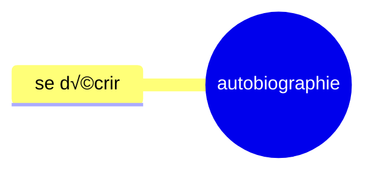

# Séquence 2: L'autobiographie
## 2) Activité 2: Etymologie

Décomposer le mot autobiographie en ces différents éléments. Nommer ces différents éléments et donner leur sens.

auto (de soi-même/ par soi-même) (préfixe) - bio (vie) (radical) - graphie (tracer) (suffixe)

| auto           | bio         | graphie       |
|----------------|-------------|---------------|
| automatisme    | biologie    | graphique     |
| automatisation | biologique  | graphologie   |
| automatisé     | biologiste  | graphologue   |
| auto-édition   | biographie  | graphiste     |
| autologie      | microbiote  | graphisme     |
|                |             | spectrographe |
|                |             | écographie    |
|                |             | géographe     |
|                |             | sysmographe   |
|                |             |               |

19

+ _

| auto | bio | graphie |
|------|-----|---------|
| autopsie | biogaz | sérigraphie |
| autodérision | biologiste | photographie |
| automutilation | biodégradable | cinématographe |
| autodéfense | biodiverstié | caligraphie |
| autonome | biopic | orthographe |
| autoportrait | bioéthique | sténographe |
| autodidacte | bioluminescent | lithographie |
| autographe | biocarburant | chorégraphie |
| autocratie | biotope | graphologue |
| autocollant | biosphère | échographie |
| autocritique | biométrie | |
| autochtone | | |
| autosatisfait | | |
| autocensure | | |

TD Bordas p. 64-65

6:
rival: rivaliser -> rivalité
crème: crémeu -> écrémé
uni: union -> unifier

7:

1. bi(deux) cyclette(roues): deux-roues
2. anti (contre) constitutionellement (qui respecte la constitution): contre la constitution
3. in inflammable: non inflammable
4. ex patrie r: sortir de la patrie

8:

1. populaire, population
2. manuel
3. clairon

9: 

adjectif + nom
adjectif + nom
adverbe + nom
verbe + nom

## 3) Activit√© 3: Carte √mentale

