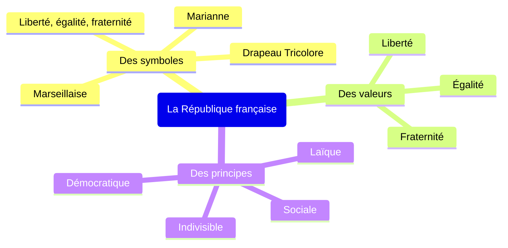

# EMC: citoyenneté française, citoyenneté européeenne

=> Quels sont les fondements de la citoyenneté française et de la citoyenneté européenne ?

## I. Être citoyen français

### A. Le citoyen posséde des droits politiques

Être citoyen français, c'est être membre d'une communauté politique, la République française, dont on accepte les règles pour vire ensemble. A ce titre, chaque citoyen a des droits politiques (droit de vote et éligibilité). Avec l'ensemble des citoyens, il détient la souveraineté nationale.

??? abstract "Souveraineté nationale"

    Autorité ou pouvoir suprême apppartenanmt au peuple tout entier

#### 1. Le droit de vote, résultat d'une conquête

#### 2. Le vote, une modalité d'expression du citoyen

| Qui peut-on élire ? | Durée du mandat | Type de suffrage | Mode de scrutin |
|---|---|---|---|
| Parlement européen | 5 ans | SUD (Suffrage universel direct) | **Scrutin proportionnel de liste:**   l'électeur vote pour une liste de candidats. Les sièges sont attribués en proportion du nombre de voix obtenues
| Président de la République | 5 ans | SUD | **Scrutin majoritaire uninominal à 2 tours:**  l'électeur vote pour un seul candidat en 2 tours. Les 2 candidats arrivés en tête au 1^e^ tour s'affrontent au 2^e^ tour. |
| Députés (assemblée nationale) | 5 ans | SUD | **Scrutin majoritaire uninominal à 2 tours** |
| Sénateurs (sénat) | 6 ans | SUI (Indirect) | **Scrutin majoritaire à 2 tours** (3 sénateurs ou moins à élire) ou un scrutin proportionnel de list (4 sénateurs ou plus à élire) |
| Conseillers régionnaux | 6 ans | SUD | **Scrutin de list à 2 tours avec représentation proportionelle et prime majoritaire** |
| Conseillers départementaux | 6 ans | SUD | **Scrutin majoritaire binominal à 2 tours** (2 conseillers par canton) |
| Conseillers municipaux | 6 ans | SUD | **Scrutin proportionnel de liste à 2 tours** (communes de plus de 1000 habitants) ou **Scrutin majoritaire plurinominal à 2 tours** (communes de moins de 1000 habitants) |

La souveraineté nationale appartient au peuple. Celui-ci délègue son pouvoir à ses reorésentants éluus soit au suffrage universel direct, soi au suffrage universel indirect. Pour chaque élection, la présence de plusieurs candidats ou de plusieurs listes garantit le pluralisme politique et la liberté de choix de citoyens. C'est la démocratie représentative.

**Suffrage universel: système dans lequel le corps électoral est constitué par tous les citoyen(ne)s**

**Pluralisme politique: existence de plusieurs opinions politiques**

(référencer les 3 feuilles)

!!! abstract "Abstention"

    Non-participation des électeurs à une élection

1. Le taux d'abstention de manière générale en France à augmenté.
2. Les principales raisons sont la perte de confiance pour les candidats, qui ont "déçu" une greande partie des électeurs, l'impression qu'un vote ne change rien, l'indécision des électeurs et les indisponibilités, ainsi qu'un manque d'intêret pour la politique

3. (recopier qd stylo )

^le sondages montrent que [...] records^

_les politiques [...] mobiliser leurs électeurs_

^en belgique [...] ne vote pas^

_n'apporte pas de solutions_

_le droit de vote [...] obligation_

_si le vote[...] containte_

### B. Le citoyen possède aussi des droits civils, économiques et sociaux

| Catégories de droits | Textes qui les garantissent | Exemples de droits |
|----------------------|-----------------------------|--------------------|
| Civils | Déclaration des droits de l'homme et du citoyen déclaration universelle des droits de l'homme, 1948 | égalité devant la loi, sécurité, protection contre l'arbitraire, propriété |
| économique et sociaux | constitution de la 4e République 1946, constitution de la 5e République 1958 | droit au travail, à l'éducation, à la santé, à la protection contre le chomage |

### C. Le citoyen a aussi des devoirs

En contrepartie, les citoyens ont des devoirs essentiels: respecter les lois de la République, payer des impôts pour financer par exemple les services publics (police, justice, écoles, hôpitaux...), participer à la défense de leurs pays, respecter les droits des autres citoyens, être jurés en cours d'assises.

### D) Les droits des femmes en France et dans le monde

_ roosvelt

1975
1979
2010
premier ministre
l'égalité salariale
1992
1995
première femme chef d'état en Afrique
2014

## II. Valeurs, principes et symboles de la République française
### A. Les symboles de la République française

2 pages

1. La marseillaise, hymne national
	1. La marseillaise à été composée dans la nuit du 25 au 26 avril 1792, à Strasbourgh par Clauude-Joseph Rouget de Lisle
	2. Car les combattants venant du Sud la chantaient
	3. En 1879, sous la IIIe République
	4. Ils se battent contre la monarchie ("la tyranie"), la liberté est mise en avant
2. Le drapeau tricolore: emblème national
	1. Le blanc pour la monarchie, le bleu et le rouge pour la ville de Paris
	2. Sur la cocarde
	3. En 1794
	4. DE 1814 à 1830
	5. Sur les édifices publiques
3. La device de la République
	1. Les philosphes des Lumières
	2. Par Rousseau et Locke
	3. Sous la République
	4. Sur les édifices publics
4. La fête nationale
	1. La prise de la bastille et la fête de la Fédération
	2. En 1880 sous la République
	3. Un défilé militaire sur les champs élysées, des balles et des feux d'artifices, un jour férié
5. Allégorie de la République
	1. La femme: le peuple, la république, le bonnet phrygien: la liberté
	2. Car c'était un prénom très répandu au 18ème siècle
	3. Dans les mairies, sur les pièces
6. Le coq français, le faisceau de licteur, le sceau de la république

<!--
| Symboles                          | Marseillaise      | Drapeau tricolore | Liberté, égalité, fraternité | 14 juillet        | Marianne          |
|-----------------------------------|-------------------|-------------------|------------------------------|-------------------|-------------------|
| Date ou période ou ils s'imposent | 3^ème^ république | 1794              | 3^ème^ République            | 3^ème^ République | 3^ème^ République |
| Nature du symbole                 | Hymne             | emblème           | devise                       | fête nationale    | emblème           |
-->

| Symbole                      | Date ou période ou ils s'imposent | Nature du symbole |
|------------------------------|-----------------------------------|-------------------|
| Marseillaise                 | 3^ème^ république                 | Hymne             |
| Drapeau tricolore            | 1794                              | emblème           |
| Liberté, égalité, fraternité | 3^ème^ République                 | devise            |
| 14 juillet                   | 3^ème^ République                 | fête nationale    |
| Marianne                     | 3^ème^ République                 | emblème           |

### B. Valeurs et principes de la République

!!! abstract "Valeurs"

    Ce sont des idéaux à atteindre ou à défendre reconnus par notre République. Elles forment notre devise nationale

!!! abstract "Principes"

    Règles considérées comme fondamentales permettent d'atteindre les valeurs défendues par notre République.

<!--
| Principes     |                                               sociale                                               |                                                                                    indivisible                                                                                    |                                                                         Laïcité                                                                          |                                                                               démocratique                                                                               |
|---------------|:---------------------------------------------------------------------------------------------------:|:---------------------------------------------------------------------------------------------------------------------------------------------------------------------------------:|:--------------------------------------------------------------------------------------------------------------------------------------------------------:|:------------------------------------------------------------------------------------------------------------------------------------------------------------------------:|
| Définition    | La République instaure une fraternité ou solidarité entre les citoyens au nom du principe d'égalité | Aucune partie du peuple ni aucun individu ne peut s'attribuer l'exercice de la souveraineté nationale. Seul le peuple exerce par ses représentants. La loi est la même pour tous. | Le pouvoir politique est séparé de l'influence des Eglises et des religions au nom de la liberté de croyance et de l'égalité des citoyens devant la loi. | Le pepuple tout entier détient le pouvoir et l'exerce directement ou indirectement par l'intermédiare de représentants élus. Les libertés fondamentales sont respectées. | 
| Exemples (n°) |                                                 4,7                                                 |                                                                                            8                                                                                      |                                                                           1, 6                                                                           |                                                                                 2,3,5,9                                                                                  |
-->

|   Principes   |                                                                                    Définition                                                                                     | Exemples (n°) |
|:-------------:|:---------------------------------------------------------------------------------------------------------------------------------------------------------------------------------:|:-------------:|
|    sociale    |                                        La République instaure une fraternité ou solidarité entre les citoyens au nom du principe d'égalité                                        |      4,7      |
|  indivisible  | Aucune partie du peuple ni aucun individu ne peut s'attribuer l'exercice de la souveraineté nationale. Seul le peuple exerce par ses représentants. La loi est la même pour tous. |       8       |
|    laïcité    |             Le pouvoir politique est séparé de l'influence des Eglises et des religions au nom de la liberté de croyance et de l'égalité des citoyens devant la loi.              |      1,6      |
| démocratique  |     Le pepuple tout entier détient le pouvoir et l'exerce directement ou indirectement par l'intermédiare de représentants élus. Les libertés fondamentales sont respectées.      |   2, 3, 5, 9  |

## II. Être citoyen européen
### A. Qu'est-ce que la citoyenneté européenne ?

inclure traité sur l'union européenne

Article 8 A.1 > Droit de circuler et séjourner dans l'UE

Article 8 B.1 > Vote et elligibilité aux élections municipales et aux élections du parlement européen dans l'état membre ou le citoyen européen réside

Article 8 C > Droit de protection

Article 8 D > Pétition devant le parlement européen 

Traité de Maastricht (1992)

Le traité de maastricht (1992) à 
instauré une citoyenneté européenne. Ainsi, toute personne 
ayant la nationalité d'un des états membres de l'union européenne
bénéficie d'un certain nombre de droits. Voir texte.

### B. Les symboles de l'Union européenne

|                             Un drapeau                             |      Un hymne       |          Une devise          |         Une monaie unique          |  Journée de l'Europe  |
|:------------------------------------------------------------------:|:-------------------:|:----------------------------:|:----------------------------------:|:---------------------:|
|  _Drapeau aux 12 étoiles à 5 branches disposées sur un fond bleu_  |  _"Ode à la Joie"_  |  _"Unie dans la diversité"_  |  _L'euro (19 états au 1/01/2015)_  |        _9 mai_        |

### C. Les valeurs et les principes de l'Union européenne

La République française et l'Union Européenne sont fondées sur des valeurs et des principes qui les définissent respctivement. L'nue comme l'autre ont choisi d'établir leur fonctionnement sur des bases démocratiques. Dès lors, leurs principes et leurs valeurs sont quasiment identiques: liberté, égalité, solidarité, tolérance

