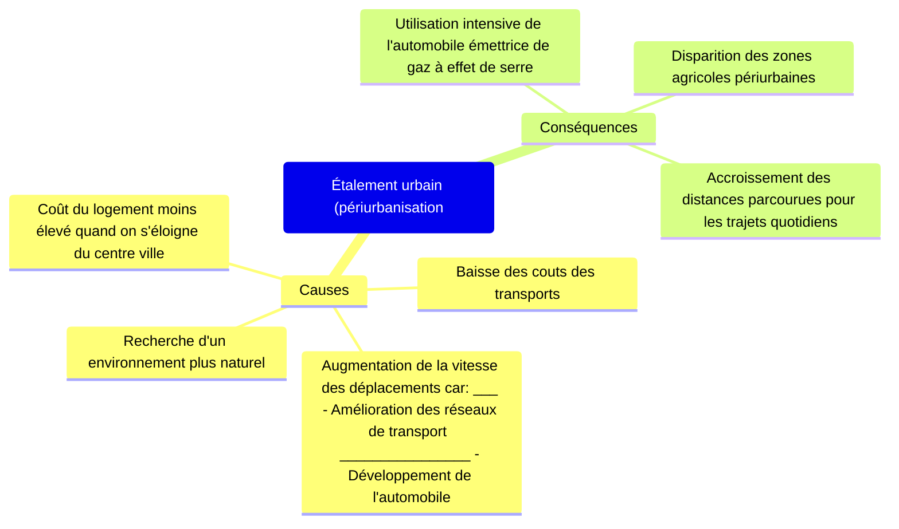

# Chapitre 1: Les aires urbaines, nouvelles géographie d'une France mondialisée

=> Quels rôles les aires urbaines jouent-elles dans l'organisation d'un territoire français de plus en plus mondialisé ?

## I. Étude de cas: l'aire urbaine de Lyon
### A. Localisation

2024-sept-20-3 pour le schema

### B. Les mobilités, un phénomène au cœur de l'aire urbaine

??? abstract "Pôle d'échanges multimodal"

	Lieu ou se connecte différents réseaux de transports.

| Nombre de voyageurs par an                                                         | 30 millions |
|------------------------------------------------------------------------------------|-------------|
| Nombre de déplacements quotidiens                                                  | 500 000     |
| Nombres de trains par jour                                                         | 550 trains  |
| Nombre d'usagers de la gare par jour (aujourd'hui)                                 | 125 000     |
| Nombre d'usagers de la gare par jour (prévisions 2030)                             | 175 000     |
| Nombre d'usagers des transports en commun à la Part Dieu chaque jour (aujourd'hui) | 170 000     |
| Nombre d'usagers des transports en commun à la Part Dieu chaque jour (2030)        | 300 000     |
| Dates de la première phase de réaménagement du pôle de la Part-Dieu                | 2017-2023   |

Objectifs:

- Répondre à la fréquentation croissante de la gare
- Mieux accueillir les usagers
- Améliorer la qualité de service ferroviaire
- Ouvrir la gare sur le quartier de la Part-Dieu
- Améliorer les connexions entre les différents modes de transport

Moyens de transport connectés au pôle: 

- Taxi
- Car
- Bus
- Métro
- Voiture
- Vélo
- Tram

Exemples d'aménagements construits ou repensés: 

- Nouvelle tour de bureaux et hôtels
- Création d'une galerie
- Création d'une douzième voie
- Parking à vélo
- Nouvel accès au métro
- Nouveaux accès au quais
- Place végétalisée
- Pôle de transports en commun repensés

Avec plus de 2.6 millions d'habitants, Lyon est la 2e aire urbaine de France. Elle est composée de 514 communes entre lesquelles les habitants effectuent de nombreux déplacements. Ces mobilités concernent donc les différentes parties de l'aire urbaine. les aménagements de transport doivent s"adapter à cette hausse des mobilités.

??? abstract "Mobilités"

	Déplacements pour le travail, les loisirs et les achats.

#### L'aire urbaine de lyon

Ville-Centre (1)

Balieue (2)

Couronne périurbaine (3)

+

= Pôle Urbain + 

 = aire urbaine

##### Les amènagements de transport: 

 Principaux axes de communication (autoroutes, voies ferrées...)

|        Zones         | Caractéristiques                                                                                                                                                                                                                                                                           |
|:--------------------:|--------------------------------------------------------------------------------------------------------------------------------------------------------------------------------------------------------------------------------------------------------------------------------------------|
|     Ville centre     | Espace le plus anciennement et le plus densément urbanisé - Habitat dense (nombreux immeubles anciens et récents) - Monuments historiques - Transports en commun - Nombreuses activités de commerces, de services, de loisirs - quartier d'affaire, centre de décision |
|       Banlieue       | Habitat:  - soit des immeubles avec de grands ensembles - soit des pavillons, des lotissements. - grandes surfaces, entreprises= beaucoup d'espace                                                                                                                             |
| Couronne périurbaine | Espace qui "mélange" ville est campagne - lottissements, zones pavillonaires, petits immeubles - villages - commerces et services de proximité                                                                                                                                 |

L'aire urbaine de Lyon, comme la majorité des aires urbaines françaises, a connu une forte croissance de sa population ces dernières années qui s'observe surtout dans la couronne périurbaine. Cette croissance urbaine s'accompagne d'un étalement spatial de la ville: on parle de périurbanisation **(= extension de la ville dans les campagnes proches)**. Cette périurbanisation entraine ausii l'augmentation des mobilités.

##### Les dynamiques spatiales

Migration pendulaires = déplacements quotidiens domicile/travail

Etalement urbain

Plus forte hausse de poplation

- augmentation des distances
- voitures
- pas de transports en commun

### D. Lyon, une métropole internationale attractive

1. è
2. Deux autres activités présentent dans la métropole lyonaise sont la médecine et les médias
3. l'avion, la voiture, le train
4. Pour douvler la surface du centre-ville
5. Plus de voyageurs, d'entreprises et d'étudiants

Pôle tertiaire: espace concentrant les activités de services et de commandement. Il attire chaque jour des flux de travailleurs.

Dans le contexte de la mondialisation, les grandes aires urbaines cherchent à êre attractives. Cela passe par les transports (autoroutes, lignes TV, aéroports) qui leur pertmettent d'étendre leur influence et de développer les liens entre elles. Certains aménagemenets (Lyon Part-Dieu, Lyonbiôle...) visent à améliorer leur compétitivité. La rénovation de certains quariers à pour but d'attirer les inestisseurs et les touristes érangers.

## II. Les dynamiquees du territoire français
### A. Les aires urbaines en france

85% des Français vivent dans une aire urbaine. Depuis les années 1950, les villes connaissent une forte croissance démographique. Ainsi, en lien avec la mondialisation, le territoire français est marqué par la métropolisation **(concentration des activités et des pouvoirs dans les plus grandes villes)**. Aujourd'hui cependant, les villes du Grand ouest et du sud sont les plus attractives.

### B. La répartition de la population française sur le territoire, une répartition inégale

Carte 1 p. 220

| Densités de population    | Où ?                                                                                                                                                            | Pourquoi ?                                                                                                                                                                                                                                             |
|---------------------------|-----------------------------------------------------------------------------------------------------------------------------------------------------------------|--------------------------------------------------------------------------------------------------------------------------------------------------------------------------------------------------------------------------------------------------------|
| Densités les plus fortes  | - Aires urbaines - Régions frontalières (Alsace, Nord-Pas-de-Calais) - Littoraux (atlantique, méditerranéeen) - Vallées fluviales (Rhône, Loire...) | Elles concentrent l'essentiel des emplois et des services   Zones d'échanges dynamiques                                                                                                                                                        |
| Densités les plus faibles | Montagnes (Pyrénées, sud des Alpes, Corse, Massif central...)   Certains espaces ruraux (des Ardennes aux Pyrénées)                                     | Principaux reliefs qui peuvent être un obstacle ) l'installation des hommes   Ils ont connu un fort exode rural Certains types d'agriculture (grandes exploitations céréalières en Bourgogne par exemple) nécessitent peu de main d'oeuvre |

Répartition et dynamiques de la popualtion française

### C. Les dynamiques de la population

Dynamique: évolution de la population dans le temps et dans l'espace

#### 1. Une mobilité croissante

##### Les flux migratoires internes

Au 1^er^ janvier 2023, la France comptai plus de 68 millions d'habitants. Cette croissance de la population s'explique principalement par un solde naturel positif. De plus, même si la fécondité en France à tendance à diminuer ses dernières années (1,8 enfants par femme), elle reste la plus élevée d'Europe. Cependant, la population Française continued e vieillir en raison de la hausse de l'espérence de vie et de l'avancée en âge des génération du baby boom, mais le vieillisement de la popualtion reste modéré par rapport à nos voisins.

??? abstract "Taux de natalité"

    Nombre de naissances pour 1000 habitants en 1 an.

??? abstract "Taux de mortalité"

    Nombre de décès pour 1000 habitants en 1 an.

??? abstract "Solde naturel"

    Différence entre le taux de natalité et le taux de mortalité

??? abstract "Taux de fécondité"

    Nombre moyen d'enfants par femme

??? abstract "Solde migratoire"

    Différence entre le nombre d'entrées et de sorties dans une région ou un pays

??? abstract "Baby-boom"

    Période de forte natalité de 1945 au début des années 1970.

