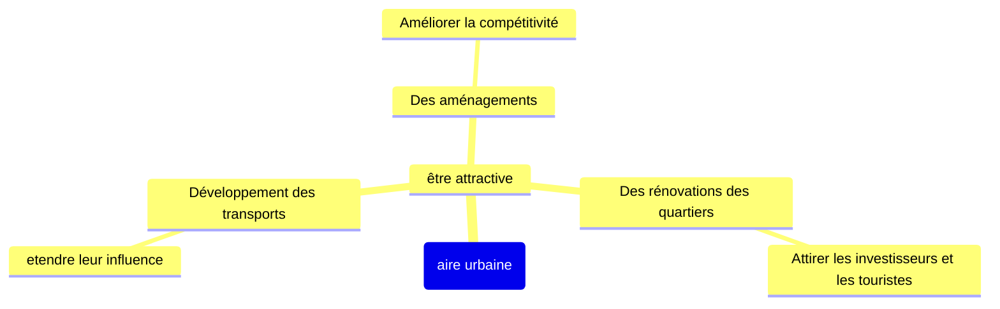

# Les aires urbaines, nouvelle géographie d'une France mondialisée

-> Quel rôle les aires urbaines jouent-elles dans l'organisation d'un territoire français toujours plus mondialisé ?

## I. L'aire urbaine de Lyon
### Localisation

<iframe src="https://www.google.com/maps/embed?pb=!1m18!1m12!1m3!1d11207314.386708453!2d4.489879830610696!3d46.70256295076479!2m3!1f0!2f0!3f0!3m2!1i1024!2i768!4f13.1!3m3!1m2!1s0x47f4ea516ae88797%3A0x408ab2ae4bb21f0!2sLyon!5e0!3m2!1sfr!2sfr!4v1728284472331!5m2!1sfr!2sfr" style="border:0;" allowfullscreen="" loading="lazy" referrerpolicy="no-referrer-when-downgrade"></iframe>

### Les mobilités, un phénomène au coeur de l'aire urbaine

!!! abstract "Pôle d'échanges multimodal"

	Lieu ou se connecte différents réseaux de transports.

!!! abstract "Mobilités"

	Déplacements pour le travail, les loisirs et les achats.

Aire urbaine de Lyon = 2,6 millions d'habitants, 2^ème^ aire urbaine de France, 514 communes

-> Donc beaucoups de déplacements, de mobilités entre les 7 parties de l'aire urbaine

+ schèma
### Les différente espaces d'une aire urbaine

|        Zones         | Caractéristiques                                                                                                                                                                                                                                                                           |
|:--------------------:|--------------------------------------------------------------------------------------------------------------------------------------------------------------------------------------------------------------------------------------------------------------------------------------------|
|     Ville centre     | Espace le plus anciennement et le plus densément urbanisé - Habitat dense (nombreux immeubles anciens et récents) - Monuments historiques - Transports en commun - Nombreuses activités de commerces, de services, de loisirs - quartier d'affaire, centre de décision |
|       Banlieue       | Habitat:  - soit des immeubles avec de grands ensembles - soit des pavillons, des lotissements. - grandes surfaces, entreprises= beaucoup d'espace                                                                                                                             |
| Couronne périurbaine | Espace qui "mélange" ville est campagne - lottissements, zones pavillonaires, petits immeubles - villages - commerces et services de proximité                                                                                                                                 |

- Forte croissance des aires urbaines surtout la couronne périurbaine + étalement => Périurbanisation

!!! abstract "Périurbanisation"

	?

- carte mentale: cause/conséquences

### Lyon, une métropôle internationnale attractive

!!! abstract "Pôle tertiaire"

	Espace concentrant les activités de services et de commandement. Il attire chaque jour des flux de travailleurs.

