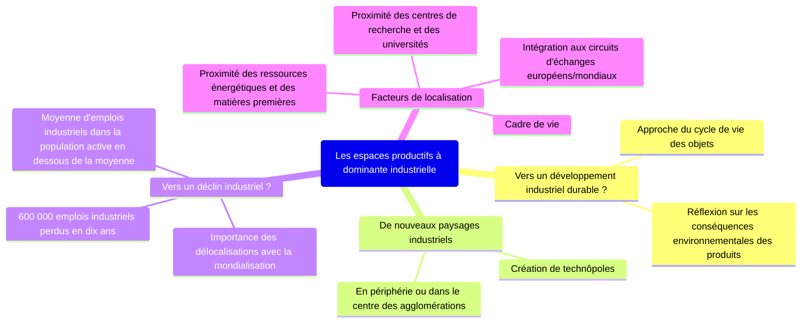
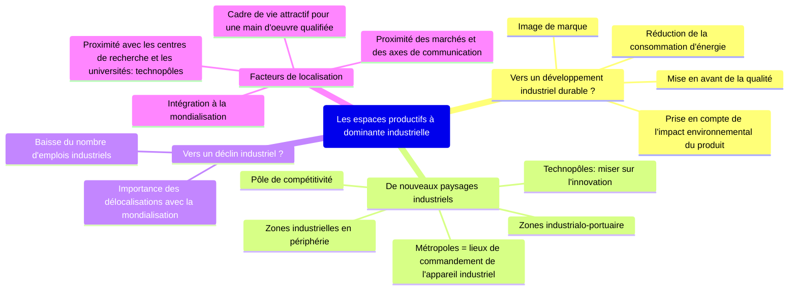

# Les espaces productifs et leurs évolutions

=> Quelles sont les dynamiques des espaces productifs en France ?

!!! abstract "Espaces productifs"

    parties du territoire directement dédiées à la production de riches'uqses elles soient agricoles, industrielles ou de services

## I. Des espaces productifs industriels transformés pour s'adapter à la mondialisation
### A. Etude de cas: la Cosmetic Valley
#### 1. Qu'est-ce que la Cosmetic Valley ?

La Cosmetic Valley est spécialisée dans la conception et la fabrication
de produits cosmétiques, de parfums. Elle coordonne l'ensemble de la
filière sur le territoire national, réunit des adhérents de toutes
les régions de France et regroupe des entreprises, des centres 
de formations et des organismes de recherche engagés dans des projets
communs et innovants. C'est un pôle de compétitivité.

#### 2. Pourquoi ce pôle de compétitivité ?

<!--

| Des compétences humaines                                                                                                                                                                           | Un territoire attractif                                                                                     | Un territoire connecté au monde                                                                                       |
|----------------------------------------------------------------------------------------------------------------------------------------------------------------------------------------------------|-------------------------------------------------------------------------------------------------------------|-----------------------------------------------------------------------------------------------------------------------|
| - un main d'oeuvre très qualifiée - présence de nombreuses universités qui sont spécialisées - tradition industrielle du bassin Parisien, de la seine Maritime - Savoir-Faire agricole | - proximité de paris (image du luxe, de la mode) - espace disponible important - image de Chartres  | - nombreux axes de transport routiers connectés à Paris: A10, A11, lignes TGV - proximité des aéorports parisiens |

-->

| Des compétences humaines                                        | Un territoire attractif                        | Un territoire connecté au monde                                             |
|-----------------------------------------------------------------|------------------------------------------------|-----------------------------------------------------------------------------|
| un main d'oeuvre très qualifiée                                 | proximité de paris (image du luxe, de la mode) | nombreux axes de transport routiers connectés à Paris: A10, A11, lignes TGV |
| présence de nombreuses universités qui sont spécialisées        | espace disponible important                    | proximité des airports parisiens                                            |
| tradition industrielle du bassin Parisien, de la seine Maritime | image de Chartres                              |                                                                             |
| Savoir-Faire agricole                                           |                                                |                                                                             |

#### 3. Un pôle de compétitivité attractif et qui fait face à de nouveaux défis

| Place de la Cosmetic Valley dans le monde                                                                                                                                                                                                                                     | Nouveaux défis de la Cosmetic Valley                                                    | La volonté d'intégrer le développement durable                                                                                                                                                                                            |
|-------------------------------------------------------------------------------------------------------------------------------------------------------------------------------------------------------------------------------------------------------------------------------|-----------------------------------------------------------------------------------------|-------------------------------------------------------------------------------------------------------------------------------------------------------------------------------------------------------------------------------------------|
| - 1^er centre de ressources mondial en parfumerie-cosmétique / 1^e pôle français - Principaux marchés = Europe, Etats-Unis - Développement de nouveaux marchés dans les pays émergents (Chine, Inde, Brésil) - Présence dans les différents salons internationaux | - Faire face à la concurence de nouveaux pays (Corée du sud, Taïwan, Chine, Etats-Unis) | - Signature d'une charte d'éco-responsabilité - Mise en place d'un système de pivoines en fonction des actions engagées par les entreprises en faveur du développement durable - Eco-conception des usines ex: La Ruche, Guerlain |

### B. Les espaces industriels à l'échelle nationale
#### 1. Des espaces industriels qui se transforment

!!! abstract "Désindustrialisation"

    baisse progressive du nombre d'activités et d'emplois industriels dans un espace

!!! abstract "Délocalisation"

    départ d'activités économiques réinstallées ailleurs (ici, à l'étranger)

!!! abstract "ZIP"

    Zone Industrialo-Portuaire, espace regroupant un port et des activités industrielles

| Quels types d'espaces industriels                                                       | Quelles régions ?                                     | Pourquoi ?                                                                                             | Permanences et mutations ?                                                          |
|-----------------------------------------------------------------------------------------|-------------------------------------------------------|--------------------------------------------------------------------------------------------------------|-------------------------------------------------------------------------------------|
| Industries de pointe, nouvelles technologies                                            | Région parisienne, Agglomération de Lyon et alentours | - Carrefours - Axes de circulation - Héritage - Nombreux technopoles                       | - Métropolisation - Déconcentration industrielle des années 1960-1970           |
| Industries tournées vers l'export et les industries nécessitants des imports importants | Littoraux de l'Ouest, Sud-Ouest et Sud de la france   | - ZIP/façades maritimes - Technopoles/Pôles de compétitivité                                       | - Littoralisation - Métropolisation - Bonne intégration à la mondialisation |
| Industries basées sur la transformation de matières premières                           | Nord-Est de la France                                 | - Crise des industries et des matières premières traditionnelles (charbon, sidérurgie, métallurgie...) | - Reconversion - Friches industrielles - Euro-région                        |
|                                                                                         | Le reste                                              | Difficulté d'accessibilité                                                                             | A l'écart de la mondialisation                                                      |

