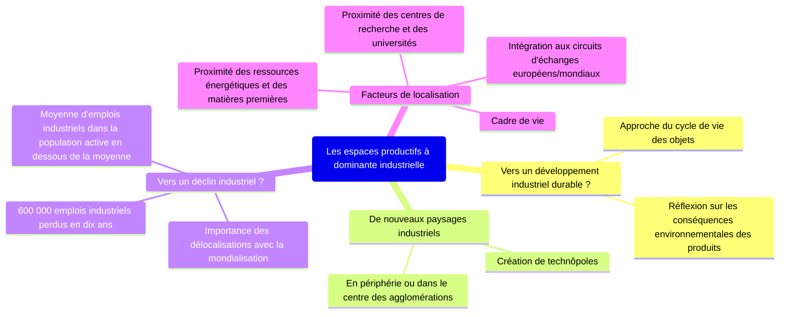
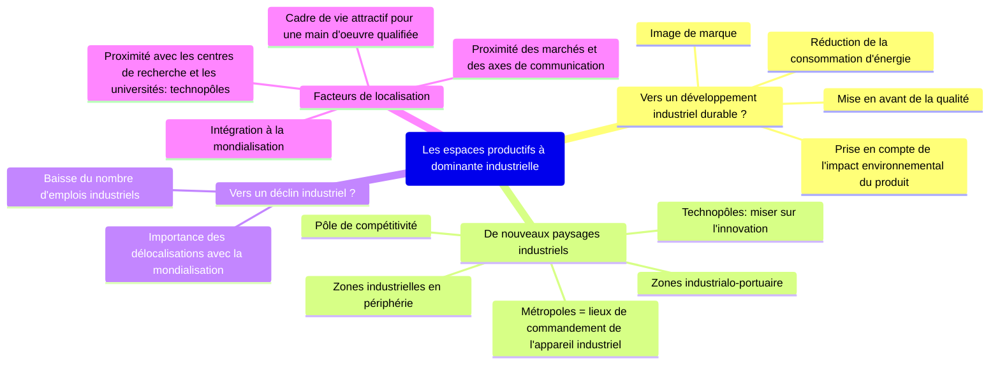

# Les espaces productifs et leurs évolutions

=> Quelles sont les dynamiques des espaces productifs en France ?

!!! abstract "Espaces productifs"

    parties du territoire directement dédiées à la production de richesses elles soient agricoles, industrielles ou de services

## I. Des espaces productifs industriels transformés pour s'adapter à la mondialisation
### A. Etude de cas: la Cosmetic Valley
#### 1. Qu'est-ce que la Cosmetic Valley ?

La Cosmetic Valley est spécialisée dans la conception et la fabrication
de produits cosmétiques, de parfums. Elle coordonne l'ensemble de la
filière sur le territoire national, réunit des adhérents de toutes
les régions de France et regroupe des entreprises, des centres 
de formations et des organismes de recherche engagés dans des projets
communs et innovants. C'est un pôle de compétitivité.

#### 2. Pourquoi ce pôle de compétitivité ?

<!--

| Des compétences humaines                                                                                                                                                                           | Un territoire attractif                                                                                     | Un territoire connecté au monde                                                                                       |
|----------------------------------------------------------------------------------------------------------------------------------------------------------------------------------------------------|-------------------------------------------------------------------------------------------------------------|-----------------------------------------------------------------------------------------------------------------------|
| - un main d'oeuvre très qualifiée - présence de nombreuses universités qui sont spécialisées - tradition industrielle du bassin Parisien, de la seine Maritime - Savoir-Faire agricole | - proximité de paris (image du luxe, de la mode) - espace disponible important - image de Chartres  | - nombreux axes de transport routiers connectés à Paris: A10, A11, lignes TGV - proximité des aéorports parisiens |

-->

| Des compétences humaines                                        | Un territoire attractif                        | Un territoire connecté au monde                                             |
|-----------------------------------------------------------------|------------------------------------------------|-----------------------------------------------------------------------------|
| un main d'oeuvre très qualifiée                                 | proximité de paris (image du luxe, de la mode) | nombreux axes de transport routiers connectés à Paris: A10, A11, lignes TGV |
| présence de nombreuses universités qui sont spécialisées        | espace disponible important                    | proximité des airports parisiens                                            |
| tradition industrielle du bassin Parisien, de la seine Maritime | image de Chartres                              |                                                                             |
| Savoir-Faire agricole                                           |                                                |                                                                             |

#### 3. Un pôle de compétitivité attractif et qui fait face à de nouveaux défis

| Place de la Cosmetic Valley dans le monde                                                                                                                                                                                                                                     | Nouveaux défis de la Cosmetic Valley                                                     | La volonté d'intégrer le développement durable                                                                                                                                                                                            |
|-------------------------------------------------------------------------------------------------------------------------------------------------------------------------------------------------------------------------------------------------------------------------------|------------------------------------------------------------------------------------------|-------------------------------------------------------------------------------------------------------------------------------------------------------------------------------------------------------------------------------------------|
| - 1^er centre de ressources mondial en parfumerie-cosmétique / 1^e pôle français - Principaux marchés = Europe, Etats-Unis - Développement de nouveaux marchés dans les pays émergents (Chine, Inde, Brésil) - Présence dans les différents salons internationaux | - Faire face à la concurrence de nouveaux pays (Corée du sud, Taïwan, Chine, Etats-Unis) | - Signature d'une charte d'éco-responsabilité - Mise en place d'un système de pivoines en fonction des actions engagées par les entreprises en faveur du développement durable - Eco-conception des usines ex: La Ruche, Guerlain |

### B. Les espaces industriels à l'échelle nationale
#### 1. Des espaces industriels qui se transforment

!!! abstract "Désindustrialisation"

    baisse progressive du nombre d'activités et d'emplois industriels dans un espace

!!! abstract "Délocalisation"

    départ d'activités économiques réinstallées ailleurs (ici, à l'étranger)

!!! abstract "ZIP"

    Zone Industrialo-Portuaire, espace regroupant un port et des activités industrielles

| Quels types d'espaces industriels                          | Quelles régions ?                                         | Pourquoi ?                                                                                             | Permanences et mutations ?                                                          |
|------------------------------------------------------------|-----------------------------------------------------------|--------------------------------------------------------------------------------------------------------|-------------------------------------------------------------------------------------|
|                                                            |                                                           | - Carrefours - Axes de circulation - Héritage - Nombreux technopoles                       | - Métropolisation - Déconcentration industrielle des années 1960-1970           |
|                                                            |                                                           | - ZIP/façades maritimes - Technopoles/Pôles de compétitivité                                       | - Littoralisation - Métropolisation - Bonne intégration à la mondialisation |
| Espaces en voie de désindustrialisation ou de reconversion | Nord-Est, quelques régions autour du massif central, Nord | - Crise des industries et des matières premières traditionnelles (charbon, sidérurgie, métallurgie...) | - Reconversion - Friches industrielles - Euro-région                        |
| Espaces ruraux sous-industrialisés                         | Espaces de montagne, espaces ruraux                       | Difficulté d'accessibilité                                                                             | A l'écart de la mondialisation                                                      |

!!! abstract "Reconversion"

    Remplacement d'une activité par une autre (industrielle ou non)

## II. Des espaces productifs de services parfaitement intégrés à la mondialisation
### A. Etude de cas: Le Parc Astérix, un espace touristique dynamique

|                                                                                                                                                                                                                                                                                           |                                                                                                                                                                                                                                                                                                                                                                                                                                                                                                                                                |
|-------------------------------------------------------------------------------------------------------------------------------------------------------------------------------------------------------------------------------------------------------------------------------------------|------------------------------------------------------------------------------------------------------------------------------------------------------------------------------------------------------------------------------------------------------------------------------------------------------------------------------------------------------------------------------------------------------------------------------------------------------------------------------------------------------------------------------------------------|
| 1. Présentation et organisation de l'espace productif **Doc 2, 4 et 5 p.238-239 + plan du parc**     Vous préciserez et expliquerez la localisation du parc Astérix, l'organisation, les aménagements réalisés dans le parc et pour se rendre à ce parc                       | - ^^Localisation:^^ Plailly (Oise) à 40 km au nord de l'agglomération parisienne - ^^Explication de cette localisation:^^ pour des raisons fiscales mais aussi pour la proximité de l'Ile-de-France (clientèle principale du parc) - ^^Organisation / Aménagements:^^   - 7 univers composés de 50 attractions, de restaurants, de boutiques réparties sur une surface de 18 hectares.   - 1 raccordement direct à l'autoroute A1   - A 15 minutes de l'aéroport Roissy Charles de Gaulle   - Proximité de la gare TGV |
| 2. Le dynamisme de cet espace productif **Docs 1 et 3 p. 238 + Doc 1,2,5,6 photocopiés**   Vous montrerez que ce parc est une réussite économique et comment elle à été obtenue                                                                                               | - Hausse du nombre de visiteurs pour atteindre 2.8 millions en 2023 (hausse de 6% par rapport à 2022). - Chiffre d'affaires: 123 millions d'euros - 2^ème^ parc d'attraction français - Des investissements importants, innovation pour rester compétitif face à la concurrence - Nouvelles attractions à sensation ou animations: la tour de Numérobis, une comédie musicale, de nouvelles mascottes - Politique de communication - Renforcement de l'offre d'hébergement                                             |
| 3. Les acteurs à l'origine du projet et ceux mobilisés pour la réussite du parc **Doc 5 p. 239 + Doc 3, 4 photocopiés**   Vous indiquerez quels sont les inventeurs de l'univers du parc Astérix (+ date de création à mais aussi les acteurs importants du parc et leur rôle | - "Inventeurs" du parc: Uderzo, Pierre Tchernia - Un parc créé en 1989 - Depuis 2002, il est géré par la Compagnie des Alpes - Plus de 80 métiers, plus de 300 salariés permanents, 1000 emplois saisonniers                                                                                                                                                                                                                                                                                                                       |
| 4. Les ambitions et les défis récents et pour les années à venir **Doc 6, 7 photocopiés**   Vous préciserez les ambitions du parc dans les années à venir                                                                                                                     | - Volonté de devenir une destination de séjour - Construction de nouveaux hôtels  et augmentation de la capacité des hôtels existants. - Attirer une clientèle de toute la France et de Belgique - Continuer la politique d'investissement (nouvelles attractions...) - Volonté de s'implanter en Chine - Volonté d'ouvrir ses portes à Noël                                                                                                                                                                               |

### B. Les espaces productifs de services en France

## III. Des espaces agricoles modernisés et spécialisés mais inégalement intégrés à la mondialisation
### A. Des espaces spécialisés

L'agriculture joue un rôle essentiel dans l'économie française. Si elle concerne seulement 3% de la population active, la France est le premier producteur européen de denrées agricoles et le troisième exportateur de l'UE. Les espaces agricoles occupent plus de la moitié du territoire national. Ils sont de plus en plus spécialisés: la polyculture est en diminution. (Voir tableau)

### B. Des espaces en mutation

1. 