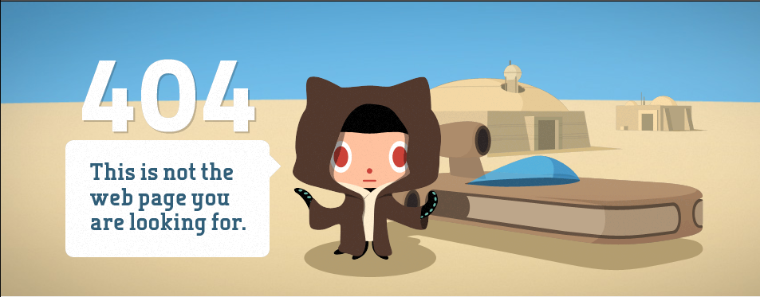

# Les espaces de faibles densités et leurs atouts

⇒ Quels sont les dynamiques et les atouts des espaces de faible densité ?

## I. Etude de cas : les Cévennes

| Les contraintes du territoire | Doc 1 p.252;  Doc 1 photocopié; Faible densité, Pas de grandes villes, beaucoup de petit villages, peu d'axes routiers importants, pluies cévenoles                                                          |
|-------------------------------|----------------------------------------------------------------------------------------------------------------------------------------------------------------------------------------------------------------------|
| Les atouts du territoire      | Doc 1 p.252; Doc 5 p. 253; Parc national des Cévennes, gorges touristiques, cadre de vie                                                                                                                     |
| Les différentes activités     | Doc 2 photocopié;  Doc 3 p.252;  Doc 4 p.252; Agriculture, agriculture labellisée, élevage ovin et caprin, tourisme vert,                                                                                |
| Les dynamiques                | Doc 5 p.253 + Doc 3 photocopié; Doc 4 photocopié; Hausse du taux d'accroissement naturel, arrivée des néoruraux, qui réhabilitent les anciennes fermes, nouvelles technologies qui permettent le télétravail |
| Les conflits                  | Doc au vidéoprojecteur; récolte des champignons, résidences secondaires, chasseurs et agriculteurs                                                                                                                   |

À partir du tableau, rédigez un paragraphe qui présente les espaces ruraux des Cévennes

Les Cévennes sont une région française à très faible densité et majoritairement agricole, caractérisée par son absence de métropole et d'axes routiers majeurs.

Les Cévennes, certes désavantagées par une faible densité et des pluies cévenoles, est avantagée par une agriculture importante et labellisée, par le biais de l'élevage ovin ainsi que caprin.

Les Cévennes font face à une hausse du tourisme vert, une arrivée de plus en plus importante de néoruraux, réhabilitant des fermes ou interresés par le télétravail, ainsi qu'une hausse du taux d'accroissement naturel.

Cependant, les Cévennes font façe à des conflits entre les interrêts des différentes populations, telles que l'occupation grandissante dde l'espace par les résidences secondaires, les chasseurs gênant les agriculteurs forestiers, ainsi que des conflits sur les récoltes de champignons.

!!! abstract "Néoruraux"

    Nouveaux habitants d'origine urbaine en zone rurale

!!! abstract "Parc national"

    territoire géré et protégé par l'Etat en raison de la richesse de son patrimoine naturel et culturel

!!! abstract "AOC/AOP"

    appelation d'origine controlée (AOC) protège le savoir-faire d'une région pour fabriquer un produit alimentaire. L'appellation d'origine protégée (AOP) est l'équivalent européen de l'AOC

## II. Les espaces de faible densité en France
### A. Les caractéristiques de ces espaces

Densité de - de 30 p/km^2, 6,5% ppl, 42% espace, - infrastructures,  1^er^ agriculture;, located at zone montagneuses, 

| Dynamique et atouts                                                                                                                                                                                                                                                                                        | Difficultés                                                                                                                                                                                                                                                                                                                                                                                               |
|------------------------------------------------------------------------------------------------------------------------------------------------------------------------------------------------------------------------------------------------------------------------------------------------------------|-----------------------------------------------------------------------------------------------------------------------------------------------------------------------------------------------------------------------------------------------------------------------------------------------------------------------------------------------------------------------------------------------------------|
| **Doc p. 257** Nouvelles populations de toutes catégories socio-professionnelles et de tous âges Regain démographique (hausse) Brassage de population intense   **Carte p.258** Parcs naturels Stations de sport d'hiver = tourisme Grands sites naturels (gorges du Tarn) | Tension entre les nouveaux arrivants et les anciens Situation de fragilités: certains espaces ne profitent pas du renouvellement économique.   **Doc 2 p.257** Vieillissement de la population Niveaux de revenus parmi les plus faibles Accessibilité en deçà de la moyenne nationale Éloignement très important des services et des commerces, des établissements scolaires |

### B. Une grande diversité des espaces à faible densité

Les espaces de faible densité (moins de 30 habitants/km^2) sont divers:

- certains sont spécialisés dans l'agriculture productiviste (agriculture commerciale qui recherche une production maximale et des rendements élevés).
- d'autres développent l'activité touristique (vert ou stations de sport d'hiver)
- parcontre, certains espaces sont en déprise: les espaces consacrés à l'agriculture sont abandonnés (par exemple les moyennes montagnes). Ils sont éloignés des littoraux et des fronières, sont peu peuplés et la population est vieillisante...

!!! abstract "Tourisme vert"

    Tourisme durable centré sur la découverte de la nature, les activités de plein air et le respect de l'environnement

!!! abstract "Déprise"

    Abandon progressif de l'activité d'agriculture ou d'élevage

