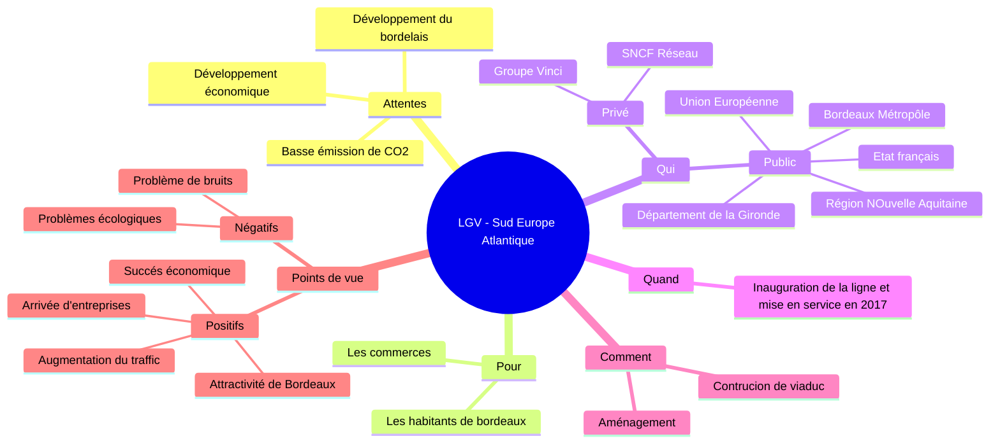
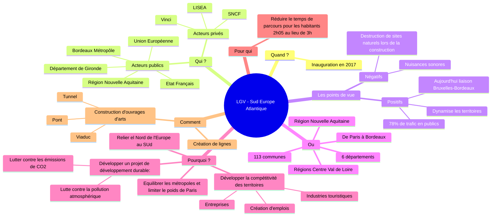
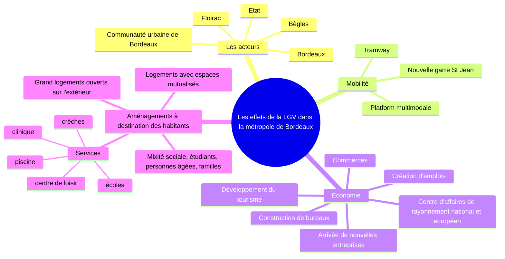

# Aménager pour répondre aux inégalités croissantes entre territoires français, à toutes les échelles

=> Quels sont les inégalités entre territories français ? Comment l'aménagement du territoire peut-il les réduire ?

## I. Etude de cas: la ligne à grande vitesse Sud Europe Atlantique

1) Les inégalités entre les territoires se manifestent par des régions mal desservies par les LGV, par le transport, et localement, des cartiers à rénover, une économie à dynamiser.
2) L'aménagement du territoire recherche à réduire les inégalités entre territoires
3) UE, état, collectivités territoriales

Cet aménagement permet de réduire les disparités des territoires et de relier les espaces. 
L'aménagement de la LGV SEA va permettre de redynamiser le centre de bordeaux en créant
un nouveau quartier et des emplois.

## II. Aménager pour répondre aux inégalités
### A. Un territoire marqué par des inégalités croissantes

| Documents           | Domaine     | Quelle inégalités ?                                                                                                                                                                      |
|---------------------|-------------|------------------------------------------------------------------------------------------------------------------------------------------------------------------------------------------|
| Doc 2 p. 279        | Transports  | - Centré vers paris - territoires moins bien reliés à l'Europe et au monde (ex: Massif Central) - Territoires bien intégrés et biens reliés à l'europe et au monde (ex: régions) |
| Doc au vidéo 1      | La richesse | - Inégalités entre les régions françaises - Poids de paris (île de france produit 1/3 de la richesse nationale -                                                                 |
| Doc au vidéo 2      | Logement    | - Régions ou le prix de l'immobilier est plus élevé (île de france, PACA, littoral atlantique) d'ou des difficultés pour ce loger.                                                       |
| Doc au vidéo 3 et 4 |             |                                                                                                                                                                                          |
| Carte 1 p.278       |             |                                                                                                                                                                                          |