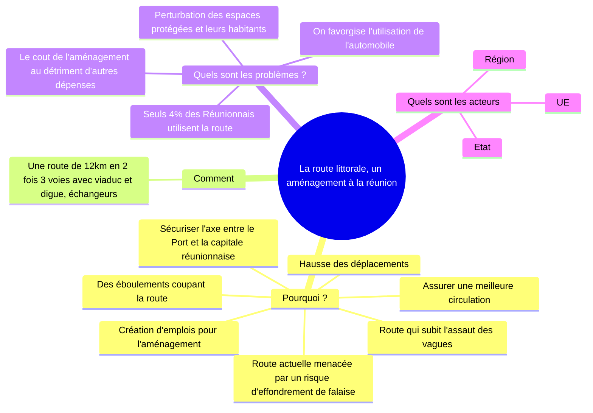

# Les territoires ultramarins français, une problématique spécifique

=> Quelles sont les particularités des territoires ultra-marins français ?
=> Quelles en sont les conséquences sur leur aménagement ?

## I. Des territoires éloignés et spécifiques
### A. Qu'appelle-t-on des territoires ultra-marins

Grâce a ses territoires ultramarins répartis entre les 5 continents et dans tous les océans, la
France est la 2^nde^ puissance maritime mondiale : sa ZEE compte plus de 10 millions de km².
ON distingue les DROM et les COM

!!! abstract "ZEE"

    Zone économique exclusive, espace sur lequel un état possède des droits d'exploitation et d'usage
    des resources

!!! abstract "DROM"

    Ces collectivités territoriales disposent du même statut qu'un département ou une région métropolitaine:
    les lois et réglements français s'y appliquent

!!! abstract "COM"

    Elles regroupent d'anciens territoires d'outre-mer ainsi que d'autres collectivités à statut particulier

### B. Quelles sont leurs spécificités.

| Des contraintes                                                                                                                                                                                                                                                                                                                                                                    | Des atouts                                                                                                                                      |
|------------------------------------------------------------------------------------------------------------------------------------------------------------------------------------------------------------------------------------------------------------------------------------------------------------------------------------------------------------------------------------|-------------------------------------------------------------------------------------------------------------------------------------------------|
| - éloignement par rapport à la métropole -> Importation de la plupart des produits de première nécessité   - insularité= un facteur d'isolement - risques naturels: alizés, fortes pluies, volcans + cyclone (sauf TAAF, St Pierre et Miquelon) - déclage horaire par rapport à la métropole - forêt tropicale humide en GUyane -> Difficultés d'accès | - climat tropical (sauf TAAF, St Pierre et Miquelon) - des atouts touristiques: paysages et espaces nautrels - Biodiversité remarquable |

## II. Le développement économique des territoires ultra-marins

Le développement économique des territoires ultra-marins repose essentiellement sur les cultures 
spécialisées (héritée du passé colonial) et le tourisme. Les échanges commerciaux avec la 
métropole sont déséquilibrés ce qui entraine une dépendance des DROM et des COM.

Des activités sont spécifiques à certains territoires comme la base spatiale en Guyane, 
le nickel en Nouvelle-Calédonie, la pêche à St Pierre et Miquelon...

## III. La place des territoires ultra-marins dans leur environnement régional

1. Les déséquilibres entre les DROM et leurs voisins sont le PIB par habitant (environ 5 fois plus élevé entre Mayotte et les Comores par exemple), l'espèrance de vie (13 ans de différence entre Mayoote et les Comores), ainsi que l'IDH. Ces différences sont causées par les aides de l'état français et le flux économique, ainsi qu'au salaires plus élevés.
2. Par rapport au pays voisins, Mayotte à un plus grand PIB par habitant (5 fois plus), et une plus grande espérance de vie (13 ans de plus) par rapport au Comores, mais un plus faible indice de fécondité (4.2). La france métropolitaine à aussi un bien plus grand PIB par habitant (10 fois plus), ainsi que 12 ans de plus d'espérance de vie, mais un indice de fécondité à 1.96 
3. Les immigrants à Mayotte viennent principalement des Comores. Ils s'installent à Mayotte pour le meilleur niveau de vie, ou pour rejoindre des proches.
4. Il ne sont pas autorisé, et les passeurs profitent de leur détresse
5. Des ports, des ponts, des lycées français, des bases militaires.
6. Il est sensé permettre de favoriser le commerce entre la Guyane est le Brésil, mais en pratique çela de marche pas.

Le niveau de développement des territoires d'outre-mer est inférieur à celui des régions de France (taux de chomage plus élevé). Mais il set supérieur à celui des états voisins (Brésil pour la Guyane, Comores pour Mayotte). Ces inégalités entrainent des flux migratoires régionaux, en partie illégaux vers les territoires français. L'Etat français aménage pour tenter d'intégrer ces territoires à leur région (hub portuaire en Guadeloupe, pont sur l'Oyapock en Guyane)

## IV. Un exemple d'aménagement: la route du littoral à la Réunion

Des inégalités territoriales

- des inégalités sociales (logement, santé...)
- des territoires délaissés (régions peu peuplées, DROM, COM)
- des régions mal desservies par des transports

Des multiples acteurs

- des acteurs privés ex: lisea
- des acteurs publics: UE, Etat, régions, départements, communes

Des aménagements pour lutter contre les inégalités

- la LGV
- la route littorale à la Réunion
- les ZRR
- politique de la ville
- pôle de compétitivité
- le pont sur l'Oyapock
- le hub portuaire en Guadeloupe

