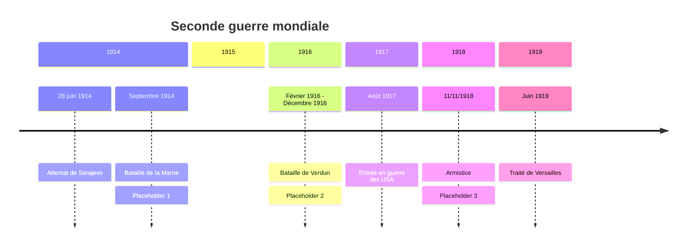

# Chapitre 1: Civils et militaires dans la Première Guerre mondiale

Le 28 juin 1914, l'archiduc François Ferdinand(héritier du trône d'Autriche-Hongrie) est assassiné à Sarajevo. L'engrenage des alliances(Triple Entente=France, Royaume-Uni, Russie; Triple Alliance=Allemagne, Autriche-Hongrie, Italie qui basculera du coté de la Triple Entente en 1915), transforme ce conflit local en guerre européenne puis mondiale.

=> Comment les civils et les militaires sont-ils mobilisés durant la I^ère^ Guerre Mondiale ?, Comment la 1^ère^ Guerre Mondiale fragilise-t-elle durablement les régimes politiques en place ?

## I. Une mobilisation totale des civils et des militaires
### A. 4 années de guerre

??? abstract "Placeholder 1"

	guerre de mouvement(Août 1914-NOvemebre 1914) avec succession d'offesives des 2 cotés les Allemands attaquent la France en passant par la Belgique et le Luxembourg en août 1914. En quelquessemaines, les Allemands sont à 45km de Paris mais ils sont stoppés sur la Marne en septembre 1914.

??? abstract "Placeholder 2"

	Guerre de position ou de tranchées (nov 1914-mars 1918): les tropes se terrent dans des tranchées et tentent de conserver leur position avec quelques tentatives pour percer le front

??? abstract "Placeholder 3"

	Guerre de mouvement (mars 1918-novembre 1918). Les Allemands lancent 5 offensives mais sont défaits par la contre-offensive. Victoire de la triple entente

!!! info "Tranchée"

	Fossé creusé dans le sol destiné à abriter le combattants

!!! info "Front"

	Lieu ou s'affrontent les armées ennemies

!!! info "Armistice"

	Accord signé entre les pays vaincus et les pays vainqueurs pour cesser les combats

[PDF](../../../assets/noscans/history-geography/correspondance-poilu.pdf)

| Extrait des lettres du 20 juin 1915 et du 3 novembre 1915 | Difficultés rencontrées par les Poilus |
|:---|:---:|
| J'éspère que tu ne t'es pas trop inquiété de moi depuis plusieurs jours que je n'ai pu vous écrire, les évènements m'en ont empêché, et quels évènements. Le papier sur lequel je t'écris en porte lui-même la marque, une balle traversant mon sac y a tout mis en bouillie | Difficultés pour donner des nouvelles à sa famille |
| J'ai reçu au soir un grand paquet de toi rempli de provisions et venant de Nantes, Je t'en remercie de tout mon cœur, il m'a fait grand, grand plaisir. Je suis sûr de ne pas mourir de faim maintenant, ni de manquer de tabac. | Manque de nourriture (donc faim et soif), manque de tabac | 
| La dernière fois que je t'ai écris, je te disais que j'étais en petit poste en avant des premières lignes. La nuit j'ai veillé au créneau et à une heure nous recevons l'ordre de monter nos sacs. Depuis 1h et demie du matin jusqu'à midi et quart, nous restâmes dans ce boyau ) attendre. De temps en temps, comme un homme montrait sa tête, une rafale d'obus durait un quart d'heure sans effet d'ailleurs. | Fatigue/ manque de sommeil, Attente de l'assaut |
| A midi ½ nous mettons baïonnette au canon et sac au dos, l’adjudant, un héros, monte sur la tranchée et crie « En avant ! ! ». Toute la compagnie est sortie ensemble sans hésitation le sourire aux lèvres d’un seul mouvement. Nous avons 500 m[ètres] de charge à faire, avec une seule station à un petit talus à 100 m[ètres]. Jusqu’au talus il n’y avait pas un homme touché si ce n’est quelques uns par les obus. Mais lorsque nous arrivâmes sur la crête quelle fusillade ô mon dieu ! ! Les mitrailleuses crépitèrent de face et d’enfilade, on aurait cru marcher dans un mur de fer. | Difficultés de l'assaut: obus, mitrailleuses, distances à parcourir, les barbelés, les blessures, la vue des camarades morts ou blssés, peur de la mort |
| Le lieutenant marchait devant nous avec une badine à la main. Nous arrivâmes ainsi sans trop de pertes jusqu’aux fils de fer boches à 30 m[ètres] de leur tranchée d’où debout sur le bord ils nous couvraient de mitraille. Devant ces fils étaient d’innombrables trous d’obus français, nous nous y couchons pour respirer. L’adjudant se lève en criant de nouveau « en avant ». Un petit sergent de la classe 14 se lève près de lui, il est fauché, un caporal de ma section l’imite, il tombe, je pars, je tombe, touché d’une balle à l’oreille que je croyais très sérieux sur le moment / et tous sont fauchés autour de moi. Il fallut s’arrêter là. Je saignais beaucoup, alors je défais mon paquet de pansement et je me l’installe, puis je mets mon sac devant moi et je me cache dans un trou d’obus que je garnis de terre tout autour de moi. Je suis resté là, immobile, couché sur le ventre toute la journée 9 heures entières. Les mitrailleuses tiraient sans interruption, les bombes et les obus nous couvraient de terre à chaque instant. Je reçois un éclat de balle dans le pied qui s’arrête à fleur de peau. Tant que je vivrai je me souviendrai de cette journée si angoissant | - |
| « Mon cher tonton, Il y a plusieurs jours que je ne t’ai écrit parce que j’ai encore déménagé. **Ma malheureuse permission si près de son échéance semble devoir je ne sais pourquoi être reculée à l’éternité.** Ce soir je vais encore une fois prendre les premières lignes et quelles lignes. Il a plu d’une façon ininterrompue depuis cinq ou six jours de sorte que **les routes étaient complètement détrempées hier soir pour venir et que chaque pas était un nouveau bain de pied.** Mais ceci n’est rien à côté du plaisir qui nous attend ce soir. **Il paraît que les boyaux sont des lacs et les tranchées** complètement comblées par les éboulements. **Il va falloir rester dans l’eau jusqu’aux genoux, sans abri, mal nourris, mal couverts pendant sept jours.** Sans compter que **les boches ne se gênent pas de nous bombarder suffisamment. J’ai peur de devenir fou** pendant cette période de martyre. J’ai idée que je serai malade avant de pouvoir partir en permission. Ce sera la confirmation de ma veine. **Comment ferai-je pour retourner dans cet enfer après ma permission** ? Je t’assure que je donnerais bien cher pour ne pas y revenir. Si tu pouvais trouver quelque chose pour moi tu m’éviterais bien des souffrances dont je puis soupeser maintenant l’étendue et bien des fureurs vaines. Pour conclure la pluie reprend, le plaisir sur toute la ligne en un mot. Peut-être ne recevras-tu pas de mes nouvelles bien régulièrement car **j’entrevois des jours horribles.** Je vous envoie de gros baisers à tous, votre neveu, M Sieklucki. » | Conditions climatiques difficiles (Pluie, boue, froid) Pas d'abris, Rats, poux, des souffrances |

### C. À l'arrière, des civils mobilisés
#### 1. Les civils participent à l'effort de guerre

Pour répondre à la demande des États qui ont tourné leur économie vers la guerre, les industriels reconvertissent leurs usines vers la production de matériels de guerre. Ex: Renault. Les femmes jouent alors un rôle clé pour remplace les homes partis au front. Par exemple, les "munitionnettes" sont les femmes travaillant dans les usines d’armement.

