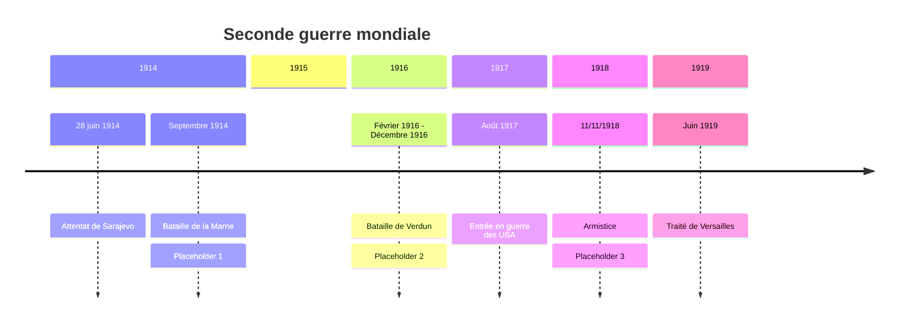
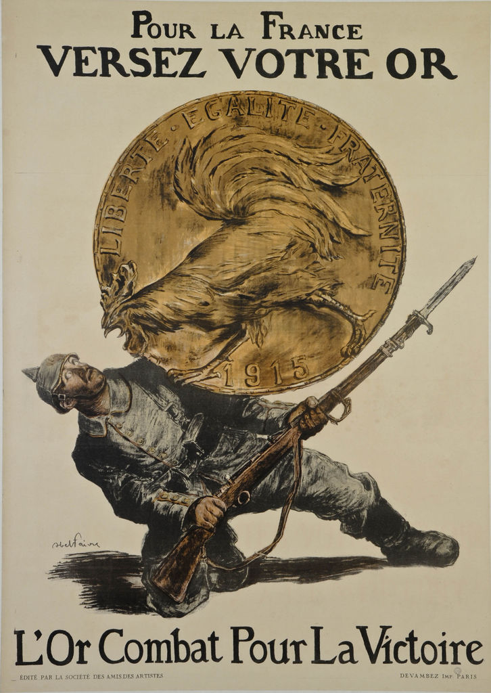
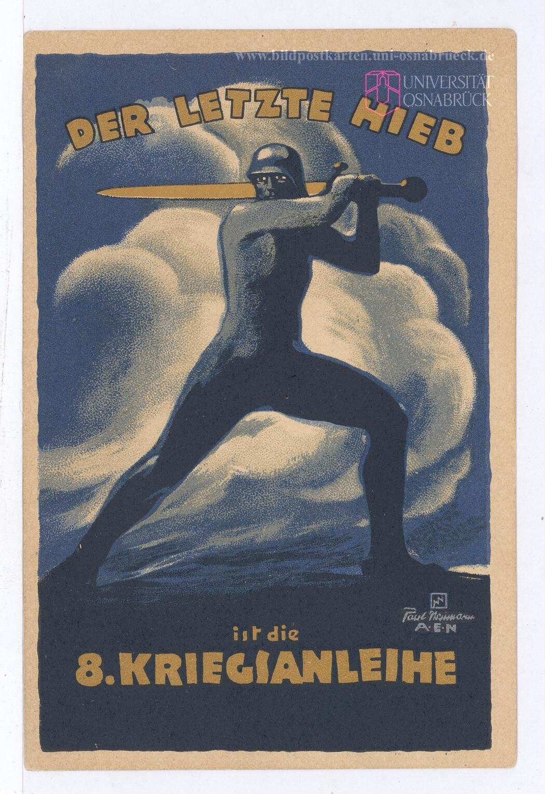
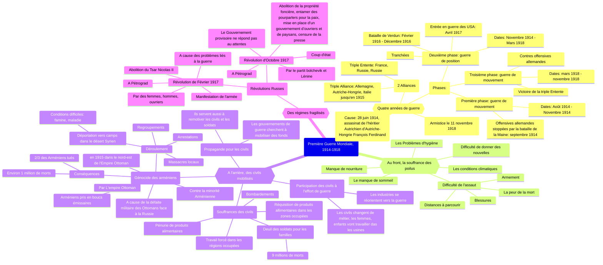

# Chapitre 1: Civils et militaires dans la Première Guerre mondiale

Le 28 juin 1914, l'archiduc François Ferdinand(héritier du trône d'Autriche-Hongrie) est assassiné à Sarajevo. L'engrenage des alliances(Triple Entente=France, Royaume-Uni, Russie; Triple Alliance=Allemagne, Autriche-Hongrie, Italie qui basculera du coté de la Triple Entente en 1915), transforme ce conflit local en guerre européenne puis mondiale.

=> Comment les civils et les militaires sont-ils mobilisés durant la I^ère^ Guerre Mondiale ?, Comment la 1^ère^ Guerre Mondiale fragilise-t-elle durablement les régimes politiques en place ?

## I. Une mobilisation totale des civils et des militaires
### A. 4 années de guerre

??? abstract "Placeholder 1"

	guerre de mouvement(Août 1914 - Novemebre 1914) avec succession d’offensives des 2 cotés les Allemands attaquent la France en passant par la Belgique et le Luxembourg en août 1914. En quelques semaines, les Allemands sont à 45km de Paris mais ils sont stoppés sur la Marne en septembre 1914.

??? abstract "Placeholder 2"

	Guerre de position ou de tranchées (nov 1914-mars 1918): les troupes se terrent dans des tranchées et tentent de conserver leur position avec quelques tentatives pour percer le front

??? abstract "Placeholder 3"

	Guerre de mouvement (mars 1918-novembre 1918). Les Allemands lancent 5 offensives mais sont défaits par la contre-offensive. Victoire de la triple entente

!!! info "Tranchée"

	Fossé creusé dans le sol destiné à abriter le combattants

!!! info "Front"

	Lieu ou s'affrontent les armées ennemies

!!! info "Armistice"

	Accord signé entre les pays vaincus et les pays vainqueurs pour cesser les combats

### B. La souffrance des poilus

[PDF](../../../assets/noscans/history-geography/correspondance-poilu.pdf)

| Extrait des lettres du 20 juin 1915 et du 3 novembre 1915 | Difficultés rencontrées par les Poilus |
|:---|:---:|
| J'éspère que tu ne t'es pas trop inquiété de moi depuis plusieurs jours que je n'ai pu vous écrire, les évènements m'en ont empêché, et quels évènements. Le papier sur lequel je t'écris en porte lui-même la marque, une balle traversant mon sac y a tout mis en bouillie | Difficultés pour donner des nouvelles à sa famille |
| J'ai reçu au soir un grand paquet de toi rempli de provisions et venant de Nantes, Je t'en remercie de tout mon cœur, il m'a fait grand, grand plaisir. Je suis sûr de ne pas mourir de faim maintenant, ni de manquer de tabac. | Manque de nourriture (donc faim et soif), manque de tabac | 
| La dernière fois que je t'ai écris, je te disais que j'étais en petit poste en avant des premières lignes. La nuit j'ai veillé au créneau et à une heure nous recevons l'ordre de monter nos sacs. Depuis 1h et demie du matin jusqu'à midi et quart, nous restâmes dans ce boyau ) attendre. De temps en temps, comme un homme montrait sa tête, une rafale d'obus durait un quart d'heure sans effet d'ailleurs. | Fatigue/ manque de sommeil, Attente de l'assaut |
| A midi ½ nous mettons baïonnette au canon et sac au dos, l’adjudant, un héros, monte sur la tranchée et crie « En avant ! ! ». Toute la compagnie est sortie ensemble sans hésitation le sourire aux lèvres d’un seul mouvement. Nous avons 500 m[ètres] de charge à faire, avec une seule station à un petit talus à 100 m[ètres]. Jusqu’au talus il n’y avait pas un homme touché si ce n’est quelques uns par les obus. Mais lorsque nous arrivâmes sur la crête quelle fusillade ô mon dieu ! ! Les mitrailleuses crépitèrent de face et d’enfilade, on aurait cru marcher dans un mur de fer. | Difficultés de l'assaut: obus, mitrailleuses, distances à parcourir, les barbelés, les blessures, la vue des camarades morts ou bléssés, peur de la mort |
| Le lieutenant marchait devant nous avec une badine à la main. Nous arrivâmes ainsi sans trop de pertes jusqu’aux fils de fer boches à 30 m[ètres] de leur tranchée d’où debout sur le bord ils nous couvraient de mitraille. Devant ces fils étaient d’innombrables trous d’obus français, nous nous y couchons pour respirer. L’adjudant se lève en criant de nouveau « en avant ». Un petit sergent de la classe 14 se lève près de lui, il est fauché, un caporal de ma section l’imite, il tombe, je pars, je tombe, touché d’une balle à l’oreille que je croyais très sérieux sur le moment / et tous sont fauchés autour de moi. Il fallut s’arrêter là. Je saignais beaucoup, alors je défais mon paquet de pansement et je me l’installe, puis je mets mon sac devant moi et je me cache dans un trou d’obus que je garnis de terre tout autour de moi. Je suis resté là, immobile, couché sur le ventre toute la journée 9 heures entières. Les mitrailleuses tiraient sans interruption, les bombes et les obus nous couvraient de terre à chaque instant. Je reçois un éclat de balle dans le pied qui s’arrête à fleur de peau. Tant que je vivrai je me souviendrai de cette journée si angoissant | - |
| « Mon cher tonton, Il y a plusieurs jours que je ne t’ai écrit parce que j’ai encore déménagé. **Ma malheureuse permission si près de son échéance semble devoir je ne sais pourquoi être reculée à l’éternité.** Ce soir je vais encore une fois prendre les premières lignes et quelles lignes. Il a plu d’une façon ininterrompue depuis cinq ou six jours de sorte que **les routes étaient complètement détrempées hier soir pour venir et que chaque pas était un nouveau bain de pied.** Mais ceci n’est rien à côté du plaisir qui nous attend ce soir. **Il paraît que les boyaux sont des lacs et les tranchées** complètement comblées par les éboulements. **Il va falloir rester dans l’eau jusqu’aux genoux, sans abri, mal nourris, mal couverts pendant sept jours.** Sans compter que **les boches ne se gênent pas de nous bombarder suffisamment. J’ai peur de devenir fou** pendant cette période de martyre. J’ai idée que je serai malade avant de pouvoir partir en permission. Ce sera la confirmation de ma veine. **Comment ferai-je pour retourner dans cet enfer après ma permission** ? Je t’assure que je donnerais bien cher pour ne pas y revenir. Si tu pouvais trouver quelque chose pour moi tu m’éviterais bien des souffrances dont je puis soupeser maintenant l’étendue et bien des fureurs vaines. Pour conclure la pluie reprend, le plaisir sur toute la ligne en un mot. Peut-être ne recevras-tu pas de mes nouvelles bien régulièrement car **j’entrevois des jours horribles.** Je vous envoie de gros baisers à tous, votre neveu, M Sieklucki. » | Conditions climatiques difficiles (Pluie, boue, froid) Pas d'abris, Rats, poux, des souffrances |

### C. À l'arrière, des civils mobilisés
#### 1. Les civils participent à l'effort de guerre

Pour répondre à la demande des États qui ont tourné leur économie vers la guerre, les industriels reconvertissent leurs usines vers la production de matériels de guerre. Ex: Renault. Les femmes jouent alors un rôle clé pour remplace les homes partis au front. Par exemple, les "munitionnettes" sont les femmes travaillant dans les usines d’armement.

Nature: Affiche

Date: 1918

Auteur: Georges Emile Capon

??? abstract "1"

	La femme française pendant la guerre

??? abstract "2"

	En médaillon, une Marianne guerrière, cuirassée et casquée

??? abstract "3"

	"Une munitionnette" devant sa machine à tourner les obus.

??? abstract "4"

	Une paysanne bêche un champ de maïs

??? abstract "5"

	Une mère allaite son nourrisson. Sa fille lui tend une lettre sans doute envoyée par son père mobilisé (position centrale)

**Quelle remarque peut-on faire sur la disposition des couleurs portées par les personnages ?**

Les vêtements des trois femmes recomposent les couleurs du drapeau français.

**Interprétation:** 

- Cette affiche montre la place nouvelle de la femme dans la guerre et son dévouement pour son pays. 
- Cependant, malgré ces changements sociaux importants, elle dit très clairement qu'il existe un féminité éternelle: le rôle fondamental de la femme est la maternité (d'où le positionnement central de la mère). Dans un contexte de mort de masse, la natalité est une priorité absolue.
- La guerre n'a donc pas totalement favorisé l'émancipation des femmes.

#### 2. Les civils, cibles de la propagande

| Affiches de propagande | {width=300px} d'Abel Faivre, 1915| {width=300px} (le dernier coup est le 8^ème^ emprunt de la guerre) de Paul Neuman de 1918 |
|---|---|---|
| **Présentation:** 1. Quel est l'auteur ? | Abel Faivre, 1915 | Paul Neuman, 1918 |
| 2. Quel est le pays commanditaire ? A quel camp appartient-il ? (Triple Entente/Triple Alliance). | France (Triple Entente) | Allemagne (Triple Alliance) |
| 3. A quelle période de la guerre correspond l'affiche ? (Début ? Milieu ? Fin ?) | Début de la guerre | Fin de la guerre |
| **Description de l'image:** 1. Qui est représenté ? | Un soldat Allemand | Un soldat Allemand |
| 2. Décrivez ses vêtements et son arme | Il est habillé en soldat, avec un fusil à baillonette et un casque à pointe | Une silhouette épurée, il à un casque et un glaive d'or. |
| 3. Décrivez ses mouvements, son expression. | Le soldat Allemand à genou, terrorisé par le coq Gaulois, ce coq est sur une pièce Française sur laquelle est inscrite les valeurs de la république | Il est prêt à utiliser son épée, à donner un coup d'épée pour achever son adversaire |
| 4.  La façon de représenter le soldat est-elle réaliste ou idéalisée (Justifiez votre réponse) | Réaliste | Idéalisée |
| **Slogan:** 5. Quel est le slogan ? | L'Or Combat Pour La Victoire | Le dernier coup est le 8^ème^ emprunt de la guerre |
| 6. Quel est son but ? | Que les Français donnent de l'argent pour financer la guerre | |
Conclusion: Il s'agit d'une affiche de propagande qui à pour objectifs de mobiliser financièrement les civils mais aussi encourager les soldats au front.

Les États endettés sont obligés de recourir à des empreints auprès des particuliers et des alliées(surtout les États-Unis) mais augmentent aussi les impôts. Pour que les civils gardent le moral, les États fond de la propagande.

??? info "Propagande"

	**Propagande:** utilisation des moyens d'informations pour influencer et convaincre l'opinion publique. 

#### 3. Les civils, victimes de violences et de souffrances

| Document | Exemples de souffrances ou de violences |
|---|---|
| Doc 1 | Pénurie de produits alimentaires => de charbon, entraîne la faim et le développement du marché noir |
| Doc 2 | Deuil des soldats pour les familles => De nombreuses veuves et orphelins |
| Doc 3 | La réquisition de produits alimentaires dans les régions occupées par les Allemands |
| Doc 4 | Les civils sont victimes de bombardements. |
| Doc 5 | Travail forcé dans certaines régions occupées par les Allemands. |

#### 4. Le génocide des Arméniens. 1915

Dossier p.26-27

??? info "Génocide"

	**Génocide:** extermination volontaire et systématique de tout un peuple.

1.  Où et quand le génocide des Arméniens a-t-il eu lieu ? 
Il à eu lieu en 1915, dans le nord est de l'Empire Ottoman.
2. Qui sont les protagonistes ? 
L'empire Ottoman contre la minorité Arménienne.
3. Pourquoi le gouvernement Ottoman décide-t-il, pendant la guerre, d'exterminer les minorités arméniennes ? 
Cela s'explique par une défaite militaire des Ottomans face aux Russes, et les arméniens sont prit en bouc émissaires
4. Quels moyens sont utiliser contre les Arméniens ?
Arrestation des Arméniens, regroupement, recensement, massacre d'une partie sur place, déportation vers les camps dans le désert Syrien 🇸🇾 avec des conditions difficiles.
5. Quel est le bilan du génocide ?
Deux tiers des arméniens sont morts durant ce génocide, soit 1 million de personnes
6.  

Introduction: 
Les Arméniens Ottomans ont été victimes en 1915 d'une extermination volontaire et complète de leur peuple par leurs propres compatriotes. 

Les Arméniens ont été massacrés de 1915 à 1916 en raison de la défaite des Ottomans à Sarikamich, en Russie. Les soldats arméniens ont été déclarés principaux coupables de cette défaite, car ils ont été accusés de collaboration avec la Russie.

Beaucoup de soldats arméniens ont été massacrés d'abord dans leurs propres bases. Ensuite, le gouvernement ottoman commença par ordonner l'arrestation des chefs politiques et des intellectuels arméniens. Puis, ils ordonnèrent petit à petit l'arrestation de toute la population Arménienne, 
pour ensuite les emmener dans des camps de concentration dans le désert Syrien, à pied, sans eau ni nourriture. La majorité moururent sur le chemin, mais une petite minorité qui restait en vie était employée à des travaux forcés une fois dans les camps.

{==Correction==}

Le génocide consiste en une extermination volontaire et systématique de tout un peuple. Les Arméniens en ont été victimes en 1915 dans l'Empire Ottoman.

Comment se passe le génocide ?

Il est organisé par les autorités gouvernementales turques (c'est le ministre de l'intérieur en personne qui donne l'ordre d'exterminer les Arméniens) qui profitent d'une défaite militaire face aux Russes pour mettre en cause la population arménienne déjà persécutée depuis la fin du XIXème Siècle (considérés comme des bouc-émissaires).

La population arménienne doit se regrouper dans les villes, les quartiers, les villages: il s'agit d'arrestations systématiques afin de les recenser le plus facilement possible. Une partie des arméniens(surtout les hommes) est massacrée sur place. Les survivants sont déportés à pied vers les camps de concentration situés dans le désert syrien. Beaucoup meurent durant le trajet: massacres, conditions difficiles (famine, maladies, épuisement).

Les 2/3 des Arméniens présents en Turquie ont été assassinés soit sur place, soit au cours de leur déportation soit 1 million de personnes de tous âges

## II. Une fragilisation des régimes
### A. En Russie, des révolutions

| | Qui ? | Où ? | Pourquoi ? | Comment ? | Conséquences ? |
|---|---|---|---|---|---|
| Révolution de Février 1917 | Des femmes, des hommes, des ouvriers industriels | à Petrograd | Des problèmes de ravitaillement, le pain, la guerre, le recul des troupes russes, problèmes avec le pouvoir autocratique du Tsar Nicolas II. (Le souverain tire ces pouvoirs de lui-même | Manifestations + soutient de l'armée | Abolition du Tsar Nicolas II le 3 mars 1917, mise en place d'un gouvernent provisoire |
| Révolution d'Octobre 1917 | Lénine avec le parti bolchevik | Petrograd | Le gouvernement provisoire ne répond pas aux attentes des Russes. Les Russes veulent la paix. | Coup d'état avec l'assaut du palais d'hiver | Abolition de la propriété foncière, entamer des pourparlers pour la paix, mise en place d'un gouvernement d’ouvriers et de paysans, censure de la presse |

Dans plusieurs pays(Allemagne, Hongrie), des soulèvements tentent de suivre la révolution russe.

En 1919, les vainqueurs de la guerre se réunissent à Paris pour rédiger les traités de paix. Le traité de Versailles (28 juin 1919) règle le sort de l'Allemagne jugée responsable de la guerre. Elle doit payer de lourdes réparations, perd une partie de son territoire et se colonies et son armée et réduite. Les autres traités démembrent les empires(russe, austro-hongrois) et créent de nouveaux états (ex: Pologne, Estonie...). Cette nouvelle carte de l'Europe entraîne de nouvelles tensions.

## Conclusion

La Première Guerre mondiale se caractérise:

- par une mobilisation totale des civils et des militaires
- par de nouvelles formes de violences
- par des conséquences aussi bien au niveau démographique, économique, sociale et politique, ce qui va fragiliser les régimes en place.

978-209-171897-2

[Online](https://mermaid.live/view#pako:eNqNV8tS20gU_ZUuzYZUmQx-JBjPygkkQxUkTMhkMcWmLbXsTlrdSj9cIRT_MrsZf8Ms9WNzbkt-YCQSFWDJ6vs-99zLXZKaTCSTpJA6K3h5oxkua4w_uLKikNW_VrC3QVh8XBqdSa5Ej_VP-qND_Bk_q8_TdXf3R-Aex7jW1Uo4lgk2j4L399tTdB285sGJCRuM2ecgddTWY9w57qTmngTVL8OT3xbVykovhWXT4K1MF1JoltGb5lkc_m703ErB3liuq3-MdOyNsBm06OzZntEBmyoluU6F23tF10crSyXYmfYCP5OoMEWkH4JzcvPZKbdWPaE7UfC5hsy-lz127rmCt5-D-xooDhGDf7Hn6dWCO-EmLV5uS1LSmUmTYMpYYcJSFHD-sRRdp9xDJZua6j8fE84O2TsDiRnE6bld7H2eC-3kEuXkMTCd4dZ5U5axxiW3THE2455LvI-l4-ySSw3nnCj9UwZORfiGaIqWaErjUHmjnwzmgf-I55JbR_fjdqmPVNIFud3-_tVOEJ-AoqABg2q1tIRAqH0JE6fVKt3YfNmuBxiysMJQ3E1Ajv15PUX6oUyR6HEbkgDfjnT8XHGLdfxwVO_kpiMfrw0chWemrcbtIp9k6o206zr7B02zh-KpLaTzMsVJeNF_6NED3pgGlls40yOdzoQ8j80X01YaqYLbZ5BTmecyDcpXqw1bEH-ElgSdwovY9az6m_CammClfXwO_nak-JUSzgXblpQLzkoRbJOPwtg98Uuuv4aYLg2zYDOoeTKUzGgtbAxdU9FRkD2zF3iVEhNTf-BWyYJ7CSuPzgEQa-vOFIWQ6rGmK2tmikDnamZd3M6BQS0e1KdJMPwn7ulF71K5lMoh5JlU0lWrRzU6uOIW5ZclJ0d3ZVCHqFDkORK2nRMthEcuYjAFB6gR8QiG1jK4j5BjSwHEI_G1fLt4YzRdcD0nGWqnakVjBXjD-1wgNa6Hds259o4tgUQgmy8jGaAU3MVzAcNpP8eYkabkc-oYIBU4UBuDHcHMqahWR6TtjEi4Jyx-YRrZaZLa4CBHsVugd64oH3ZJMpymE0liPhiPVt71hAkfn5xRGff7EVxv-s3t1Kht9lQrHWjWUqzWZEF6IgxJkXDZ2h0geNBdtrW9TVLOC_kY23R9qFZfg6zpf8_WjjGURdd1-W40kViahrKd21-ZYsZtVqe8jXdjqZFmm1IPrvUCaPPYYR2qD94iISaVWU1U3AJVGsBsyx1dzaxfG0B72-xQuO26c1aURK3vvTdo3HYl6Cl2EXvnJw7XBB-JScKaJIqZrt3Uol1oylLazhpGy6pVzqVHywCQMfMx2MYslRE8Tf3MOzekhlub5KCcWNKQi5kJKahghSHhOuATIYQd0AT1xPCr9UOBj0Tjuk99EHPoKruAsOVseJQSxpRBLr51n4RzJRisJrjIRSkvyg02KXvoUM-ub4mxuvU0xVpTehZHglQ006lPaJcsuOJZV3oh66hrBHVxt5nBr8NYvZ1q-AAXuyXO9FJiMrM-1V81DUlTzu3Oh9N1t9AUAZfMuyYCWntpVKijJLy0ruI7p8jc7gp23N0V2Q6VL0z9Ca4lSdeFdFCat2ZuefajXiDcbgalkgiuQX3X5GmGv8zXuNzuKZT9rj6ZGdUQX2AfHcJ6J1OjMIHOz3-QKFL9HttZs2E9kSkAs6TR7NGDCjNnKb_QiLggTHSzwo9yhXXj7c5so3wtpYvLoo5TuwTAYRhMGRj3cWN0XXAOZR0QbPKOtsfmZSPjILFL2gewFBVFETTWPZH0kkLYgssM_9nekYKbxC_g2E0ywW3G7Zeb5Ebf4xx2RnN9q9Nk4m0QvQQMMV8kk5wrh6dQYmyJU8kReLE-Un95hnY1dnOy5PovYzZn8JhM7pJvyaTfHz0_eTk4GhyNj0dHg-Fo1Etuk8lo_Hw0Hg76_Rf94-FweDIe3feS71HD0fPxyfi4fzwevBj3j4bjwf3_AWymzA)

- BAtaille de Verdun
- G: Génocide arménien