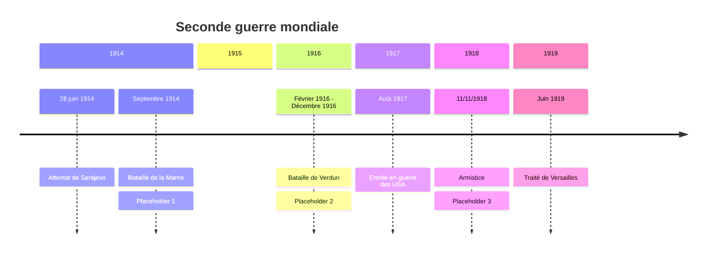

# Chapitre 1: Civils et militaires dans la Première Guerre mondiale

Le 28 juin 1914, l'archiduc François Ferdinand(héritier du trône d'Autriche-Hongrie) est assassiné à Sarajevo. L'engrenage des alliances(Triple Entente=France, Royaume-Uni, Russie; Triple Alliance=Allemagne, Autriche-Hongrie, Italie qui basculera du coté de la Triple Entente en 1915), transforme ce conflit local en guerre européenne puis mondiale.

=> Comment les civils et les militaires sont-ils mobilisés durant la I^ère^ Guerre Mondiale ?, Comment la 1^ère^ Guerre Mondiale fragilise-t-elle durablement les régimes politiques en place ?

## I. Une mobilisation totale des civils et des militaires
### A. 4 années de guerre

??? abstract "Placeholder 1"

	guerre de mouvement(Août 1914-NOvemebre 1914) avec succession d'offesives des 2 cotés les Allemands attaquent la France en passant par la Belgique et le Luxembourg en août 1914. En quelquessemaines, les Allemands sont à 45km de Paris mais ils sont stoppés sur la Marne en septembre 1914.

??? abstract "Placeholder 2"

	Guerre de position ou de tranchées (nov 1914-mars 1918): les tropes se terrent dans des tranchées et tentent de conserver leur position avec quelques tentatives pour percer le front

??? abstract "Placeholder 3"

	Guerre de mouvement (mars 1918-novembre 1918). Les Allemands lancent 5 offensives mais sont défaits par la contre-offensive. Victoire de la triple entente

!!! info "Tranchée"

	Fossé creusé dans le sol destiné à abriter le combattants

!!! info "Front"

	Lieu ou s'affrontent les armées ennemies

!!! info "Armistice"

	Accord signé entre les pays vaincus et les pays vainqueurs pour cesser les combats

