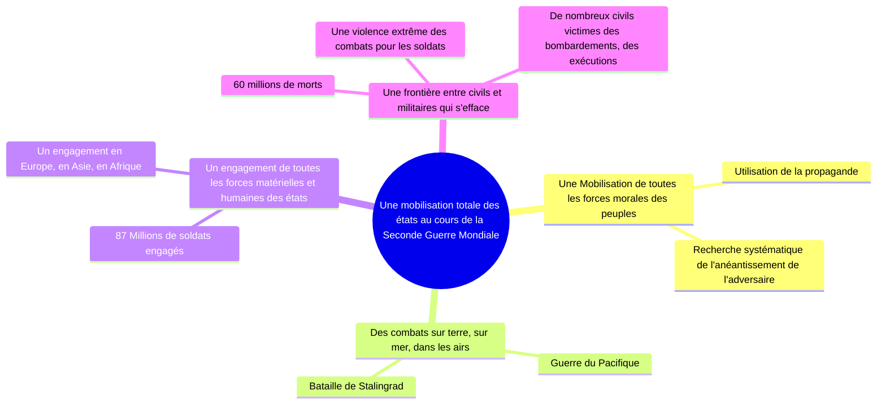

# Chapitre 3: La 2^nde^ Guerre Mondiale (1939-1945), une guerre d'anéantissement

> Pourquoi peut-on dire que la 2^nde^ Guerre mondiale se caractérise par une violence de masse et par une volonté d'anéantissement notamment à L'Est ?

## I. La 2^nde^ Guerre mondiale, un conflit aux dimensions planétaires

## II. Une mobilisation totale

1. La bataille de Stalingrad à lieu de juillet 1942 à février 1943
2. Les bélligérents

23

## III. Une volonté d'anéantissement : Le génocide des Juifs et des Tziganes

<!--
| Moyen d'extermination | Ghetto                                                                                                  | Fusillade de masse par les Einsatzgruppen                                                                                             | Camps d'extermination                                                                       |
|-----------------------|---------------------------------------------------------------------------------------------------------|---------------------------------------------------------------------------------------------------------------------------------------|---------------------------------------------------------------------------------------------|
| Definition            | Regroupement de juifs en quartiers isolés du reste d'une ville, et coupés de leurs besoins fondamentaux | Groupes speciaux charges, a partir de l'invasion de l'URSS en 1941, d'assassiner les Juifs et les responsables politiques sovietiques | Espace clos et organisé destiné à l'assassinat de groupes de populations juives et tziganes |
| Quand ?               | Des 1939 (jusqu'en 1943 a Varsovie)                                                                     | A partir de juin 1941                                                                                                                 | A partir de 1942 jusqu'à la libération des camps en 1945                                    |
| Ou ?                  | Allemagne, Pologne, Ukraine et autres pays d'Europe de l'Est                                            | Ancienne URSS                                                                                                                         | Pologne, Bohémie-Moravie                                                                    |
| Nombre de morts       | Plus de 800 000                                                                                         | Plus de 1 300 000                                                                                                                     | 3 000 000                                                                                   |
| Comment ?             | Par la famine, l'ennui, les maladies non traites (le typhus surtout), les execution pour la loi         | Creusement d'un ravin puis assassination des Juifs rassemblés à  coté, dans le ravin sur le corps d'autres Juifs                      | Gazage des Juifs dans des salles fermés (gaz variants) après acheminement aux camps         |
-->

| Moyen d'extermination                     | Définition                                                                                                                            | Quand ?                                                  | Ou ?                                                         | Nombre de morts   | Comment ?                                                                                                                                                        |
|-------------------------------------------|---------------------------------------------------------------------------------------------------------------------------------------|----------------------------------------------------------|--------------------------------------------------------------|-------------------|------------------------------------------------------------------------------------------------------------------------------------------------------------------|
| Ghetto                                    | Regroupement de juifs en quartiers isolés du reste d'une ville, et coupés de leurs besoins fondamentaux                               | Des 1939 (jusqu'en 1943 a Varsovie)                      | Allemagne, Pologne, Ukraine et autres pays d'Europe de l'Est | Plus de 800 000   | Par la famine, l'ennui, les maladies non traites (le typhus surtout), les execution pour la loi                                                                  |
| Fusillade de masse par les Einsatzgruppen | Groupes spéciaux charges, a partir de l'invasion de l'URSS en 1941, d'assassiner les Juifs et les responsables politiques sovietiques | A partir de juin 1941                                    | Ancienne URSS/Front est                                      | Plus de 1 300 000 | Creusement d'un ravin puis assassination des Juifs rassemblés à coté, dans le ravin sur le corps d'autres Juifs                                                  |
| Camps d'extermination                     | Espace clos et organisé destiné à l'assassinat de groupes de populations juives et tziganes                                           | A partir de 1942 jusqu'à la libération des camps en 1945 | Pologne, Ukraine, Bohémie-Moravie                            | 3 000 000         | Acheminement en train à bestiau, puis tri et Gazage des Juifs dans des salles fermés (gaz variants) après acheminement aux camps, puis four crématoire ou bucher |

La décision d'exterminer systématiquement les Juifs et prise fin 1941, "La solution finale" est organisée lors de la Conférence de Wannsee le 20 janvier 1942.
Ainsi, les Juifs de toute l'Europe occupée ainsi que les tsiganes sont déportés en masse vers les camps d'extermination comme Auschwitz (plus de 1 million de personnes sont mortes dans ce camp). Au total, la Shoah a fait plus de 5 millions de morts parmi les Juifs. Le génocide des siganes a fait près de 250 000 morts.

!!! abstract "Camp d'extermination"

    Un camp destiné à exterminer immédiatement les juifs et les tsiganes en les envoyant dès leur arrivé dans des chambres à gaz

!!! abstract "Solution finale"

    Expression employée à partir de 1942 par les nazis pour désinger la destruction totale des Juifs d'Europe

!!! abstract "Génocide"

    Extermination volontaire et systématique de tout un peuple

!!! abstract "Shoah (de l'hébreu catastrophe)"

    Génocide des Juifs pendant la Seconde Guerre Mondiale

