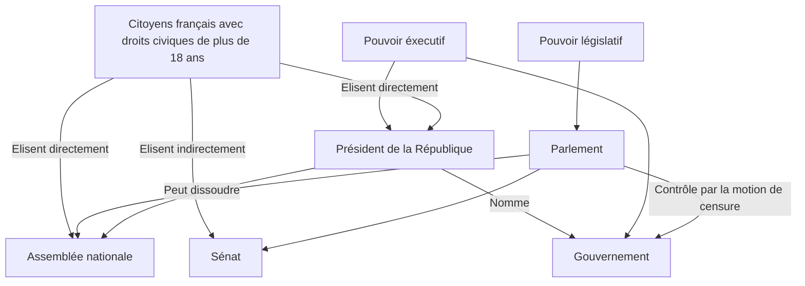

# Chapitre 2: La V^eme^ République, de la République Gaullienne à l'alternance et à la cohabitation

=> Comment la vie politique évolue-t-elle sous la V^eme^ République ?

## I. De Gaulle et la V^eme^ République
### A. Le retour de De Gaulle et la naissance de la V^eme^ République

1. Au bord de la guerre civile
2. Le général de Gaulle
3. A la libération/résistance

1. Une réforme de la constitution
2. "tenter de conduire une fois de plus au salut le pays"

La constitution de la V^eme^ République est adoptée le 28 septembre 1958, par référendum. En décembre 1958, De Gaulle est élu président de la république. 

!!! abstract "Referendum"

    Vote des citoyens qui doivent répondre par Oui ou Non à une question posée. 

2. Le président et le premier ministre. 

| Nom des assemblées | Nom donnée aux élus | Mode de scrutin | Nom des élections | Durée du mandat | Lieu de réunion | Rôles et fonctions particuliers | Rôles et fonctions communs |
| Assemblée nationale | Députés | Suffrage universel direct | Election legislatives | 5 ans | Palais Bourbon | Motion de censure | - Voter les lois   - Voter la loi de finances de l'Etat   - Autorisation de déclaration de guerre   - Initiative de lois (proposition des lois)   - Contrôle du gouvernement (questions aux ministres) |
| Sénat | Sénateurs | Suffrage universel Indirect | élections sénatoriales |  6 ans | Palais du Luxembourg (Paris) | Représentation des collectivités territoriales | - |

6. Le pouvoir de le censurer
7. Le pouvoir de la dissoudre
8. C'est un régie parlementaire avec une pouvoir éxecutif fort. 

!!! abstract "Motion"

    Procédure par laquelle l'assemblée nationale peut contraindre le gouvernement à démissionner

En 1962, par réferendum, de Gaulle demande que le président soit élu au suffrage universel direct. C'est donc l'ensemble des citoyens  qui l'élisent pour sept ans. Celà renforce les pouvoirs du président. 

De Gaulle cherche à maintenir un lien direct avec les français, notament à travers les médias.

En mai 1968, De Gaulle doit faire face à un grand mouvement de contestation. La crise est sociale mais aussi politique puisque les opposants réclament le départ du gouvernement. Il rétablit l'ordre mais se sent désavoué.
De Gaulle démissionne en avril 1969 suite aux résultats du référendum sur la régionalisation.

## II. La V^ème^ République à l'épreuve de la durée
### A. La continuité

Georges Pompidou (1969-1974) et Valéry Giscard d'Estaing (1974-1981) succèdent à De Gaulle. Les années 60-70 sont marquées par une stabilité politique: le pouvoir reste aux mains des successeurs de De Gaulle

### B. 1981, L'alternance

Les mesures de la gauche au pouvoir:
- Création de la fête de la musique
- 5^e^ semaine de congés payés
- Nationalisation de 39 banques et de secteurs industriels
- Semaine de travail de 39 heures
- Création de la Haute Autorité de l'audiovisuel
- Retraite à 60 ans
- Création de l'impôt sur les grandes fortunes (IGF)
- Loi Defferre sur la décentralisation (davantage de pouvoirs donnés aux régions)
- Augmentation du SMIC (salaire minimum)
- Autorisation des "radios libres"
- Lois Auroux qui renforcent les droits des salariés dans les entreprises
- Abolition de la peine de mort. (octobre 1981)
- Mesures en faveur des locataires

1. François Mitterrand
2. Les élections législatives, avec le PCF
3. Car le gouvernement passe de la droite à la gauche (président + majorité)
4. Nationalisation de 39 banques et de secteurs industriels; sociale: semaine de 39h, retraite à 60 ans, 5eme semaine de congés payés, création de l'IGF, mesures en faveurs de locataires, augmentation du SMIC, lois Auroux; administrative et judiciaire: abolition de la peine de mort, loi Defferre sur la décentralisation; culturelles: création de la fête de la musique, création de la Haute autorité de l'audiovisuel, autorisation des radios libres.
5. Deux réformes héritées de la libération sont les nationalisations et la retraite à 60 ans
6. Les congés payés et la semaine de travail de 39 heures

En mai 1981, le socialiste François Mitterrand est élu président de la république, et en juin le parti socialiste remporte les élections législatives: c'est l'alternance politique. De nombreuses réformes sont entreprises.

!!! abstract "Alternance politique"

    Passage au pouvoir d'une majorité politique à une autre.

### C. L'exemple de la première cohabitation

1. Le président de la République en 1986 est François Mitterrand
2. Car la majorité à l'assemblée est de droite
3. Le premier ministre/gouvernement
4. Le président n'a pas de grand rôle dans la politique intérieure du pays, puisque c'est le gouvernement qui à ce pouvoir.
5. Les réformes sont toutes l'inverse de celles prisent par la gauche(nationalisation puis privatisation, annulation des réformes du gouvernement d'avant)
6. D'assurer la continuité et les affaires courantes et les affaires étrangères, il est le chef des armées.

En 1986, la droite remporte les élections législatives, Mitterrand nomme un premier ministre de droite: Jacques Chirac. C'est la première cohabitation.
Le Président conserve le pouvoir dans le domaine de la Défense et de la politique étrangère mais il n'intervient pas dans les choix politiques du gouvernement.

!!! abstract "Cohabitation"

    Présence à la tête de l'Etat d'un Présideent et d'un gouvernement de tendances politiques opposées

## Conclusion

