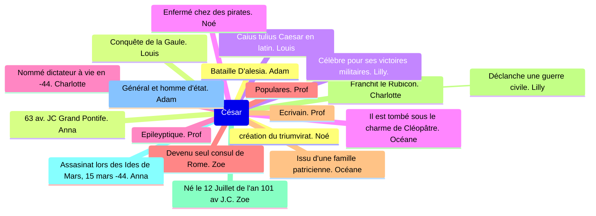

## Exercice 1

**En Italie** *(CCL)*, Janus est l'un des plus anciens **dieux** *(NOM)*.

**La légende** *(Attribut du sujet, Nominatif)* raconte qu'il avait appris **aux premiers hommes** *(S, N)* du Latium la culture **des champs
** *(COI, NOM)*.

Il sauva aussi **les Romains** *(COI, Datif)* alors qu'ils livraient **bataille** *(CDN, Géntif)* **aux Sabins** *(COD, Accusatif)*.

Il apporta **la victoire** *(COD, Accusatif)* // **aux Romains** *(COS, Datif)* en faisant jaillir des eaux chaudes qui
provoquèrent la fuite **des Sabins** *(CDN, Génitif)*.

C'est pourquoi on décidé de laisser toujours ouverte la porte **du temple** *(CDN, Génitif)* de Janus pour que **le dieu** *(Sujet, Nominatif)* puisse à tout moment porter **secours** *(COD, Accusatif)* aux Romains.

C'était un dieu **bon** *(Attribut du sujet, Nominatif)*.

## Exercice 2

L'èléve parle ^^à son maître^^
maître -> COI, Datif, magistro <- 0

Les fils ^^de l'esclave^^ travaillent
de l'esclave -> CDN, Génitif, servi <- 0

Les servantes travaillent ^^la terre^^
la terre -> COD, Accusatif, terram <- 0

Le consul donne ^^de l'eau^^ / ^^à ses esclaves^^
de l'eau -> COD, Accusatif, aquam <- 0
ses eslaves -> COS, Datif, servis <- 0

Les loups sont nombreux dans les ^^fôrets^^
forêts -> CCL, Ablatif, silvis

^^Ô, maître^^, écoute ^^tes esclaves^^
Ô, maître -> Domine <- 0
tes esclaves -> COD, Accusatif, seros <- 0

La fille ^^du maître^^ aime ^^le fils^^ ^^de l'esclave^^
du maître -> CDN, Génitif, domini
le fils -> COD, Accusatif, filium
l'esclave -> CDN, Génitif, servi

## Exercices déclinaisons

1. _

| Terminaison | 1^ère^ déclinaison | 2^ème^ déclinaison | 3^ème^ déclinaison |
|:-----------:|:------------------:|:------------------:|:------------------:|
|     -is     |                    |                    |    nominatif ?     |
|     -i      |                    |                    |                    |
|     -e      |                    |                    |                    |
|     -a      |                    |                    |                    |
|     -um     |                    |                    |      génitif       |

2. _

| Nom    | Entrée lexicale | Déclinaison | Cas possible |
|--------|-----------------|-------------|--------------|
| finis  |                 |             |              |
| pueris |                 |             |              |
| mari   |                 |             |              |
| capita |                 |             |              |
| aqua   |                 |             |              |

3. Cherchez l'intrus de chaque série et justifiez votre réponse
    1. temporum / pas bonne déclinaison
    2. ivium / n'existe pas
    3. domina / nom féminin: autres neutres
    4. maria / sens différnet
    5. libri / les autres sont des personnes
4. _

| noms       | Déclinaison | Accusatif Singulier | Accusatif Pluriel | Génitif Pluriel |
|------------|-------------|---------------------|-------------------|-----------------|
| puer       | 2e          | puerum              | pueros            | puerorum        |
| iter       | 3e (n)      | iter                | itinera           | **itinerum**    |
| magister   | 2e          | magistrum           | magistros         | magistrorum     |
| servus     | 2e          | servum              | servos            | servorum        |
| virtus     | 3e (f)      | virtutem            | virtutes          | virtutum        |
| puella     | 1ère        | puellam             | puellas           | puellarum       |
| caput      | 3e (n)      | caput               | capita            | capitum         |
| memoria    | 1re         | memoriam            | memorias          | memoriarum      |
| hostis     | 3e (m/f)    | hostem              | hostes            | hostium         |
| consilium  | 2e (n)      | consilium           | consilia          | consiliorum     |

5. _
    1. Ad castra itinera ducunt = Les chemins mènent au camp
    2. Hostium consilium consules timent et cuntorum civium auxilium petunt = Les consuls ont peur du projet des ennemis et cherchent à obtenir l'aide de tous les citoyens
    3. Romani non tantum hostium multitudinem virtuemque sed etiam hominum magna corpora et novum pugnae genus timent

Romani (Romain) non (non) tantum (seulement) hostium (ennemis) multitudinem (foule) 
virtutemque (bravoure/force) sed (mais) etiam (aussi) hominum (personne) magna (great) 
corpora (corps) et (et) novum (nouveau) pugnae (bataille) genus 
(sang/race/origines/rang/manière de) timent (peur)

= 

Romain non seulement ennemis foule
bravoure/force mais aussi en plus personne great corps
et nouveau bataille sang/race/origines/rang/manière de
peur

Les romains ont non seulement une foule d'ennemis braves mais aussi beaucoup de 
corps sur les mains et la peur d'une nouvelle bataille fratricide

Les romains craignent non seulement la foule et le courage des ennemis mais aussi les grands corps des hommes et un nouveau genre de combat.

tempus, temporis, n: abl, s: tempore  
servolus, servolu, m: acc s: servolum  
corpus, corporis, n: acc p: corpora  
consul, consulis, m: gen p: consulum  
toga, togae, f: acc p: togas

L'esclave ramena Cesar chez lui.

Le conjuré blesse César sous la gorge

César pris le bras de Casca

César reçut une blessure à la poitrine

L'ennemi transperça la gorge de son glaive.

## Nouveaux exos

Le messager fuit la douleur
^            ^       ^
nuntius dolore_m_  fugit
sujet     verbe     COD

-> 2

Elle donne son amour à son mari
^      ^       ^     ^  ^   ^
illa dat suum amorem suo marito
sujet verbe COD COD COS

verbe (3e personne)  COD(Accusatif sing.)  COI (D sing.)
amorem marito dat.

-> 0

La femme du consul demande de l'aide au messager
^            ^        ^       ^           ^
uxor     consulis   auxilium nuntiis     petit
sujet CDN Verbe COD COS

-> 1

Le combat est dans la ville
    ^      ^       ^ 
  pugna   est    in urbe
  sujet  verbe    CC

pugna in urbe est

-> 2

L'épouse de l'homme détruit les lettres du messager
^ ^ ^ ^ ^ ^ ^ ^
uxor viri epistulas nuntii delet
sujet CDN COD CDN verbe

-> 1

---

nuntii dolores -> 1
amores maritis -> 0
uxores consulum auxilia nuntio -> 0
pugnae in urbibus -> 0
uxares virorum epistulam nuntiorum -> 0

m,e,e

Jules César, né en 100 av. J.-C., est issu d’une famille patricienne. Capturé par des pirates en mer Égée, 
il impressionne ses ravisseurs avant de les punir une fois libéré. Chef charismatique, il inspire ses soldats par sa proximité et ses 
discours motivants. Le 15 mars 44 av. J.-C., il est tragiquement assassiné au Sénat par des conjurés craignant qu’il ne devienne roi.

Jules César, né en -100 où -101, dans une famille patricienne prestigieuse: la gens Julia. Marius, son oncle par alliance, s'intéresse à lui: sous son influence, César se range au côté des démocrates (les populares). Pour éviter les proscriptions (Scylla), il se rend à Rhodes où il étudie la rhétorique: il était bilingue. 

Rentré à Rome, après la démission de Scylla, il entreprend une grande carrière politique. Il fait le cursus honorum, puis il est envoyé comme gouverneur en Espagne et devient membre du sénat. Il se lie d'amitié avec Pompée et Crassus (citoyens très riches), en -60. Il forment le premier triumvirat. 
 
En -59, il obtient le commandement des troupes en Gaule et mène 7 campagnes militaires en -58 jusqu'en -52, triomphant de Vercingétorix à Alésiaw

en son absence, crassus, après être rentré en guerre contre les parthes et battu et tué. seul pompée, nommé consul unique par le sénat en -52 sépare César du pouvoir absolu. Au début de -49, César, refusant de céder aux injonction de son rival, et de démanteler son armée, César marche sur Rome, ou il se fait nommer dictateur, et mène une guerre civile contre Pompée. Il porte la guerre en grèce, ou pompée c'est enfui, l'écrase à la bataille de Pharsale et le poursuit en égypte, ou il est assasiné par des agents du frère de Cléopâtre.

[e](https://mermaid.live/view#pako:eNptU8tu2zAQ_JWFLm6BVIjbtAffXNk1bCRpkN4CX9YibRMluQofAtIg_1L0VPU3-GNdykllB9VBIsXZndnZ5WNRk5DFpDDKCoPN2gI_jijAmyp1Ht3bw6_81C51GBRZEBGCU9G0ymEo4ZpSN8A-fQBsS1hVsHBoBdyQDWorS5haiwOsQhU9hKjzp0LJXCAtaGawJVxSVH4ALzVIHyCQ2aQOPHGIllDv0RkJQkKlU0dN-hUc83ytWaeVQ_Q1GcNhQtUBg4wO0k9olcx07y4uSqg4j6YQjkJmspU2gpdRQ03W84dpbslw_js6Ai69jyBG0UrYolGaZTXI5tRKWvs_MV_YlHqvQi7gNm4UZz9SAAOwl5G6Wme8hMywi9I5rlu1SnPuS6Z7OCqTa-Sk4_ewillIyJL1CC2Mz8-5J7Aqq1fqp96jVxZZDTnPeA_L_OLAK3T-DMYfwfDi4NNpAxeps6lzyK0JsGeLuROj1IU8EVOBZkB-xoC9M7MRaukVvgZUZO9j-hP6XmqEBca-vtMh4IHU6feGDWiIm-hZZ8stJeV4xdYrZuHlsy_lEDi3W-nyBLCPP_oimzy4GXo6uvOGfX1ogrqPTH_jaDuc3VATNfb5Tw_mtVMt5qHN_4uzwjAZKsG36jGj1kXYSyPXxYSXAt33dbG2T4zDGOjbg62LSXBRnhWO4m5fTLaoPe9iI1jiTOHOoXmBNGjviP5tpVCB3NXhCvc3-SVu3p88J3v6C0NOR-I)

## Questions

à quel moment se déroule la bataille;

de nuit

qu'arrive-t-il au soldats de Vercingétorix ; 

que fait Vercingétorix au lendemain de la bataille;

Au lendemain de la bataille, Vercingétorix capitule et jette ses armes aux pieds de César: ""

pour quel motif dit-il avoir entreprit cette guerre;

qu'est-il prêt à faire ;

quel est la phrase du texte qui illustre le mieux le tableau de Lionel Royer

