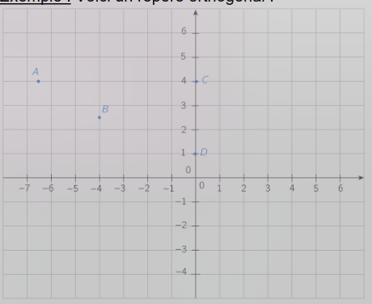
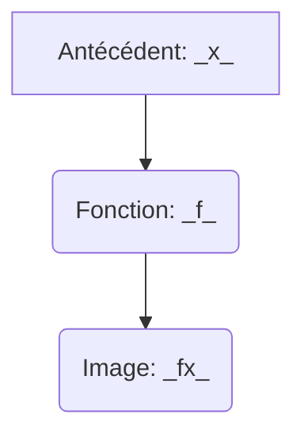
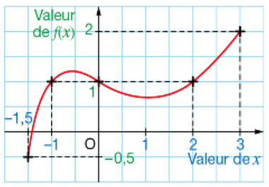

# Séquence 1 : Notion de fonctions

Ap math lundi

[Version du professor](../../assets/noscans/maths/maths-chapter1-start.pdf)

## I) Rappel: Graphique
Un graphique est composé d’une (ou plusieurs) **courbes** et d’un **repère orthogonal**.
Celui-ci est composé de :

- Deux droites **perpendiculaires** : une verticale et une horizontale
- D’une **échelle**

^^Exemple^^: Voici un repère orthogonal:

O s’appelle **l’origine** du repère.
La droite horizontale s’appelle **l’axe des abscisses**.
La droite verticale s’appelle **l’axe des ordonnées**.

Dans un graphique, on repère les points grâce à
leurs **coordonnées**.
Le point A à pour **abscisse** -6,5 et pour **ordonnée** 4.
Ses coordonnées sont (-6,5 ; 4).
Et on note A(-6,5 ; 4).
De la même façon, on note B(-4 ; 2,5), C(0 ; 4) et
D(0 ; 1).

## II) Qu'est-ce qu'une fonction ?

Une fonction $f$ est un ==procédé== qui, à un nombre $x$, associe un unique nombre que l'on note $f(x)$(lire "$f$de $x$").
On dit que $f(x)$ est ==l'image== de $x$ par la fonction $f$ et que $x$ est ==un antécédent== de $f(x)$ par la fonction $f$.

{++Notation:++} On utilise aussi la notation $f:x$ -> $f(x)$ qui se lit $f()$ de $x$; $f$ est la fonction qui , à $x$ associe le nombre $f(x)$

{++Exemple:++}

Soit $f$, la fonction qui, à un nombre, associe son carré. On définit ainsi une fonction, car un nombre donné n'a qu'un seul carré. 

Pour cette fonction, l'image de $3$ et $9$ est l'image de $-4$ est $16$.

{++Remarque:++} 
**Un nombre peut avoir plusieurs antécédents.**
Dans l'exemple précédent, l'image de $4$ est aussi $16$.
Ce qui veut dire que $16$ a, au moins, $2$ antécédents: $-4$ et $4$

## III) Déterminer une image ou un antécédent
### A) Avec une formule

$h$ est la fonction $h$: $x$ -> $x^2 - 1$ ( on peut aussi écrire $h(x) = x^2 - 1$).

Pour chaque nombre $x$, on associe le nombre $h(x)$ obtenu en appliquant le programme de calcul ci-dessous.

* Choisir un nombre.
* Elever au carré.
* Soustraire 1

On peut obtenir un tableau de valeurs:

| Nombre: $x$       | $-2$  | $-1$ | $0$   | $1$  |
|-------------------|-------|------|-------|------|
| Image: $x^2 - 1$  | $3$   | $0$  |  $-1$ |  $0$ |

### B) Avec un tableau

{==Définition:==} Les images respectives par la fonction $g$ de certaines valeurs de $x$ peuvent être présentées dans un tableau appelé **tableau de valeurs**.

Ce tableau définit une fonction $g$ qui, à chaque nombre $x$ de la première ligne, associe un nombre $g(x)$ de la deuxième ligne. 

| Nombre $x$ | $0$ | $1$ | $2$ | $3$ | $4$ | $5$ |
|---|---|---|---|---|---|---|
| Image $g(x)$ | $-5$ | $-3$ | $0$ | $5,2$ | $0$ | $7$ | 

### C) Une courbe

{==Définition:==} La **représentation graphique** d'une fonction $f$ est la courbe constituée de l'ensemble des points de cordonnées ($x$; $f(x)$).

Ce graphique ci-dessous définit une fonction $f$ qui, à chaque nombre $x$ (lu sur l'axe des abscisses), associe un nombre $f(x)$ (lu sur l'**axe des ordonnées**).

{ align="left" }

Par exemple, on peut lire que 
* $f(3) = 2$
* $1$ a trois antécédents: $-1;0$ et $2$.
* L'image de $-1.5$ par la fonction $f$ est $-0.5$