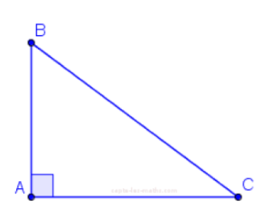
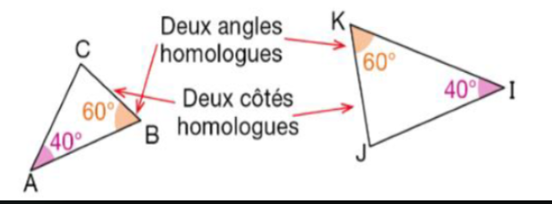
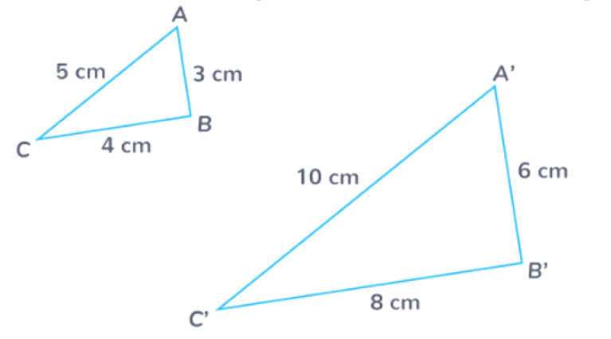
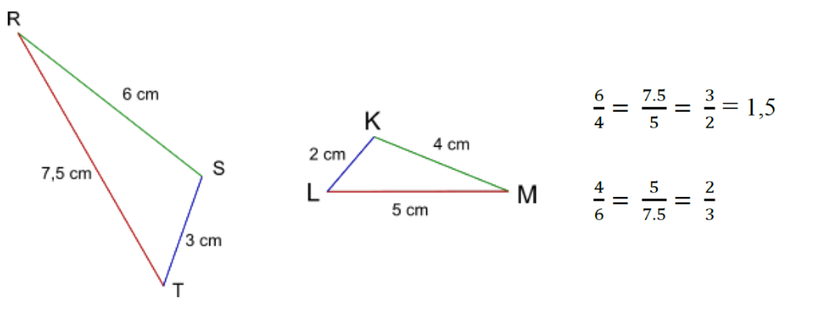

# Séquence 3: Le théorème de Thalès et sa réciproque
## I) Rappels de 4ème
### A) Le Théorème de Pythagore

^^Théorème: ^^ **Si un triangle est rectangle, et seulement dans ce cas, 
alors le carré de la longueur de l'hypoténuse est égal à la somme 
des carrés des longueurs de ses deux côtés. Autrement dit, si ABC
est un triangle rectangle en A, ainsi l'égalité de Pythagore,
$BC^2 = AB^2 + AC^2$, est vérifiée.**

^^Remarque: ^^ Ce théorème fonctionne dans les 2 sens, si l'égalité
de Pythagore est vérifiée, le triangle est forcément rectangle.

### B) Théorème de Thalès

^^Théorème: ^^ 
Dans un triangle ABC tel que: M est un point du côté [AB] et N
est un point du côté [AC], si les droites (MN) et (BC) sont
parallèles, alors: $\frac{AM}{AB} = \frac{AN}{AC} = \frac{MN}{BC}$

Autrement dit, les longueurs des côtés du triangle AMN sont
proportionnelles aux longueurs des côtés du triangle ABC.

^^Remarque: ^^ 
La propriété sur la longueur du théorème de la droite des milieux
est un cas particulier du théorème de Thalès.

## II) Triangles semblables
### A) Angles

^^Définition :^^ Des triangles semblables sont des triangles qui ont leurs angles deux 4 deux de méme mesure.
^^Propriété :^^ Si deux triangles ont deux angles deux a deux de méme mesure, alors ces triangles sont semblables.

Vocabulaire : Lorsque deux triangles sont semblables :
- un angle d'un triangle et l'angle de méme mesure de l'autre triangle sont dits homologues ;
- les sommets (ou les côtés opposés) de deux angles homologues sont aussi dits homologues.

### B) Longueurs

^^Propriété: ^^ Si deux triangles sont semblables, alors les longueurs de leurs côtés sont deux à deux proportionnelles.

^^Exemple : ^^ Ces triangles ABC et A’B’C’ sont semblables. Done les longueurs de leurs cétés homologues sont deux

$\frac{AB}{A'B'} = \frac{BC}{B'C'} = \frac{AC}{A'C'} = 0.5$

^^Propriété: ^^ Si les longueurs des côtés de deux triangles sont deux a deux proportionnelles, alors ces triangles sont semblables

^^Exemples: ^^

Donc les triangles RST et KLM sont semblables. Done TRS = LMK, RST = MKL et STR = KLM

KLM est une réduction de RST dans le rapport $\frac{2}{3}$ bien RST est un agrandissement de KLM dans le rapport 1,5.

^^Remarque: ^^ Lorsque les 2 triangles semblables ont un Sommet commun et 2 paires de cotés homologues alignés,
on arrive dans une configuration très particulière, la configuration de Thalès.

## III) Nouvelle configuration: Le sablier / ?

Théorème du cercle circonscrit à un triangle rectangle

Propriété

Dans un triangle rectangle, le milieu de l'hypoténuse est le centre du cercle circonscrit à ce triangle.

Autre formulations du théorème:

* Si un triangle est rectangle, alors il peut être inscrit dans un cercle ayant pour diamètre son hypoténuse.
* Le milieu de l'hypoténuse d'un triangle rectangle est équidistant des trois sommets.

0