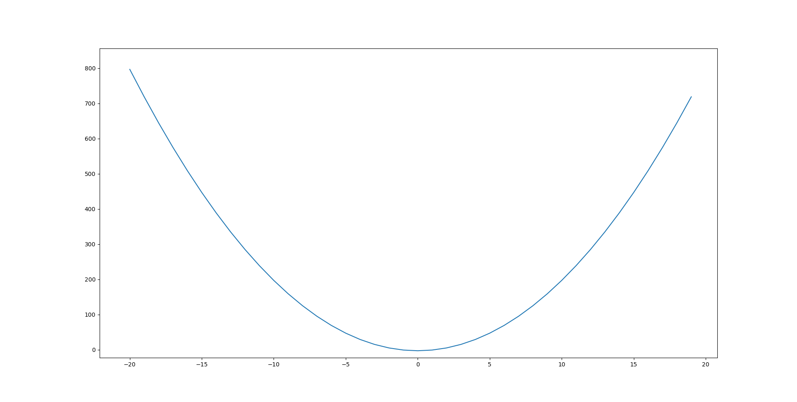
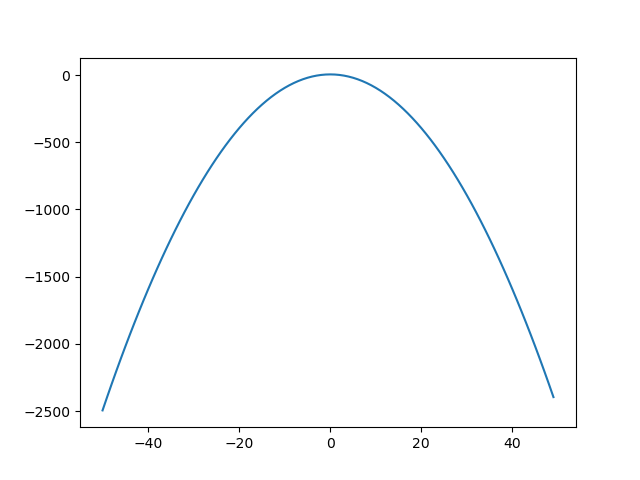

je suis le lundi

# Exercices

Replacer x et y par leur valeur pour calculer chaque expression.


|    A = 4x + 3y pour x = -5 et y = -2       |
|:------------------------------------------:|
|     B = -3x + 8y pour x = 7 et y = -4      |
|    C = (x+y)(x-y) por x = -4 et y = -1     |
| D = (2x + 1)(2 - y) pour x = -1 et y = -9  |
| E = x^2^ + 2xy + y^2^ pour x= -3 et y = -2 |


$A=4*-5+3*-2$;
$A=-26$;

$B=-3*7+8*-4$;
$B=-53$;

$C=(-4+-1)(-4-(-1))$;
$C=15$;

$D=(2*-1+1)(2-(-9))$;
$D=-11$;

$E=((-3)*(-3))+(2*(-3)*(-2))+(-2*-2)$;
$E=25$;


## Activité 1 p 120
Entre chaque numéro, il y à 5 lignes et 40 minutes, cela veut dire que une ligne = $40/5$. Cela donne:  $8$.

1. L'entreprise arrête à $308$ minutes d'utiliser l'engin, cela donne $308/60$, donc ils arrête d'utiliser l'engin à $14.133333333$.
2. Les phases de consommation sont: 80-75L entre 0 et 60 minutes; 75-45L entre 60 et 148 minutes; pas de consommation entre 148 et 180, recharge jusqu'à 90L entre 180 et 188. Entre 188 et 308 minutes, on passe de $90$L à $80$L.

## Activité 2 p 120 (faux, mal lu la consigne)
3. On sait que $(X-10)*2=Y$, donc

$Y=(X-10)*2$

$Y=(2X-20)$

4.

|    Nombre de départ choisi     | 0  | 3.5  | 12   | -2   | 1.5  |
|:------------------------------:|:--:|:----:|:----:|:----:|:----:|
| Résultat final annoncé: $f(x)$ | 0  |  7   |  24  |  -4  |  3   |

5.  Celà donne $24$
6. Cela donne $25$

## Exercice 16 p.126
a. $4$ est l'image de $-3$ par la fonction $f$

b. $-3$ est l'antécédent de $4$ par la fonction $f$

## Exercice 17 p.126
a. L'égalité est: $f(3)=-5$

b. L'égalité est: $g(-4)=7$

## Exercice 18 p.126
L'image de $-3$ par la fonction $g$ est $g(-3)=-6$

## Exercice 19 p.126
a. Faux

b. Vrai

c. Vrai

d. Faux

## Exercice 20 p.126

| $x$    | $0$   | $-1$  | $2$   | $-2$   |
|--------|-------|-------|-------|--------|
| $f(x)$ | $0$   | $2$   | $8$   | $8$    |

## Activité 3 p.121
1. La hauteur est de 2 mètres.

2. Elle est de 0

3.
| $x$    | $0$ | $0,4$ | $0,8$ | $1,2$ | $1,6$ |
|--------|-----|-------|-------|-------|-------|
| $h(x)$ | $2$ | $3.9$ | $4.2$ | $2.9$ | $0$   | 

4.

## Exercice 4 p.123
1. (-27)
2. 0

## Exercice 5 p.123
1. 1

## Exercice 20 p.126
| $x$    | $0$   | $-1$ | $2$   | $-2$   | $6$   | $-6$   |
|--------|-------|------|-------|--------|-------|--------|
| $f(x)$ | $0$   | $2$  | $8$   | $8$    | $72$  | $72$   |

## Exercice 7 p.123
1. 2
2. 3
3. -1, -2

## Exercice 21 p.126
1. -1
2. 5,3
3. 1

## Exercice 9 p.125

$f(x)=2x^{2}-3$

1.

| $x$    | $-1$ | $-0,5$ | $0$  | $0,5$  | $1$  | $1,5$ | $2$ |
|--------|------|--------|------|--------|------|-------|-----|
| $f(x)$ | $-1$ | $-2.5$ | $-3$ | $-2.5$ | $-1$ | $1.5$ | $5$ |



## Exercice 11 p.125

1. -3
2. 1
3. 0
4. Null

## Exercice 27 p.127

la 2 et la 3

## Exercice 22 p.126

1. Vrai
2. Faux
3. Vrai
4. Vrai

## Exercice 25 p.126

1. $h(x) = 2x+5$
2. $h(\frac{1}{3}) = \frac{2}{3}+5 = \frac{17}{3}$

## Exercice 26 p.126

Première oui, deuxième non

## Exercice 28 p.127

1.

|  $x$   | $-3$ | $-2$ | $-1$ | $0$ | $1$ | $2$ | $3$  |
|:------:|:----:|:----:|:----:|:---:|:---:|:---:|:----:|
| $f(x)$ | $−4$ | $1$  | $4$  | $5$ | $4$ | $1$ | $-4$ |



## Exercice 30 p.127

1. L'image de $2$ par la fonction $f$ est $4$
2. L'antécédent de $0$ par la fonction $f$ est $-6$
3. La valeur de $f(0)$ est $-3$, la valeur de $f(-2)$ est $2$, la valeur de $f(-6)$ est $0$.

## Exercice 31 p.127

Oui

## Exercice 32 p.127

1. L'image de $-1$ est $0$
2. un antécédent de $2$ est $-2$
3. $2$
4. Des antécédents de $1$ sont $-3$, $2,5$, $-6,25$
5. Il n'y à pas de nombre qui à pour image $3$.
6. Un nombre qui à pour antécédent 2 est $-2$
7. Une solution de l'équation $f(x)=0$ est $-1$

## Exercice 33 p.127

1. C
2. A
3. B

## Exercice 47 p.131

1. $OB$ est égal à $2$.
2. Le filet est à 9 m du lanceur, ce qui donne $h(9)$, donc $3.35$.
3. La limite du camp adverse est à $19$ m. $h(19) = -4.65$, donc le ballon sera tombé avant.

## Exercice 41 p.130

1. 14, car $d(16)=14$
2. Depuis 48 ans, car $d(48)=42$

## Exercice 42 p.131

1. Le GPS à représenté la vitesse en fonction du temps.
2. La vitesse de David au bout de 15 minutes est de 4 km/h, au bout de 65 minutes elle est de 3 km/h
3. 10 km/h: de 40 à 45 minutes; 6 km/h: 30m, 60m; Elle n'est jamais égale à 12km/
4. _

| Temps (en min)    | 0 | 15 | 42 | 50  | 70 |
|-------------------|:-:|:--:|:--:|:---:|:--:|
| Vitesse (en km/h) | 0 | 4  | 10 | 8.2 | 0  |

## Exercice 44 p.131

1. $A(x)= (30-2x)(16-2x)=4x^2 - 92x + 480$
2. $A(2) = 312$ L'aire de la partie végétalisée est de 312m^2^.

## Exercice 45 p.131

1. $A(x) = ((100-x)*25)+(x*20)$
2. $A(f) = 2 185$, 63 personnes on prit le menu à 20 euros

## Exercice 52 p.133

1. Le niveau de bruit à une distance de 100 mètres est de 45 dB
2. La tondeuse est à 25 mètres

## Erxicce 53 p.133

1. La distance d'arrêt est de 22.5m
2. _
    1. Pour une distnace de réaction de 15m on roule à 50km/h
    2. La distance de freinage n'est pas une droite donc elle n'est pas proportionnelle
    3. A 90 km/h. Distance de réaction: 25m; Distance de freinage: 40M. 40+25 = 65m. A 90lm/h, la distance d'arrêt est de 65m
3.

## Exercice


## DM
### Exercice 1

1. _
    1. Si on choisit $-3$ comme nombre de départ pour le programme A, la première étape du programme revient à $-3*-2$; $-3*-2=6$. La deuxième étape revient donc à $6+5$; $6+5=11$. Le résultat du programme est donc $11$.
    2. Si on choisit $5,5$ comme nombre de départ pour le programme B, la première étape du programme revient à $5,5-5$; $5,5-5=0,5$. La deuxième étape du programme revient à $0,5*3$; $0,5*3=1,5$. La troisième étape du programme revient donc à $1,5+11$; $1,5+11=12,5$. Le résultat du programme est donc $12,5$
2. Si $x$ est le nombre de départ, $A(x)=(x*-2)+5$, et $B(x)=((x-5)*3)+11$
3. _
    4. Dans ce graphique, $f(x)=3x-4$ et $g(x)=-2x+5$ sont représentés. Pour obtenir à quelle courbe un point appartient, il suffit de lire les valeurs du point et de les comparer au résultat de la fonction. En suivant cette méthode, on peut tester le point (1;3) de la droite $(D2)$, le résultat de $f(1)$ est $-1$, la droite ne correspond donc pas à la fonction $f$. Ensuite, on teste $g(1)$, $g(1)=1$, la droite $(D2)$ correspond donc à $g$. Vu qu'il n'y à que $f$ et $g$ représentés, on peut en déduire que $(D1)$ représente forcèment $f$.
    5. L'intersection est approximativement à $0.8$.
4. Pour obtenir l'intersection, nous devons résoudre $x$ dans l'équation : $(x \cdot -2) + 5 = ((x - 5) \cdot 3) + 11$. $-2x + 5 = 3(x - 5) + 11 = -2x + 5 = 3x - 15 + 11 = -2x + 5 = 3x - 4 = -2x - 3x = -4 - 5 = -5x = -9$ maintenant, $x = \frac{-9}{-5} = \frac{9}{5}$ Le nombre de départ pour lequel les programmes A et B donnent le même résultat est:  $x = \frac{9}{5}$

### Exercice 2

1. Pour savoir si le point \((3; -1)\) est sur la fonction \(f(x) = -2x + 8\), substituons \(x = 3\) et vérifions si l'image correspond à \(y = -1\). Calculons \(f(3) = -2 \cdot 3 + 8 = -6 + 8 = 2\). Étant donné que \(f(3) = 2\) et non \(-1\), le point \((3; -1)\) n'appartient pas à la fonction \(f(x) = -2x + 8\). La fonction $f$ est correspond donc forcèment à la droite $C2$
2. $f(3)=−2×3+8=2$. $f(3)$ est égale à $2$.
3. Pour chercher l'antécédent de $6$ par la fonction $f$, on cherche $-2x+8=6$, Donc $-2x+8-8=6-8$, $-2x=-2$, $-2x/-2=-2/-2$, $x=1$, l'antécédent de $3$ par $f$ est donc $1$.
4. On peut saisir "=B1*-2+8"

### Exercice 3

1. L'athlète c'est arrété pour son changement d'équipement de la 14ème minute à la 15ème minute.
2. La partie cyclisme commence à 0,6km et finit à 10,5km, çela donnne 9,9km parcouru à vélo
3. L'étape de course à pied est commencée à 44,84mn et finie à 55,16mn, sela donne donc 10,32mn
4. L'épreuve de natation est effectuée en 1,714 km/h, L'épreuve de cyclisme à 30km/h, l'épreuve de course à pied à été effetuée à 14,535km/h. L'athlète à donc étée plus rapide à vélo
5. Non, car cela donne 13,972km/h
## Exos flash
### 1

1. translation
2. symétrie axiale
3. symétrie centrale
4. rotation

### 2

1. axiale
2. centrale
3. rotation
4. translation

### 3

C'est une translation de quatres carreaux horizonteaux pour un carreau vertical

### 4

1. 1
2. 4
3. 9
4. 16
5. 25
6. 36
7. 49
8. 64
9. 81
10. 100

### 5

14.4
43.2

### 6

C'est le multiplier par 1/5

## Exercice 1

1. Non. axiale
2. Non. centrale
3. Oui.
4. Translation avec aggrandissment

## Exercice 2

1. Faux: c'est la translation du vecteur AA`
2. Vrai: \(BB` = CC`\)
3. Vrai, les figures sont identiques

## Exercice 3

1. Oui
2. Non
3. Non
4. Non

## Exercice 4

## Exercice 5

1. _
2. La translation de vecteur BC

## Exercice 6

. violet
. vert
. bleu
. bleu
. orange

## Exercice 7

## Exercice 8

## Exercice 10


## Exercice scratch type brevet
### 1)

Dans l'algorithme 1, Scratch demande un nombre et affiche le double de ce nombre pendant 2 secondes.

Dans l'algorithme 2, Scratch demande deux nombre et multiplie l'un par l'autre, puis affiche la réponse pendant 2 secondes.

Dans l'algorithme 3, Scratch demande un nombre, et affiche si le nombre est inférieur ou supérieur pendant 2 secondes.

Dans l'algorithme 4, Scratch demande un note sur 30 et la transforme en note sur 20, et affiche le résultat pendant 2 secondes.

### 2)

X=A<br />
A=B<br />
B=X

### 3)

Input<br />
X=Response<br />
Input<br />
Z=Response<br />
Input<br />
Y=Response<br />
Say X+Z+Y for 2 seconds

### 4)

SI X>Y:<br />
AFFICHER x est supérieur à y PENDANT 2 SECONDES<br />
SI Y>X:<br />
AFFICHER y est supérieur à x PENDANT 2 SECONDES

nv

### 4)

|  Etapes  | Réponse |  X  | Y  |
|:--------:|:-------:|:---:|:--:|
|    1     |    5    |  0  | 0  |
|    2     |    5    |  5  | 0  |
|    3     |    5    |  5  | 0  |
|    4     |    5    |  5  | 5  |
|    5     |    5    | 13  | 5  |
|    6     |    5    | 13  | 5  |
|    4`    |    5    | 13  | 13 |
|    5`    |    5    | 20  | 13 |
|    6`    |    5    | 20  | 13 |
|   4``    |    5    | 20  | 20 |
|   5``    |    5    | 27  | 20 |
|   6``    |    5    | 27  | 20 |
|    7     |    5    | 27  | 20 |
|    8     |    5    | 27  | 20 |

### 5)

| Etapes | Réponse | X  | Y |
|:------:|:-------:|:--:|:-:|
|   1    |   20    | 80 | 0 |
|   2    |   20    |
|   3    |   20    |
|   4    |   20    |
|   5    |   20    |
|   6    |   20    |
|   7    |   20    |
|   8    |   20    |
|   9    |   20    |
|   10   |   20    |


## Exercice 9

1. de centre O et d'angle 60° dans le sens anti-horaire
2. de centre O et d'angle 120° dans le sens trigonométrique
3. de centre O et d'angle 60° dans le sens trigonométrique
4. de centre O et d'angle 120° dans le sens horaire


## Exercice 12

1. 42°*3 =135°
2. 45°

## Exercice 13

1. _

Pétale 1: Pétale 9
Pétale 8: Pétale 4
Pétale 6: Pétale 2

## Exercice 21

C'est une rotation de point O (centre de la figure, de 60° horaire)

## Exercice 25

| Homothétie de ...          | Numéro de l'image |
|----------------------------|:-----------------:|
| Centre I et de rapport 2   |         1         |
| Centre I et de rapport -3  |         4         |
| Centre I et de rapport 0,5 |         2         |
| Centre I et de rapport 0,5 |         3         |

## Questions flash

1) 48
2) 2
3) 60/**85**

## 1.
1. 25
2. 0
3. 16

## 2.

## Questions flash

1. 77
2. 27
3. 6/11
4.
5. 10

## Exercice 13

1.

## Questions flash

1. 56
2. _
3. -8/3
4. 4x+4 - x^2^

## Exercice 14

1. $2^{-4} * 3^{-4} =6^{-4}$
2. $6^4 * 6^{-4} = 1$

## Exercice 19

1. $3^4$
2. $(\frac {4}{3})^8$
3. $8^5$

## Exercice 21

1. $10^219$
2. $(\frac {1}{3})^{11}$
3. $(\frac {27}{9})^7$
4.

## Questions flash

1. 47
2. 11
3. 11
4. 7
5.

## Exercice 34

1. positif
2. négatif
3. positif
4. négatif
5. positif
6. positif

## Exercice 36

## E5 not sci

1. 30
2. 4
3. 3.5

## E6 not sci

1. -2
2. -6

## E7 not sci

1. false: ^6
2. true
3. false: ^5
4. true

## E9 not sci


## Flash

1) 150
2) 4/3 > 7/6
3) 0.5
4) 33

## Exercice 1

Le triangle ABV étant un triangle rectangle en V, l'hypothènuuse est AB.
$AB^2 = BV^2 + AV^2$<br />
$AB = \sqrt[]{BV^2 + AV^2}$<br />
$AB = \sqrt[]{1296+110.25}$<br />
$AB = \sqrt[]{1406.25}$<br />
$AB = \sqrt[]{1406.25}$<br />
$AB = 37.5$<br />

Maintenant le temps ($T$):

$T = (60/150)*37.5$

Le temps est donc 15 minutes

## Flash

1) 56
2) 7/3
3) $\sqrt[]{25}$
4) 20 euros
5) 1515 euros


## E3

Le plus grand des 3 coté du triangle ABC est BC.

$BC^2 = 1,34^2 = 1,7956$

$AB^2 + AC^2 = 0,6^2 + 1,2^2 = 0.36+1,44 = 1,8$

## Flash

1) 65
2) 32
3) 45
4) 8
5) 0

## Exercice 20

BC: 5.872972973
EC: 2.464864862

## Flash

1) 79
2) 5
3) 1000
4) _
5) 9x^2^


## Flash

1) 70
2) 3
3) $1,5 = \frac{3}{2}$
4) _
5) A=0

1 481 959 811

Ex 3

CB/ZY = AC/XZ = AB/XY

## Exercice 4

Ils le sont car 5/3 et 3/1.8 sont égaux

## Exercice 5

Pas semblables

## Exercice 6

chaigneau247

## fLASH

1) 26
2) 60
3) 2^-2^
4) 18 euros
5) 2km/min

## Exercice 7

| Sommest homologues | Côtés homologes | Angles homologues |
|--------------------|-----------------|-------------------|
| A et E             | AB et ER        | ^R et Ê           |
| B et R             | BC et RD        | ^B et ^R          |
| C et D             | CA et ED        | ^C et ^D          |

## Exercice 9

Hervé

## Exercice 14

## Flash

$$200$$
$$\sqrt[]{9}$$
$$1$$
$$103,033$$
$$-2$$

## Exercice 19 p.249

GC/FG = EG/EA = EC/FA

## Exercice 42 p.257


## Flash

1) 45
2) 4
3) 3450
4) sqrt 6
5) $2^6$

## Exercice 45 p.257

Le sapin est situé à 2525m, car 2750-1850 = 900. Elle parcourt donc 900 mètres en vertical. 900%(72+24) = 9,375 m/s verticaux.
24*9,375= 225m. Au bout de 24s elle à donc parcouru 225m verticaux. 2750-225=2525: Le sapin est à 2525m d'altitude.

## DM
### Exo 1

1. Si [AB] est un segment et que CAB et EBD sont des angles de 90°, ils ont une différence d'angle de 180°. Ils sont donc paralléles
2. 4 pas (thorème de pythagore) AB/AE = CA/BD
3. (théorème de thalèes) AC^2+AE^2=CE^2; 18+400 = 418; 20.4 pas; 20.4*65/100 = 13.3
4. _
    1. 5/13,3  = 0.37593985 m/s
    2. 2.66 km/h, donc oui, le baton va à moins de 10km/j

### Exo 3


## Flash

1) 19
2) 24
3) 3
4) $x^2+7x+15$

## Activité 1

2

A=19

B=11

C=-40

D=10

3

B=12-8x

C=-3x + -21

5

A=3(x + y)
B=5(x+3)
C=3(a+1)

## Activité 2

1. 5: non; 4: non;

## Activité 3


## Flash

1) 0.62
2) 63
3) 7081
4) 15
5) 9834,66

## Flash

1) 12
2) 13
3) 45
4) 15
5) 9

## 1)

1) Soit a et b des nombres quelconques. EN utilisant que (a - b)^2 = (a-b)*(a-b), développer et réduire (a-b)^2

## Flash

1) 7
2) 43
3)

7^2 - 2*7*2x + 2x^2
49-28x+4x^2

## Exercice 23

## Exercice 32 p. 77

$A=x^2+4$

$B=y^2-9$

$C=6a^2+4*4$

$D=7^2-4b^2$

## Exercice 33 p. 77

## ETB

## Exercice 1

1) On peut résumer le programme tel que, avec $y$ le nombre de départ et $k$ le résultat: $k=(y-6)*(y-2)$. $y$ étant 8, $(8-6)*(8-2)=12$, Le programme donne bien 12 comme résultat avec 8 en entrée
2) On peut résumer qu'il faut trouver $y$ dans l'équation suivante $0=(y-6)*(y-2)$. Si $y=2$, cette expression est vérifiée, donc **le nombre d'entrée pour avoir zéro est $2$**.
3) L'affirmation est prouvée avec la valeur 3: le résultat du programme est -3. L'affirmation 2 peut être vérifiée comme suit: $(\frac {1}{3}-\frac {18}{3})*(\frac {1}{3}-\frac{6}{3})=\frac {-17}{3}*\frac {-5}{3}=\frac{85}{3}$. $\frac{85}{3}!=\frac{85}{9}$. L'affirmation est donc **fausse**

## Exercice 5

1. Nous considérons l'aire de la figure en m^2^ étant k et que Z est le milieu du segment AE: $k=AB*AE+(ZC-AB)*BD/2$. Nous considérons que, ABDE étant un triangle, $[AE]=[BD]$, et donc que $k=AB*AE+(ZC-AB)*AE/2=6*7.5+(9-6)*7.5/2=45+11.25=56.25$. $k=56.25$. Il suffit maintenant de diviser la surface totale à couvrir par la surface couverte par un pot de peinture: $k/24=56.25/24=2.34375$. Il faut donc 2.34375 pots de peinture. Considérant qu'il n'est pas possible d'acheter des portions de pots de peinture, on considérera qu'il faut 3 pots de peinture et qu'il restera 0.65625 pots de peinture inutilisés. 3 pots de peinture donnent **310.35 euros.**
2. La première mensualité est donc $\frac {2} {5}$ de la facture, soit $\frac {2}{5}*343,50=137.4$. Les trois autres mensualités sont toutes d'un tiers du reste, soit $(343.5-137.4)/3=68.7$. Voici donc le tableau des mensualités:

| Mensualité | Montant |
|:----------:|:-------:|
|     1      |  137.4  |
|      2     |  68.7   |
|     3      |  68.7   |
|     4      |  68.7   |

## FLash

### 1
10100

### 2

## Exercice 33 p. 77

D=2x+x^2^-1

E=4^2^+3a^24a

## Exercice 54 p. 82

Jade: non 12

x=-20/44

3x2.3
19
123.4

## La méthode d'Al Khwarizmi

### 1)

$x^2+12x=85$

$(x+6)^2=85$

$x^2+(6x)*2+36=85$

$x^2+12x+36=85$

$x^2+12x=49$

$(x^2+12x)/x=49/x$

$x+12=49/x$

$x=49/x-12$

$x^2=49-12$

$x^2=37$

$\sqrt[2][x^2]=\sqrt[2][37]$

$x=\sqrt[2][37]$


## bruh

On définit $x$ le côté des triangles contenus:

$3*3x=6-(x*x/2)$

$9x=6-(x^2/2)$

$18x=12-x^2$


80:

1 mm^3
4 mm

$4*\\pi*r^2$

Donc $h$ = $4*4*\\pi*30^2$

$50.265482457*900$

$45238.9342113$mm

$4.52389342113$ m

## 74
Pour sa fête d’anniversaire, Jade a organisé un jeu
« Quitte ou Triple » où, à chaque partie, chaque joueur
mise un certain nombre de jetons et répond à une
question.

es règles du jeu sont les
suivantes.
 Si le joueur donne une bonne
réponse à la question, il gagne
et reçoit le triple du nombre
de jetons qu’il a misés.
 Si le joueur donne une
réponse fausse, il perd tous
les jetons qu’il a misés.
Jules décide de jouer ainsi : il
misera tous ses jetons et, s’il gagne, il en donnera à
chaque fois 12 à son petit frère Pierre pour constituer
une réserve ; puis il jouera à nouveau avec tous les
jetons qui lui restent.
Jules joue et gagne ses trois premières parties. Après
sa troisième partie, il a donné en tout 36 jetons à Pierre,
et il lui en reste 87 pour la quatrième partie.


AA', BB', CC' parallèles à OA

OA=4
OA'=4.84
AA'=2.73
OB=5.6
OB'=6.78
BB'=3.82
OC=7.36
OC'=8.91
CC'=5.02

OA/OA'=0.826446281
OB/OB'=0.825958702
OC/OC'=0.826038159

Les valeurs sont à peu près équivalentes, mais quand même différentes.

cos(O) = 0.825999928

Les valeurs sont aussi dans le même angle de grandeur.

AA'/OA'=0.564049587
BB'/OB'=0.563421829
CC'/OC'=0.563411897

sin(O)=0.563670222 même ordre de grandeur.

AA'/OA=0.6825
BB'/OA=0.955
CC'/OA=1.255

tan(O)=0.682409529

| On connaît | On utilise                                        | On obtient avec la calculatrice (arrondir au dixième) |
|------------|---------------------------------------------------|-------------------------------------------------------|
|            | 4/8=cos(x)=0.5                                    | acos(0.5)=60                                          |
|            | 5/7=cos(x)=44.415308621<br/>180-(90+44.415308621) | 45.584691379                                          |
|            |                                                   |                                                       |

### B)

| La situation | Cos, Sin, Tan                                        | Résolution |
|--------------|------------------------------------------------------|------------|
|              | Dans le triangle MNP rectangle en N:<br/>On connaît  |            |
|              |                                                      |            |
|              |                                                      |            |

cah
soh
toa


cos=adjacent/hypothénuse
sin=opposé/hypothénuse
tan=opposé/adjacent


56.94426888
33.05573112
5=BC

Exercice 1:

Moyenne Ali: $11.84$.

$MBarbara < MAli < MAlan$


La moyenne d'une série de données et le nombre égal à la somme des données de la série divisée par l'effectif total de la série.

Exemple: moyenne de 1, 2 et 3: $(1+2+3)/3$

Exercice 1:
1) 174.6 cm
2) 179 cm (moyenne des valeurs 7-8)
3) 19
4) 3/14

Exercice 2:
1) $(8*2+9*3+10+11*3+12*5+13*4+14+15*3+16*2+17)/(2+3+1+3+5+4+1+3+2+1)$, $12.24$
2) 12-13: C'est 12
3) 14/25
4) 9

Exercice 3:

1) 

```
mindmap
    root ((Statistiques))
        Moyenne
        Médianne
        étendue
            plus grand - plus pettit
        fréquence
            nombre de la valeur / total des valeurs
```

## Exercice 1

- 6
- 1
- 20

## Exercice 2

16,6

## Exercice 3

| Équation | Réponse |
|----------|---------|
| $4x = 12$ | $3$  |
| $-6x = 34$ |  $\frac {34}{-6}$ |
| $7x + 2 = 0$ | $\frac {-2}{7}$ |
| $4x - 16 = 0$ | $4$ |
| $x - 5 = 15$ | $20$ |
| $x + 8 = 15$ | $7$ |
| $3x - 7 = 23$ | $10$ |
| $-3x + 2 = 19$ | $\frac {17}{-3}$ |
| $5x - 8 = -10$ | $−0,4$ |
| $4x - 7 = 2x + 13$ | $10$ |
| $-6x + 3 = 3x + 15$ | $\frac {12}{-9}$ |
| $-7x + 8 = -4x + 12$ | $\frac {4}{-3}$ |
| $(3x-6)(2x+8) = 0$ | $-2$, $4$ |
| $(5x-10)(3x+15) = 0$ | $2$, $5$ |
| $x(3x-7)(-2x + 4) = 0$ | $0$, $\frac {-7}{3}$, $-2$ |
| $(6x-7)(-3x - 9) = 0$ | $\frac {-7}{6}$, $-3$ |
| $(7x-8) - (3x - 20) = 0$ | $\frac {-28}{4}$ |
| $(7x - 8) + (3x - 20) = 0$ | $\frac {-28}{10}$ |
| $(7x - 8)(3x-20) = 0$ | $\frac {8}{7}$, $\frac {20}{3}$ |
| $x^2 = 16$ | $4$ |
| $x^2 = 15$ | $\sqrt {15}$ |
| $x^2 = -100$ | $10i$ |
| $3x^2 = 27$ | $3$ |
| $4x^2 - 2 = 23$ | $\sqrt {6,5}$ |
| $3 + x^2 = 100$ | $\sqrt {97}$ |
| $(3 + x)^2 = 100$ | $\sqrt {91}$ |
| $(3 - x)^2 = 100$ | $\sqrt {109}$ |
