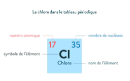
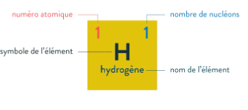

# Chapitre 1 : les atomes dans l’Univers
## Introduction :

La matière qui nous entoure est constituée d’une infinité d’atomes. Nous allons nous intéresser à leur structure complexe. En effet, les atomes sont composés d’élément infiniment petits, ce qui est remarquable si on considère leur taille. Nous appellerons ces éléments des particules.

Nous nous intéresserons aux particules et aux électrons composants les atomes.

Un modèle est une représentation qui permet d’expliquer un phénomène (Activité 2)

**Un atome est un élément indivisible constitutif de la matière. Il est constitué d'un noyau et d'électrons qui tournent autour du noyau. Un atome est électriquement neutre.**

## I) Le noyau

**Selon les représentations actuelles, le noyau d’un atome a une forme sphérique et occupe une place centrale dans l’atome.**

La dimension du noyau est de l’ordre de $10^-15$m, ce qui est dérisoire comparée à celle de l’atome qui est de l’ordre de $10^-10$m soit 0,1 nanomètre. On peut donc en déduire que le noyau est 100 000 fois plus petit que l’atome.

On peut comparer l’atome à un terrain de football et le noyau à une abeille posée dans le rond central. Cependant la quasi-totalité de la masse de l’atome se trouve dans le noyau.

**Le noyau est la partie centrale de l'atome. Il est constitué de particules appelées nucléons. Il existe deux types de nucléons (Noté $A$):**

- **Un proton est une particule subatomique qui porte une charge positive (Noté $Z$)**
- **Un neutron est une particule subatomique qui est électriquement neutre. (Noté $N$)**

**Le noyau possède donc une charge électrique apportée par les protons: il est chargé positivement.**

Il est donc possible de connaître le nombre de neutrons : nombre de neutrons (N)=
nombre de nucléons (A) – nombre de protons (Z) ($N=A-Z$)

Attention on peut trouver la représentation symbolique d’un atome sous la forme : $^{A}{_{Z}}X$

### 1. Exemple de l’atome de chlore Cl

{ align=left }

Protons Z=17

Nucléons A=35

Neutrons N=18

〿
### 2. Exemple de l’atome d’hydrogène H

{ align=left }

Z=1

A=1

N=0

〿

〿

**Pour être stable un atome doit être électriquement neutre son noyau étant chargé positivement, des particules négatives sont nécessaires pour compenser les protons : ce sont les électrons.**

## II) Les électrons
Ils forment le nuage électronique autour du noyau.

**Un électron est une particule élémentaire de charge électrique négative qui gravite autour du noyau de l’atome**

Les électrons tournent dans le vide autour du noyau et ne s’en éloignent pas car les
charges positives attirent les charges négatives.
Il y a donc autant de protons que d’électrons dans un atome.

Exemple :

- Chlore 17 protons et 17 électrons
- Hydrogène 1 proton et 1 électron

## III) Le tableau périodique et l'atome

