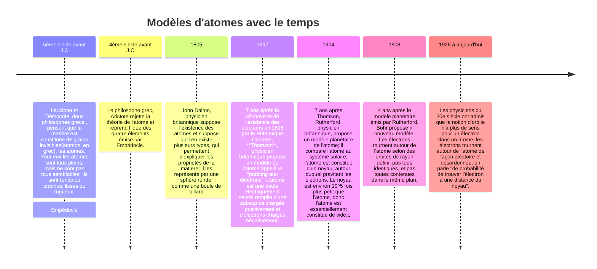
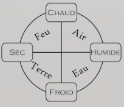
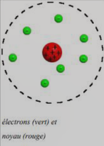
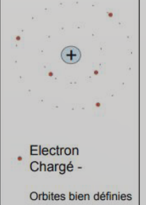
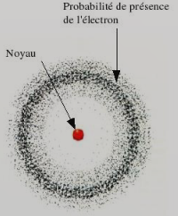

# Chapitre 1: Commment s'organise la matière dans l'Univers ?

2024-sept-5-1

[Fiche de début](../../assets/noscans/chimie/chimie-chapter1-route.pdf)

2024-sept-5-2

2024-sept-5-3

2024-sept-5-4

[Activité 1](../../assets/noscans/chimie/chimie-chapter1-activity1.pdf)

1. Infiniment petite
2. Car le temps serait nul à ce moment(solution: Au moment du Big Bang la matière commence a être crée donc son histoire ne peut commencer avant.)
3. Une température plus basse
4. De la gravité.
5. Les plus lourds résultent de la fusion en chaîne des atomes les plus légers.
6. Principalement de l'hydrogène
7. Car c'est un élément avec un numéro atomique très bas(et donc simple).
8. Car elle libère les éléments les contenant

[Activité 2](../../assets/noscans/chimie/chimie-chapter1-activity2.pdf)

??? abstract "Leucippe"

    
    Leucippe

??? abstract "Empédocle"

    
    

    Modèle de l'atome: 

??? abstract "Aristote"

    
    

    Modèle de l'atome: Empédocle

??? abstract "Démocrite"

    
    

    Modèle de l'atome: Leucippe

??? abstract "Dalton"

    

    Modèle de l'atome: 

??? abstract "Thomson"
    
    
    
    Modèle de l'atome: 

??? abstract "Rutherford"

    

??? abstract "Bohr"

    

    Modèle de l'atome: 

??? abstract "Schödinger"

    

    Modèle de l'atome: 

