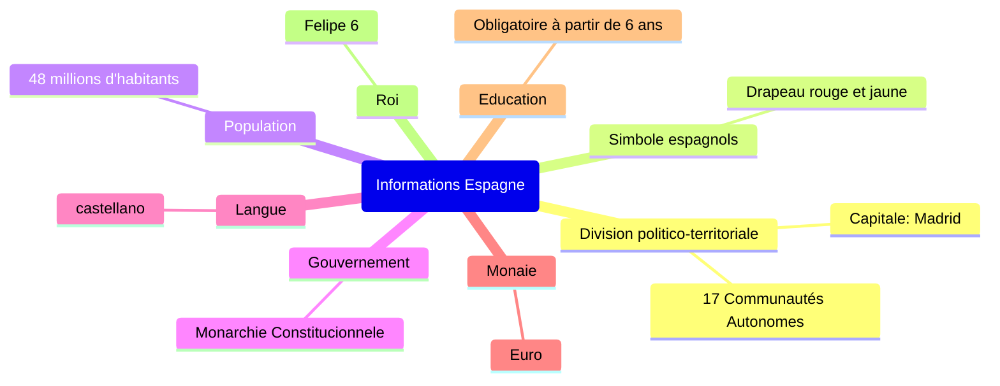
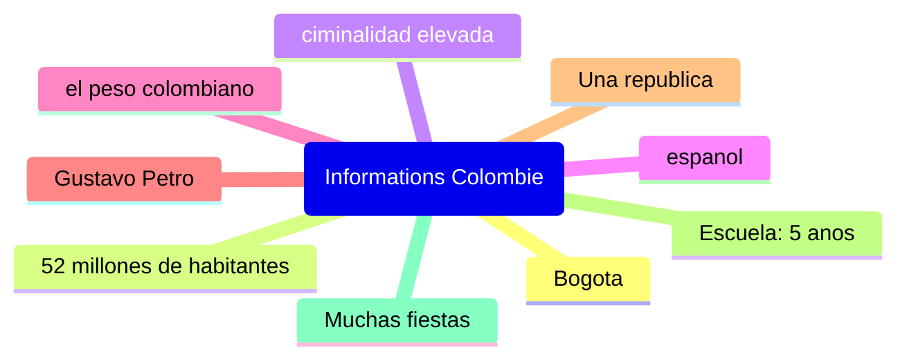

# Secuencia dos
## Viernes, cuatro de octubre

## Lunes, siete de octubre

Espana es un monarquia mientras que Colombia es una republica
En Espana se habla espanol tal como en Colombia

4. España es una monarquía constitucional mientras que Colombia es una república. 
5. En España, se habla castellano al igual que en Colombia donde también se habla español. 
6. Madrid es la capital de España, mientras que Bogotá es la de Colombia. 
7. España tiene una población de 48 millones de habitantes, mientras que Colombia tiene 52 millones. 
8. La bandera de España es roja y amarilla, mientras que la bandera de Colombia tiene tres colores: amarillo, azul y rojo. 
9. El euro es la moneda utilizada en España, mientras que Colombia usa el peso colombiano.

_

1. En Colombia hay 51 millones de habitantes meintras queen Espana hay 48 millones de habitantes
2. En Espana hay muchas fiestas tal como en Colombia.
3. En Colombia hay mas criminalidad que en Espana
4. Espana tiene menos habitantes que Colombia.

## Martes, ocho de octubre

sesion 2: la vida cotidiana en Espana y en COlombia

"vidéo vidas paraleleas"

Las dos chicas se llamana Sofia y Maria. Maria es Colombiana y Sofia es espanola. Por la manase levantan a las siete y trenta. Luego desayunan y van al colegio.
Por la tarde, Maria habla inglés y Sofia trabaha.
A las chicas les gusta el futbol.

---

Querida Sofía,

Mi nombre es María y soy de Colombia.
Por las mañanas, me levanto a las siete y media. Luego desayuno y voy al colegio. Mi colegio es moderno. 
Después de las clases, en mis actividades extraescolares, suelo practicar inglés y los fines de semana veo el fútbol
con mi familia.

María

---

Querida María,

Mi nombre es Sofía y soy de España. Soy española.
Por las mañanas, me levanto a las siete y media. Luego desayuno y voy al colegio. 
Después del colegio, en mis actividades extraescolares, trabajo en una tienda local y los fines de semana también veo al fútbol.

Sofía

