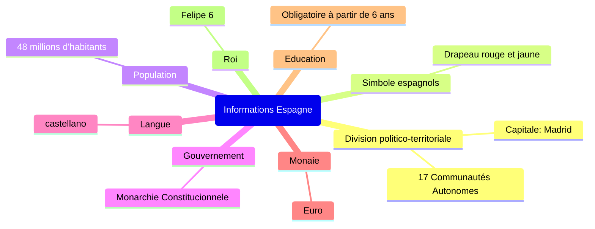
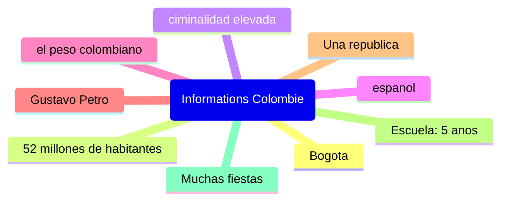

# Secuencia dos
## Viernes, cuatro de octubre

## Lunes, siete de octubre

Espana es un monarquia mientras que Colombia es una republica
En Espana se habla espanol tal como en Colombia

4. España es una monarquía constitucional mientras que Colombia es una república. 
5. En España, se habla castellano al igual que en Colombia donde también se habla español. 
6. Madrid es la capital de España, mientras que Bogotá es la de Colombia. 
7. España tiene una población de 48 millones de habitantes, mientras que Colombia tiene 52 millones. 
8. La bandera de España es roja y amarilla, mientras que la bandera de Colombia tiene tres colores: amarillo, azul y rojo. 
9. El euro es la moneda utilizada en España, mientras que Colombia usa el peso colombiano.