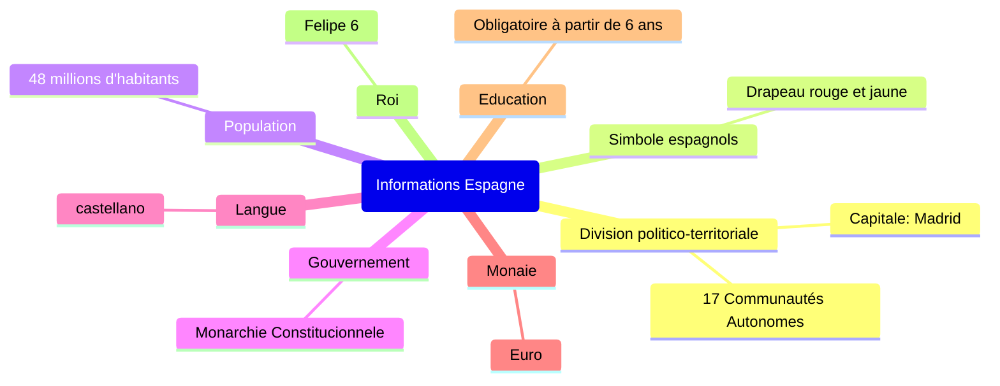
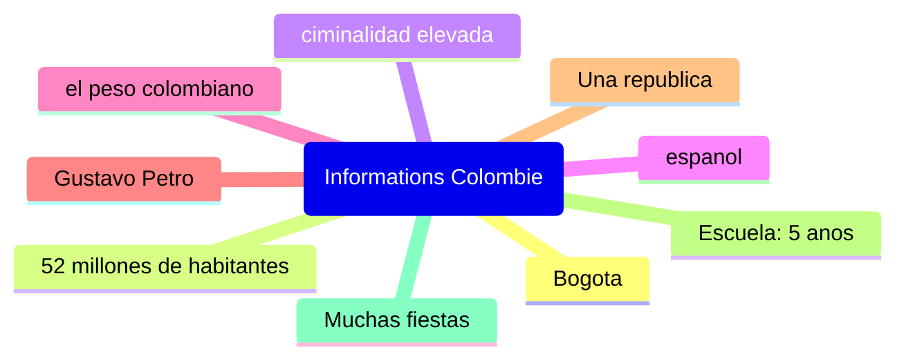

# Secuencia dos
## Viernes, cuatro de octubre

## Lunes, siete de octubre

Espana es un monarquia mientras que Colombia es una republica
En Espana se habla espanol tal como en Colombia

1. **España tiene un clima más templado que Colombia*
2. **La gastronomía española es más conocida por el jamón ibérico y la paella**
3. **España tiene una menor biodiversidad que Colombia**