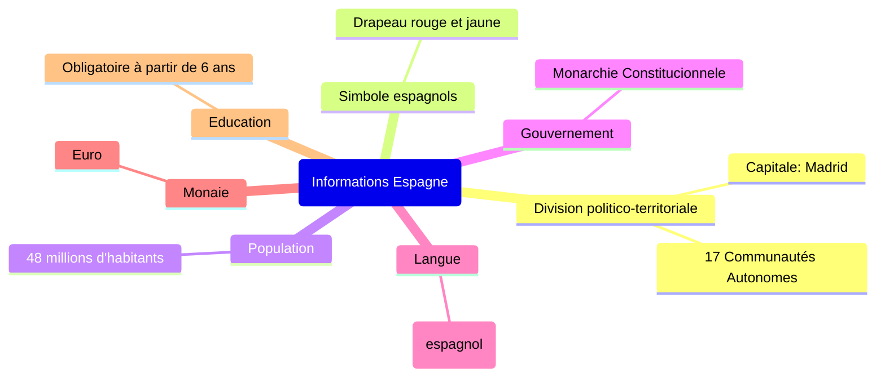

# Secuencia dos
## Viernes, cuatro de octubre

```mermaid
mindmap
    root (Informations Espagne)
        Division politico-territoriale
            17 Communautés Autonomes
            Capitale: Madrid
        Simbole espagnols
            Drapeau rouge et jaune
        Population
            48 millions d'habitants
        Gouvernement
            Monarchie Constitucionnele
        Langue
            castellano (espagnol)
        Monaie
            Euro
        Education
            Obligatoire à partir de 6 ans
        
```

