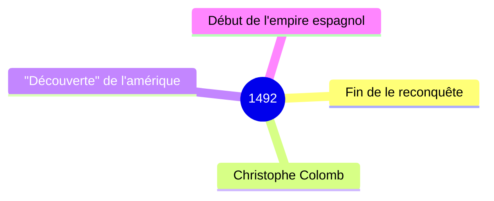

# La infancia de Cristobal COlon

Cristobal Colon vivia en Génova, en Italia. Nacio en 1451. C. C era curioso porque escuchaba las historias de viaje de los marineros. Era aventurero porque sonaba con aventurarse mas alla del horizonte. Era dinamico porque escalaba la muralla. A C.C le gustaba la cartografia

- 

1) Cristobal COlon fue a ver a la Reina Isabel la Catolica para financiar su viaje a la India (queria crear una ruta maritima comercia hacia eloeste)
2) El 3 de agosto de 1492, Cristobal Colon y los marineros salieron  del Puerto de Palos (sur de espana) con tres caravelas: la nina, la pinta y la santa maria.
3) Viajaron mas de dos meses sin ver tierra. Los marineros estaban cansados, desperados. Tenian miedo, sed y hambre.
4) Finalmente, el 12 de octubre de 1492, Rodrigo de Triano vio la tierra y grito "Tierra Tierra Tierra" llegaron a la isla de Guanaharni, actual San Salvador, y se encontraron con los indigenas.

salir = partir
la salida = le départ
estar cansado = être fatigué
tener miedo = avoir peur
tener sed = avoir soif
tener hambie = avoir faim
encontrar = trouver
llegar = arriver

## Sesion 3 el encuentro entre europa y america

on est enfin arrivés mais c pas le bon endroit

 - Hemos navegado durante semanas, enfrentando tormentas y un mar implacable, hasta que finalmente avistamos tierra desconocida.
- Al desembarcar, nos encontramos con pueblos que parecían vivir en armonía con la naturaleza, con costumbres y lenguas distintas a las nuestras.
- Los primeros intercambios fueron pacíficos, pero pronto comenzaron las tensiones cuando nuestros líderes exigieron riquezas y tierras.
- Muchos de los indígenas cayeron enfermos por nuestras enfermedades, y algunos de mis compañeros comenzaron a hablar de conquistar en lugar de comerciar.
- Ahora me pregunto si nuestra llegada es realmente el comienzo de una nueva era o el fin de un mundo que nunca debimos perturbar.

