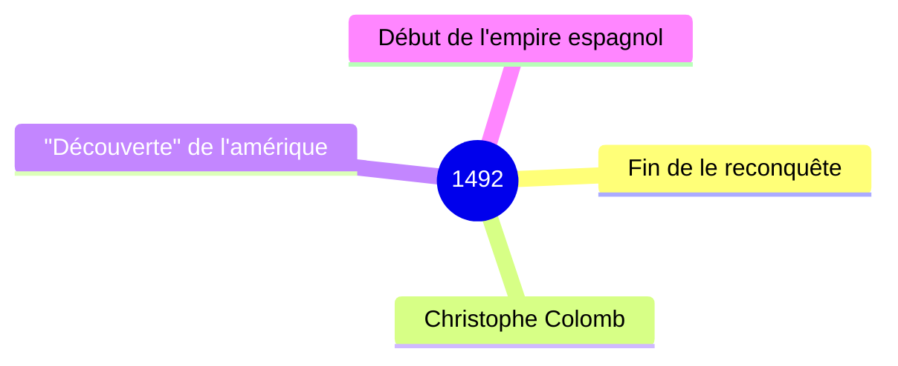

# La infancia de Cristobal COlon

Cristobal Colon vivia en Génova, en Italia. Nacio en 1451. C. C era curioso porque escuchaba las historias de viaje de los marineros. Era aventurero porque sonaba con aventurarse mas alla del horizonte. Era dinamico porque escalaba la muralla. A C.C le gustaba la cartografia

