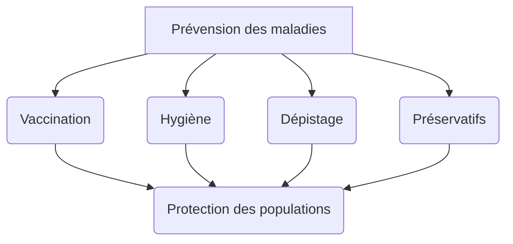

# Chapitre III- mieux vaut prévenir que guérir
## I- La vaccination, un geste de prévention.

Activité 1 : Compétence travaillée : « Extraire les informations »

1) Montrer à l’aide du document 1p396 que la « réponse secondaire » est plus efficace que la « réponse
   primaire ».
2) Expliquer cette différence à l’aide du document 2p397
3) Expliquer pourquoi les poules du lot B du document 3p397 survivent après la première injection, puis
   après la deuxième injection.

1. Je constate que la réponse primaire génére moins d'anticorps que la réponse secondaire, la réponse secondaire est donc plus efficace
2. Cette différence est causée par la "mise en mémoire" des anticorps, permettant une productino plus rapide
3. Les poules du lot B survivent grâce à l'aide de la réoonse secondaire induite par l'injection de bactéries vieillies

## II - Pour quelles raisons certains vaccins sont-ils obligatoires ?

^^Bilan 2: ^^ La vaccination permet de lutter contre la contamination et l'infection.

^^La couverture vaccinnale^^ = proportion d'individus vaccinés dans une population (en %)

Plus la couverture vaccinale est grande, plus l'épidémie tend à disparaître.

Si la couverture vaccinale n'est pas suffisante, il y a un risque d'épidémie pour les personnes non vaccinées

 
2) La couverture virale augmente de 82% en 1996 à 85% en 2004 (2 doses recommandées en 96, ça augmente l'immunité)
3) immunité augmentée donc plus de cas de rougeole

* Se vacciner c'est "se protéger soi-même" car le vaccin provoque la fabrication d'anticorps et de lymphocytes B mémoiresqui immunisent
* Se vacciner c'est "protéger aussi les autres" car étant mmunisé, nous ne pouvons pas contaminer (transmettre la maladie) d'autres personnes

