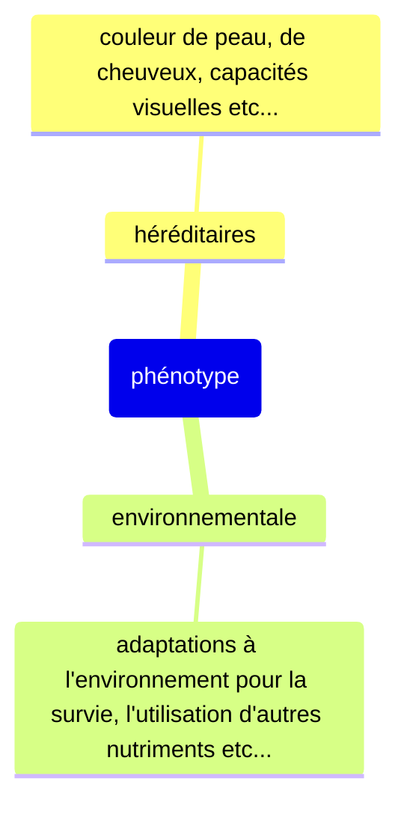

# Chapitre IV - Comment expliquer la variabilité d'un caractère au sein d'une popualtion ?

Page 238 - 239

Fiare "pistes pour réussir" p.239

Dans le document 1, le facteur de modification est du à la génétique.

Dans le document 2, le facteur de modification est du à la température

Dans le document 3, le facteur de modification et la nourriture de l'abeille pendant son enfance

Dans le document 4, le facteur de modification est l'acidité du sol

