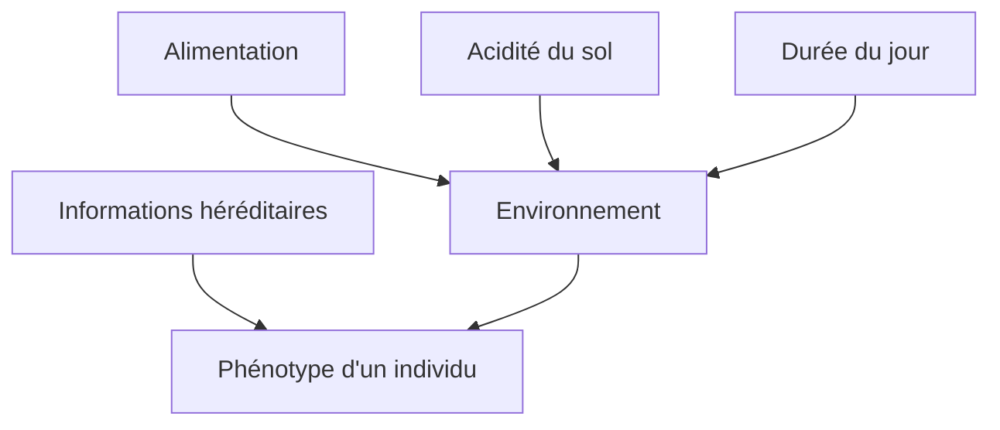

# Chapitre IV - Comment expliquer la variabilité d'un caractère au sein d'une popualtion ?

Page 238 - 239

Fiare "pistes pour réussir" p.239

Dans le document 1, le facteur de modification est du à la génétique.

Dans le document 2, le facteur de modification est du à la température

Dans le document 3, le facteur de modification et la nourriture de l'abeille pendant son enfance

Dans le document 4, le facteur de modification est l'acidité du sol

| Caractére étudié                                | Facteur responsable du caractère     |
|-------------------------------------------------|--------------------------------------|
| caractéres héréditaires (couleur yeux, cheuveux | informations héréditaires            |
| couleur pelage                                  | température / saison (durée du jour) |
| diversité population (reine / ouvrières)        | alimentation                         |
| couleur fleur. hortensias                       | PH du sol.                           |

^^Un caracctère héréditaire:^^ un caractère qui se transmet de génération en génération. Il peut sauter une génération.

^^Phénotype:^^ ensemble des caractéristiques visibles d'un individu ou 